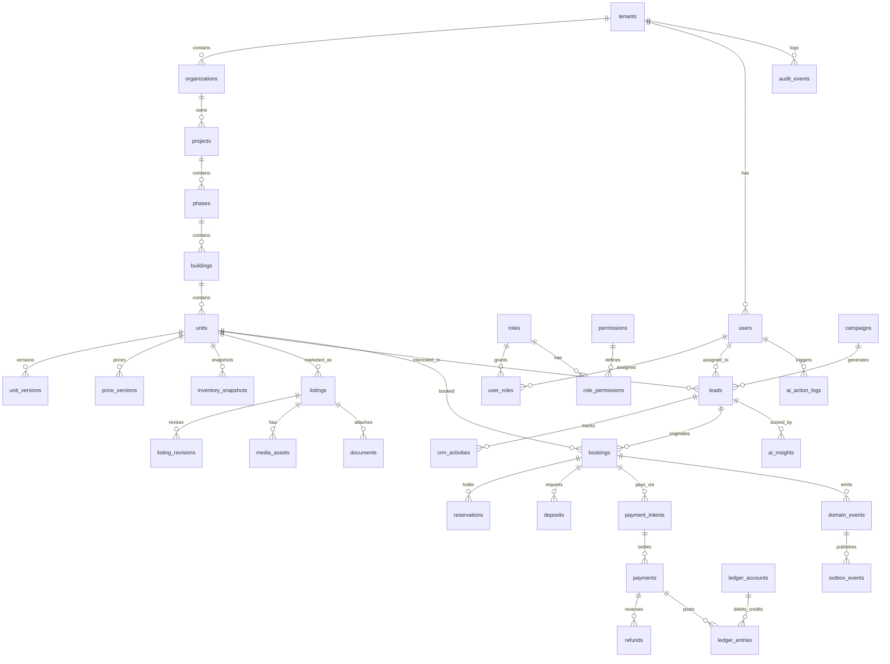
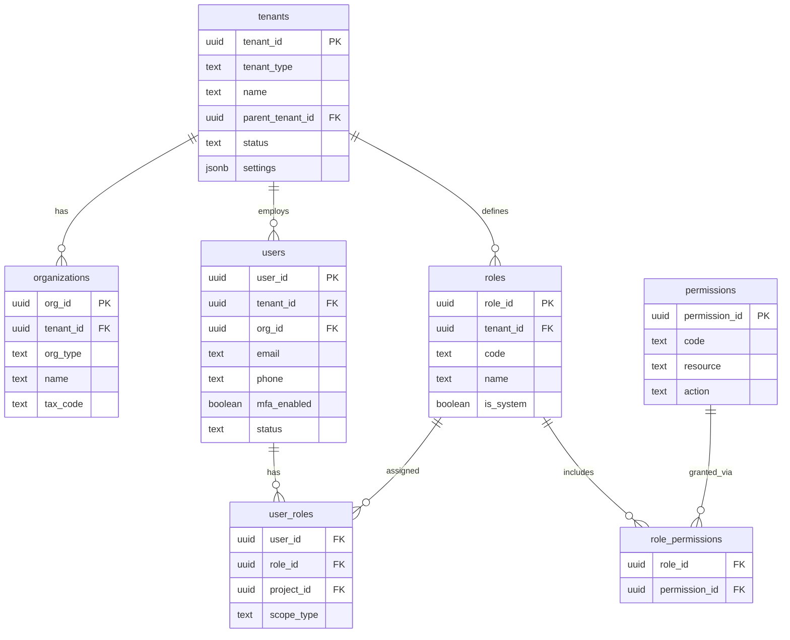
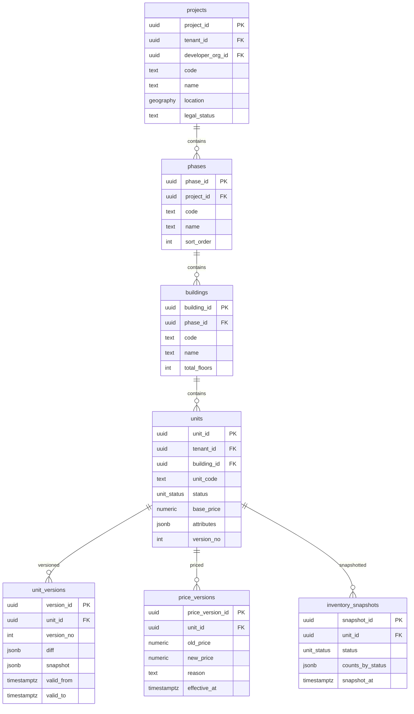
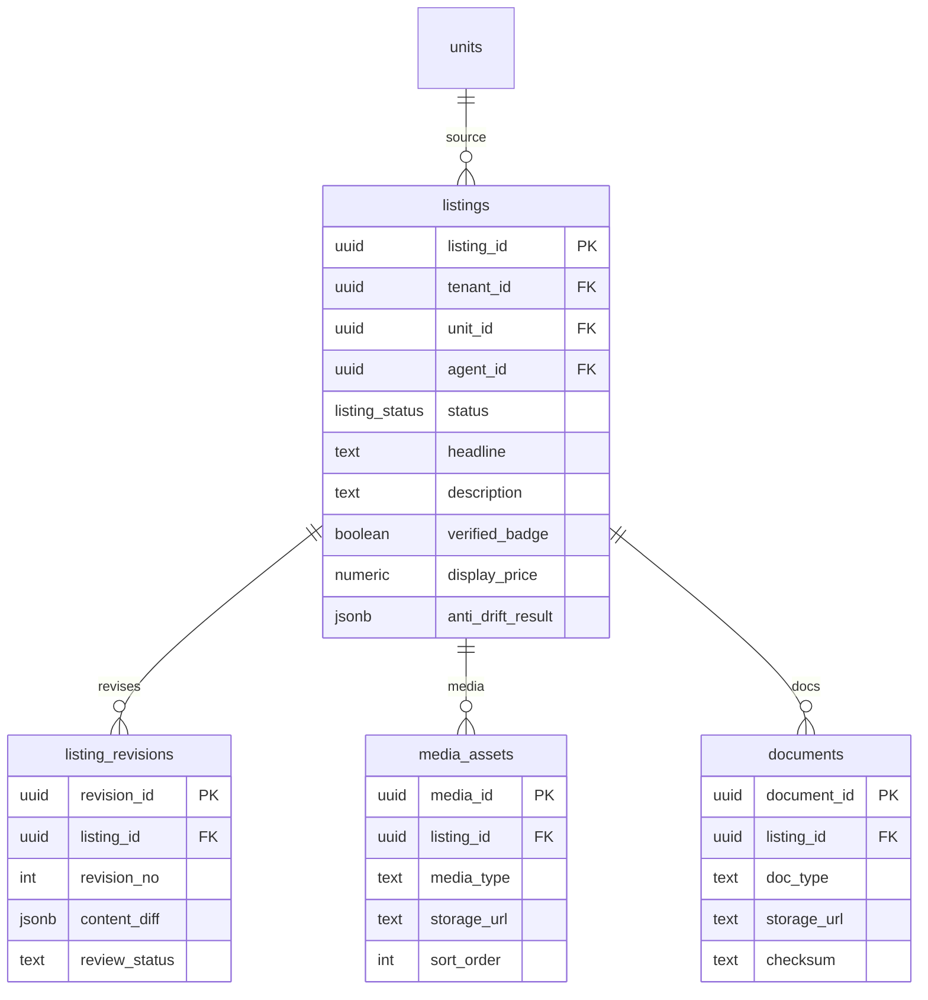
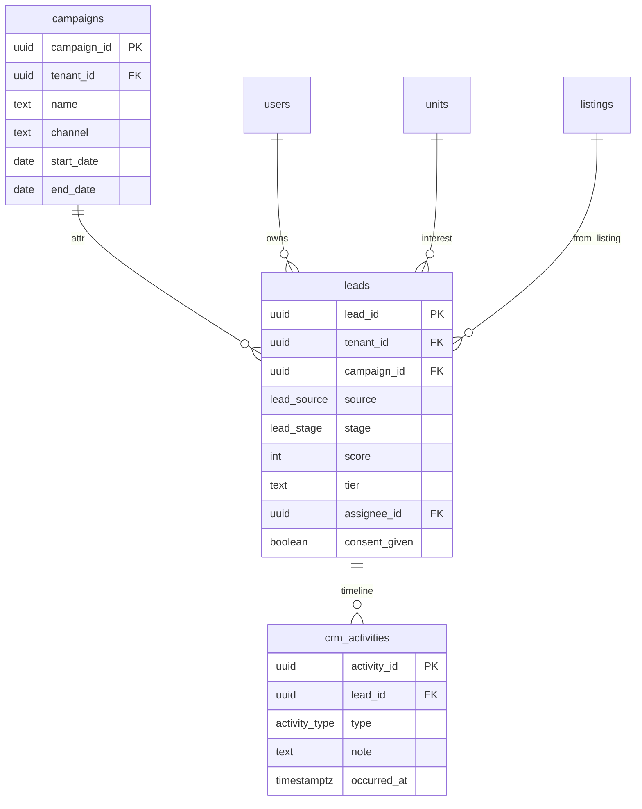
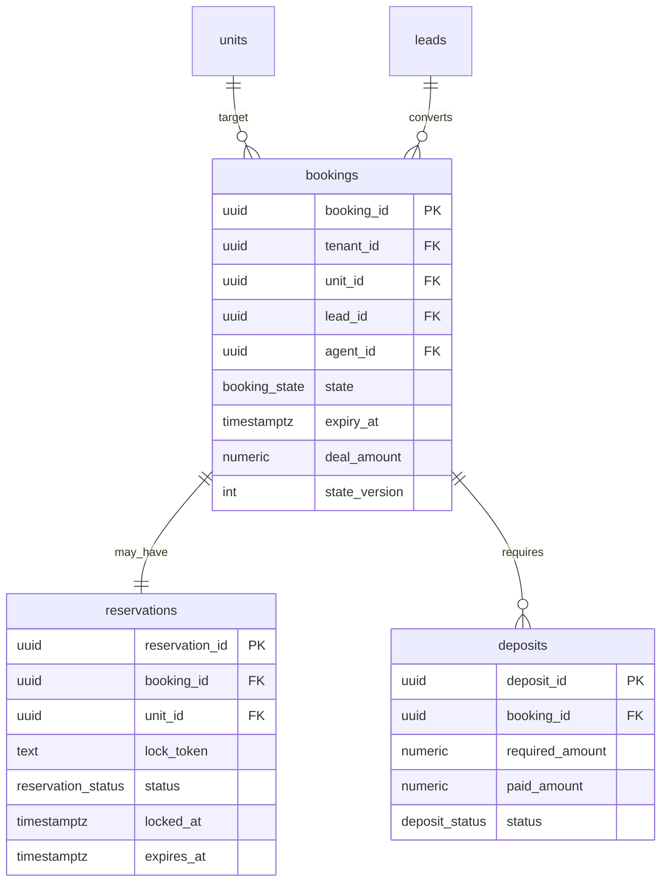
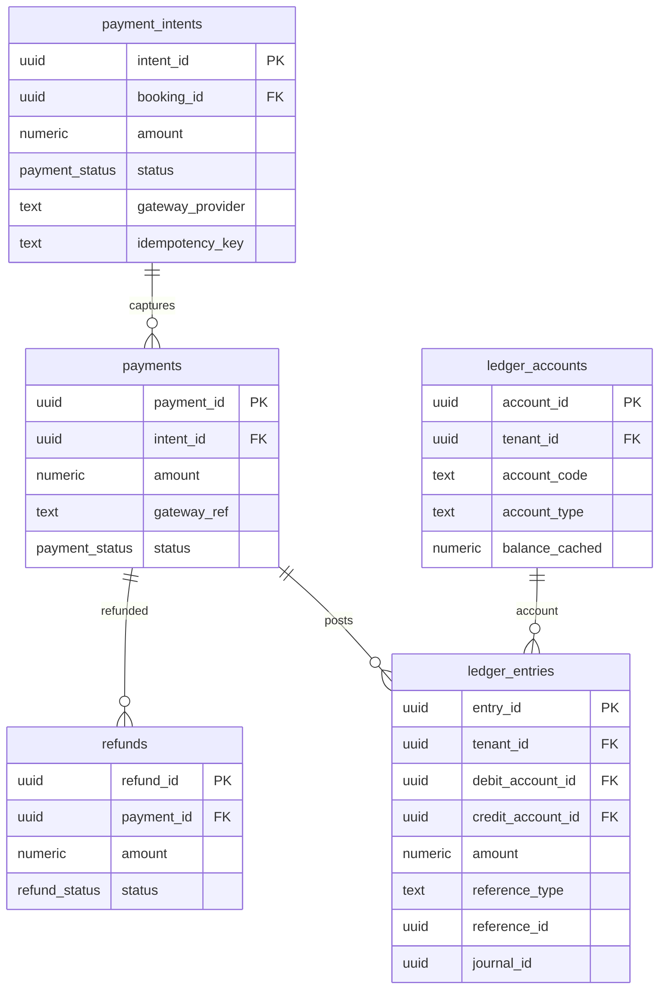
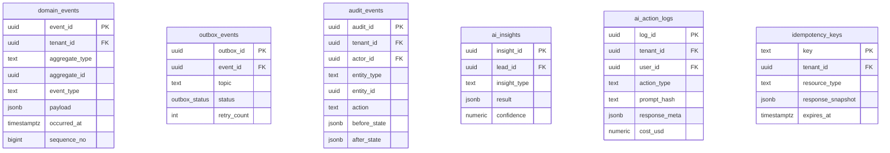

# Sơ đồ CSDL — WEREAL REOS Phase 1 MVP

> **Mã tài liệu:** WEREAL-DB-2026-v1.0  
> **Phiên bản:** 1.0  
> **Ngày phát hành:** 28/07/2026  
> **Trạng thái:** Draft — Internal Review  
> **Cơ sở dữ liệu:** PostgreSQL 16  
> **Tham chiếu:** SRS v2.0 (`Tai-lieu-yeu-cau-phan-mem.md`), Confirmed Requirements v2.0 (`Yeu-cau-da-xac-nhan.md`)

---

## Mục lục

1. [Kiểm soát tài liệu & Quy ước](#1-kiểm-soát-tài-liệu--quy-ước)
2. [Tổng quan ERD Phase 1](#2-tổng-quan-erd-phase-1)
3. [ERD chi tiết theo domain](#3-erd-chi-tiết-theo-domain)
4. [Định nghĩa bảng đầy đủ (~35 bảng)](#4-định-nghĩa-bảng-đầy-đủ-35-bảng)
5. [RLS Policies — Ví dụ SQL](#5-rls-policies--ví-dụ-sql)
6. [Thiết kế Event Store](#6-thiết-kế-event-store)
7. [Bảng Versioning](#7-bảng-versioning)
8. [Định nghĩa Enum](#8-định-nghĩa-enum)
9. [Chiến lược Index](#9-chiến-lược-index)
10. [Chiến lược Partitioning (tương lai)](#10-chiến-lược-partitioning-tương-lai)
11. [Chiến lược Migration (Flyway/Prisma)](#11-chiến-lược-migration-flywayprisma)
12. [SQL mẫu](#12-sql-mẫu)
13. [Data Dictionary — Tất cả cột](#13-data-dictionary--tất-cả-cột)
14. [Chính sách Retention theo bảng](#14-chính-sách-retention-theo-bảng)

---

## 1. Kiểm soát tài liệu & Quy ước

### 1.1 Thông tin phiên bản

| Thuộc tính | Giá trị |
|------------|---------|
| **Tên tài liệu** | Sơ đồ CSDL — Database Design Document |
| **Mã tài liệu** | **WEREAL-DB-2026-v1.0** |
| **Phiên bản** | 1.0 |
| **Baseline tham chiếu** | WEREAL-BL-2026-002 |
| **SRS tham chiếu** | WEREAL-SRS-2026-v2.0 |
| **DBMS** | PostgreSQL 16.x |
| **Schema mặc định** | `wereal` |
| **Encoding** | UTF-8 |
| **Timezone lưu trữ** | TIMESTAMPTZ (UTC) |
| **Tiền tệ mặc định** | VND (`NUMERIC(18,2)`) |

### 1.2 Lịch sử phiên bản

| Version | Ngày | Mô tả thay đổi | Author | Reviewer |
|---------|------|----------------|--------|----------|
| 0.1 | 15/07/2026 | Draft nội bộ — entity list từ workshop kiến trúc | Data Architect | Tech Lead |
| 0.5 | 25/07/2026 | Bổ sung booking 15-state, ledger double-entry | Data Architect | Finance Lead |
| **1.0** | **28/07/2026** | **Phát hành Phase 1 MVP — 35 bảng, RLS, event store, data dictionary** | **Data Architect** | **Tech Lead** |

### 1.3 Phân phối tài liệu

| Nhóm | Mục đích |
|------|----------|
| Backend Engineering | Implementation schema, migrations |
| DevOps / DBA | RLS, partitioning, backup, retention jobs |
| QA | Test data setup, isolation verification |
| Finance | Ledger rules, reconciliation queries |
| Legal / Compliance | Retention matrix, audit immutability |
| BA / PO | Traceability FR → table mapping |

### 1.4 Quy ước đặt tên

| Loại | Quy ước | Ví dụ |
|------|---------|-------|
| Bảng | `snake_case`, số nhiều | `ledger_entries`, `unit_versions` |
| Cột | `snake_case` | `tenant_id`, `created_at` |
| Primary Key | `{entity}_id UUID` hoặc `id UUID` | `booking_id`, `unit_id` |
| Foreign Key | `{referenced_entity}_id` | `project_id`, `user_id` |
| Enum type | `{domain}_{attribute}` | `booking_state`, `unit_status` |
| Index | `idx_{table}_{columns}` | `idx_units_tenant_status` |
| Unique | `uq_{table}_{columns}` | `uq_units_project_code` |
| Check constraint | `chk_{table}_{rule}` | `chk_ledger_entries_amount_positive` |
| RLS policy | `{table}_{action}_policy` | `units_tenant_select_policy` |

### 1.5 Quy ước kiểu dữ liệu

| Mục đích | PostgreSQL type | Ghi chú |
|----------|-----------------|---------|
| ID / UUID | `UUID` | `gen_random_uuid()` default |
| Tiền tệ | `NUMERIC(18,2)` | Không dùng FLOAT |
| Phần trăm | `NUMERIC(5,2)` | Commission rate |
| Timestamp | `TIMESTAMPTZ` | Luôn UTC |
| JSON linh hoạt | `JSONB` | Attributes, payload, metadata |
| Enum | PostgreSQL `ENUM` hoặc `TEXT` + CHECK | Ưu tiên ENUM cho core domain |
| Soft delete | `deleted_at TIMESTAMPTZ NULL` | Không hard-delete giao dịch |
| Audit | `created_at`, `created_by`, `updated_at`, `updated_by` | Bắt buộc mọi bảng nghiệp vụ |
| Tenant scope | `tenant_id UUID NOT NULL` | Bắt buộc + RLS |

### 1.6 Quy ước bảo mật

- Mọi bảng nghiệp vụ Phase 1 có `tenant_id` và RLS enabled.
- Bảng append-only (`domain_events`, `audit_events`, `ledger_entries`): **không UPDATE/DELETE** từ application layer.
- PII columns (`email`, `phone`, `national_id`): tagged trong data dictionary; mask trong log/export.
- Session variable `app.current_tenant_id` set bởi middleware trước mọi query.

### 1.7 Mapping FR → Domain tables

| Module FR | Bảng chính |
|-----------|------------|
| FR-ID-01→04 | tenants, organizations, users, roles, permissions, role_permissions, user_roles |
| FR-GR-01→08 | projects, phases, buildings, units, unit_versions, price_versions, inventory_snapshots |
| FR-LS-01→06 | listings, listing_revisions, media_assets, documents |
| FR-CRM-01→05 | leads, crm_activities, campaigns |
| FR-BK-01→07 | bookings, reservations, deposits, domain_events |
| FR-PAY-01→05 | payment_intents, payments, refunds, ledger_accounts, ledger_entries, idempotency_keys |
| FR-TR-01,05 | audit_events, ai_action_logs |
| FR-AI-01→04 | ai_insights, ai_action_logs |
| FR-BK-04 (outbox) | outbox_events |

---

## 2. Tổng quan ERD Phase 1

Phase 1 MVP gồm **35 bảng** trong schema `wereal`, nhóm theo 7 domain.



### 2.1 Danh sách 35 bảng Phase 1

| # | Bảng | Domain | Mô tả ngắn |
|---|------|--------|------------|
| 1 | tenants | Identity | Tổ chức tenant (Platform/Developer/Agency) |
| 2 | organizations | Identity | Chi nhánh / đơn vị con trong tenant |
| 3 | users | Identity | Người dùng hệ thống |
| 4 | roles | Identity | Vai trò RBAC |
| 5 | permissions | Identity | Quyền hạn chi tiết |
| 6 | role_permissions | Identity | N-N role ↔ permission |
| 7 | user_roles | Identity | N-N user ↔ role (scope ABAC) |
| 8 | projects | Golden Record | Dự án BĐS |
| 9 | phases | Golden Record | Giai đoạn/Khu trong project |
| 10 | buildings | Golden Record | Tòa nhà/Block |
| 11 | units | Golden Record | Unit gốc (Golden Record) |
| 12 | unit_versions | Golden Record | Snapshot thuộc tính unit |
| 13 | price_versions | Golden Record | Lịch sử giá immutable |
| 14 | inventory_snapshots | Golden Record | Snapshot tồn kho định kỳ |
| 15 | listings | Listing | Marketing layer trên GR |
| 16 | listing_revisions | Listing | Lịch sử draft/revision |
| 17 | media_assets | Listing | Ảnh/video listing |
| 18 | documents | Listing | Tài liệu đính kèm |
| 19 | leads | CRM | Khách tiềm năng |
| 20 | crm_activities | CRM | Hoạt động CRM timeline |
| 21 | campaigns | CRM | Chiến dịch marketing |
| 22 | bookings | Booking | Giao dịch / deal state machine |
| 23 | reservations | Booking | Giữ chỗ atomic lock |
| 24 | deposits | Booking | Yêu cầu cọc gắn booking |
| 25 | payment_intents | Payment | Intent trước khi charge gateway |
| 26 | payments | Payment | Giao dịch thanh toán thực tế |
| 27 | refunds | Payment | Hoàn tiền |
| 28 | ledger_accounts | Payment | Tài khoản sổ cái |
| 29 | ledger_entries | Payment | Bút toán double-entry |
| 30 | domain_events | Event | Event store append-only |
| 31 | outbox_events | Event | Outbox pattern CDC publish |
| 32 | audit_events | Audit | Audit trail hệ thống |
| 33 | ai_insights | AI | Lead scoring, recommendations |
| 34 | ai_action_logs | AI | Log mọi AI call |
| 35 | idempotency_keys | Infra | Idempotency webhook/import |

---

## 3. ERD chi tiết theo domain

### 3.1 Domain Tenant / Identity



**Ghi chú kiến trúc:**
- `tenants.parent_tenant_id` hỗ trợ hierarchy Platform → Developer → Agency → Branch.
- `user_roles.project_id` + `scope_type` triển khai ABAC theo project/khu vực (FR-ID-02).
- `permissions` có thể global (Platform) hoặc tenant-scoped qua `role_permissions`.

### 3.2 Domain Golden Record (Product Graph)



**Product Graph:** `Developer → Project → Phase → Building → Unit` — mọi listing/booking phải reference `unit_id` hợp lệ.

### 3.3 Domain Listing



**Anti-drift:** `listings.display_price` và `listings.anti_drift_result` so sánh với `units.base_price` + `price_versions` tại thời điểm publish.

### 3.4 Domain CRM



### 3.5 Domain Booking / Transaction



**State machine 15 trạng thái** lưu tại `bookings.state` (enum `booking_state`).

### 3.6 Domain Payment / Ledger



**Quy tắc double-entry:** Mỗi payment tạo ≥ 2 `ledger_entries` cùng `journal_id`; tổng debit = tổng credit.

### 3.7 Domain Audit / Event / AI



---

## 4. Định nghĩa bảng đầy đủ (~35 bảng)

### 4.0 DDL chung — Extensions & Schema

```sql
-- WEREAL-DB-2026-v1.0 — Bootstrap
CREATE EXTENSION IF NOT EXISTS "pgcrypto";
CREATE EXTENSION IF NOT EXISTS "uuid-ossp";
CREATE EXTENSION IF NOT EXISTS "postgis";  -- geo search Phase 1

CREATE SCHEMA IF NOT EXISTS wereal;
SET search_path TO wereal, public;
```

### 4.1 tenants

| Cột | Kiểu | Null | Mặc định | Ràng buộc | Mô tả |
|-----|------|------|----------|-----------|-------|
| tenant_id | UUID | NO | gen_random_uuid() | PK | ID tenant |
| tenant_type | tenant_type | NO | — | ENUM | platform/developer/agency/branch |
| name | VARCHAR(255) | NO | — | — | Tên hiển thị |
| slug | VARCHAR(100) | NO | — | UNIQUE | Subdomain/slug |
| parent_tenant_id | UUID | YES | NULL | FK → tenants | Hierarchy |
| status | tenant_status | NO | 'active' | — | active/suspended/archived |
| settings | JSONB | NO | '{}' | — | Config tenant |
| created_at | TIMESTAMPTZ | NO | now() | — | — |
| created_by | UUID | YES | NULL | — | — |
| updated_at | TIMESTAMPTZ | NO | now() | — | — |
| updated_by | UUID | YES | NULL | — | — |
| deleted_at | TIMESTAMPTZ | YES | NULL | — | Soft delete |

**Indexes:** `idx_tenants_parent`, `idx_tenants_type_status`, `uq_tenants_slug`

```sql
CREATE TABLE wereal.tenants (
    tenant_id         UUID PRIMARY KEY DEFAULT gen_random_uuid(),
    tenant_type       wereal.tenant_type NOT NULL,
    name              VARCHAR(255) NOT NULL,
    slug              VARCHAR(100) NOT NULL UNIQUE,
    parent_tenant_id  UUID REFERENCES wereal.tenants(tenant_id),
    status            wereal.tenant_status NOT NULL DEFAULT 'active',
    settings          JSONB NOT NULL DEFAULT '{}',
    created_at        TIMESTAMPTZ NOT NULL DEFAULT now(),
    created_by        UUID,
    updated_at        TIMESTAMPTZ NOT NULL DEFAULT now(),
    updated_by        UUID,
    deleted_at        TIMESTAMPTZ
);
CREATE INDEX idx_tenants_parent ON wereal.tenants(parent_tenant_id) WHERE deleted_at IS NULL;
CREATE INDEX idx_tenants_type_status ON wereal.tenants(tenant_type, status);
```

### 4.2 organizations

| Cột | Kiểu | Null | Mặc định | Ràng buộc | Mô tả |
|-----|------|------|----------|-----------|-------|
| org_id | UUID | NO | gen_random_uuid() | PK | — |
| tenant_id | UUID | NO | — | FK → tenants | — |
| org_type | org_type | NO | — | ENUM | hq/branch/sales_office |
| name | VARCHAR(255) | NO | — | — | — |
| tax_code | VARCHAR(50) | YES | NULL | — | MST |
| address | TEXT | YES | NULL | — | — |
| metadata | JSONB | NO | '{}' | — | — |
| created_at | TIMESTAMPTZ | NO | now() | — | — |
| updated_at | TIMESTAMPTZ | NO | now() | — | — |
| deleted_at | TIMESTAMPTZ | YES | NULL | — | — |

**Indexes:** `idx_organizations_tenant`, `uq_organizations_tenant_tax_code`

### 4.3 users

| Cột | Kiểu | Null | Mặc định | Ràng buộc | Mô tả |
|-----|------|------|----------|-----------|-------|
| user_id | UUID | NO | gen_random_uuid() | PK | — |
| tenant_id | UUID | NO | — | FK → tenants | — |
| org_id | UUID | YES | NULL | FK → organizations | — |
| email | VARCHAR(320) | NO | — | — | Login email |
| phone | VARCHAR(20) | YES | NULL | — | PII |
| password_hash | VARCHAR(255) | YES | NULL | — | Nullable nếu SSO P4 |
| full_name | VARCHAR(255) | NO | — | — | — |
| mfa_enabled | BOOLEAN | NO | false | — | FR-ID-04 |
| mfa_secret | VARCHAR(255) | YES | NULL | — | Encrypted at app layer |
| status | user_status | NO | 'active' | — | — |
| last_login_at | TIMESTAMPTZ | YES | NULL | — | — |
| created_at | TIMESTAMPTZ | NO | now() | — | — |
| updated_at | TIMESTAMPTZ | NO | now() | — | — |
| deleted_at | TIMESTAMPTZ | YES | NULL | — | — |

**Indexes:** `uq_users_tenant_email`, `idx_users_tenant_status`, `idx_users_org`

### 4.4 roles

| Cột | Kiểu | Null | Mặc định | Ràng buộc | Mô tả |
|-----|------|------|----------|-----------|-------|
| role_id | UUID | NO | gen_random_uuid() | PK | — |
| tenant_id | UUID | NO | — | FK → tenants | — |
| code | VARCHAR(100) | NO | — | UNIQUE per tenant | developer_admin, agent, ops_admin |
| name | VARCHAR(255) | NO | — | — | — |
| description | TEXT | YES | NULL | — | — |
| is_system | BOOLEAN | NO | false | — | Role hệ thống không xóa |
| created_at | TIMESTAMPTZ | NO | now() | — | — |
| updated_at | TIMESTAMPTZ | NO | now() | — | — |

**Indexes:** `uq_roles_tenant_code`

### 4.5 permissions

| Cột | Kiểu | Null | Mặc định | Ràng buộc | Mô tả |
|-----|------|------|----------|-----------|-------|
| permission_id | UUID | NO | gen_random_uuid() | PK | — |
| code | VARCHAR(150) | NO | — | UNIQUE | units:write, bookings:create |
| resource | VARCHAR(100) | NO | — | — | units, listings, payments |
| action | VARCHAR(50) | NO | — | — | read, write, approve, delete |
| description | TEXT | YES | NULL | — | — |

### 4.6 role_permissions

| Cột | Kiểu | Null | Mặc định | Ràng buộc | Mô tả |
|-----|------|------|----------|-----------|-------|
| role_id | UUID | NO | — | PK, FK → roles | — |
| permission_id | UUID | NO | — | PK, FK → permissions | — |
| granted_at | TIMESTAMPTZ | NO | now() | — | — |
| granted_by | UUID | YES | NULL | — | — |

### 4.7 user_roles

| Cột | Kiểu | Null | Mặc định | Ràng buộc | Mô tả |
|-----|------|------|----------|-----------|-------|
| user_id | UUID | NO | — | PK, FK → users | — |
| role_id | UUID | NO | — | PK, FK → roles | — |
| project_id | UUID | YES | NULL | FK → projects | ABAC scope |
| scope_type | scope_type | NO | 'tenant' | ENUM | tenant/project/region |
| scope_value | VARCHAR(255) | YES | NULL | — | Region code nếu scope=region |
| assigned_at | TIMESTAMPTZ | NO | now() | — | — |
| assigned_by | UUID | YES | NULL | — | — |

**Indexes:** `idx_user_roles_user`, `idx_user_roles_project`

### 4.8 projects

| Cột | Kiểu | Null | Mặc định | Ràng buộc | Mô tả |
|-----|------|------|----------|-----------|-------|
| project_id | UUID | NO | gen_random_uuid() | PK | — |
| tenant_id | UUID | NO | — | FK → tenants | Developer tenant |
| developer_org_id | UUID | YES | NULL | FK → organizations | — |
| code | VARCHAR(50) | NO | — | UNIQUE per tenant | Mã dự án |
| name | VARCHAR(255) | NO | — | — | — |
| description | TEXT | YES | NULL | — | — |
| location | GEOGRAPHY(POINT, 4326) | YES | NULL | — | Geo search |
| address | TEXT | YES | NULL | — | — |
| province_code | VARCHAR(10) | YES | NULL | — | — |
| legal_status | project_legal_status | NO | 'pending' | ENUM | — |
| attributes | JSONB | NO | '{}' | — | Loại hình, tiện ích |
| created_at | TIMESTAMPTZ | NO | now() | — | — |
| updated_at | TIMESTAMPTZ | NO | now() | — | — |
| deleted_at | TIMESTAMPTZ | YES | NULL | — | — |

**Indexes:** `uq_projects_tenant_code`, `idx_projects_location` (GIST), `idx_projects_tenant`

```sql
CREATE TABLE wereal.projects (
    project_id         UUID PRIMARY KEY DEFAULT gen_random_uuid(),
    tenant_id          UUID NOT NULL REFERENCES wereal.tenants(tenant_id),
    developer_org_id   UUID REFERENCES wereal.organizations(org_id),
    code               VARCHAR(50) NOT NULL,
    name               VARCHAR(255) NOT NULL,
    description        TEXT,
    location           GEOGRAPHY(POINT, 4326),
    address            TEXT,
    province_code      VARCHAR(10),
    legal_status       wereal.project_legal_status NOT NULL DEFAULT 'pending',
    attributes         JSONB NOT NULL DEFAULT '{}',
    created_at         TIMESTAMPTZ NOT NULL DEFAULT now(),
    updated_at         TIMESTAMPTZ NOT NULL DEFAULT now(),
    deleted_at         TIMESTAMPTZ,
    CONSTRAINT uq_projects_tenant_code UNIQUE (tenant_id, code)
);
CREATE INDEX idx_projects_location ON wereal.projects USING GIST(location);
```

### 4.9 phases

| Cột | Kiểu | Null | Mặc định | Ràng buộc | Mô tả |
|-----|------|------|----------|-----------|-------|
| phase_id | UUID | NO | gen_random_uuid() | PK | — |
| project_id | UUID | NO | — | FK → projects | — |
| code | VARCHAR(50) | NO | — | UNIQUE per project | — |
| name | VARCHAR(255) | NO | — | — | — |
| sort_order | INT | NO | 0 | — | — |
| attributes | JSONB | NO | '{}' | — | — |
| created_at | TIMESTAMPTZ | NO | now() | — | — |
| updated_at | TIMESTAMPTZ | NO | now() | — | — |

### 4.10 buildings

| Cột | Kiểu | Null | Mặc định | Ràng buộc | Mô tả |
|-----|------|------|----------|-----------|-------|
| building_id | UUID | NO | gen_random_uuid() | PK | — |
| phase_id | UUID | NO | — | FK → phases | — |
| code | VARCHAR(50) | NO | — | UNIQUE per phase | Block/Tòa |
| name | VARCHAR(255) | NO | — | — | — |
| total_floors | INT | YES | NULL | — | — |
| attributes | JSONB | NO | '{}' | — | — |
| created_at | TIMESTAMPTZ | NO | now() | — | — |
| updated_at | TIMESTAMPTZ | NO | now() | — | — |

### 4.11 units (Golden Record)

| Cột | Kiểu | Null | Mặc định | Ràng buộc | Mô tả |
|-----|------|------|----------|-----------|-------|
| unit_id | UUID | NO | gen_random_uuid() | PK | — |
| tenant_id | UUID | NO | — | FK → tenants | — |
| building_id | UUID | NO | — | FK → buildings | — |
| unit_code | VARCHAR(50) | NO | — | UNIQUE per building | A-12-05 |
| unit_type | unit_type | NO | 'apartment' | ENUM | apartment/land/villa |
| status | unit_status | NO | 'available' | ENUM | available/reserved/sold/... |
| base_price | NUMERIC(18,2) | NO | — | CHECK ≥ 0 | Giá gốc Developer |
| currency | CHAR(3) | NO | 'VND' | — | — |
| area_sqm | NUMERIC(10,2) | YES | NULL | — | Diện tích |
| floor_no | INT | YES | NULL | — | — |
| direction | VARCHAR(20) | YES | NULL | — | Hướng |
| bedroom_count | SMALLINT | YES | NULL | — | — |
| attributes | JSONB | NO | '{}' | — | Extended attrs |
| version_no | INT | NO | 1 | — | Optimistic lock |
| locked_by_booking_id | UUID | YES | NULL | FK → bookings | Atomic lock ref |
| lock_expires_at | TIMESTAMPTZ | YES | NULL | — | — |
| created_at | TIMESTAMPTZ | NO | now() | — | — |
| created_by | UUID | YES | NULL | — | — |
| updated_at | TIMESTAMPTZ | NO | now() | — | — |
| updated_by | UUID | YES | NULL | — | — |
| deleted_at | TIMESTAMPTZ | YES | NULL | — | — |

**Indexes:** `uq_units_building_code`, `idx_units_tenant_status`, `idx_units_status_lock`, `idx_units_base_price`

```sql
CREATE TABLE wereal.units (
    unit_id              UUID PRIMARY KEY DEFAULT gen_random_uuid(),
    tenant_id            UUID NOT NULL REFERENCES wereal.tenants(tenant_id),
    building_id          UUID NOT NULL REFERENCES wereal.buildings(building_id),
    unit_code            VARCHAR(50) NOT NULL,
    unit_type            wereal.unit_type NOT NULL DEFAULT 'apartment',
    status               wereal.unit_status NOT NULL DEFAULT 'available',
    base_price           NUMERIC(18,2) NOT NULL CHECK (base_price >= 0),
    currency             CHAR(3) NOT NULL DEFAULT 'VND',
    area_sqm             NUMERIC(10,2),
    floor_no             INT,
    direction            VARCHAR(20),
    bedroom_count        SMALLINT,
    attributes           JSONB NOT NULL DEFAULT '{}',
    version_no           INT NOT NULL DEFAULT 1,
    locked_by_booking_id UUID,
    lock_expires_at      TIMESTAMPTZ,
    created_at           TIMESTAMPTZ NOT NULL DEFAULT now(),
    created_by           UUID,
    updated_at           TIMESTAMPTZ NOT NULL DEFAULT now(),
    updated_by           UUID,
    deleted_at           TIMESTAMPTZ,
    CONSTRAINT uq_units_building_code UNIQUE (building_id, unit_code)
);
CREATE INDEX idx_units_tenant_status ON wereal.units(tenant_id, status) WHERE deleted_at IS NULL;
CREATE INDEX idx_units_status_lock ON wereal.units(status, lock_expires_at) WHERE status = 'reserved';
```

### 4.12 unit_versions

| Cột | Kiểu | Null | Mặc định | Ràng buộc | Mô tả |
|-----|------|------|----------|-----------|-------|
| version_id | UUID | NO | gen_random_uuid() | PK | — |
| unit_id | UUID | NO | — | FK → units | — |
| tenant_id | UUID | NO | — | FK → tenants | Denormalized RLS |
| version_no | INT | NO | — | UNIQUE(unit_id, version_no) | — |
| diff | JSONB | NO | — | — | JSON Patch / field diff |
| snapshot | JSONB | NO | — | — | Full snapshot tại version |
| change_reason | TEXT | YES | NULL | — | — |
| valid_from | TIMESTAMPTZ | NO | now() | — | — |
| valid_to | TIMESTAMPTZ | YES | NULL | — | NULL = current |
| created_by | UUID | YES | NULL | — | — |
| created_at | TIMESTAMPTZ | NO | now() | — | Append-only |

**Indexes:** `idx_unit_versions_unit_valid`, `idx_unit_versions_tenant`

### 4.13 price_versions

| Cột | Kiểu | Null | Mặc định | Ràng buộc | Mô tả |
|-----|------|------|----------|-----------|-------|
| price_version_id | UUID | NO | gen_random_uuid() | PK | — |
| unit_id | UUID | NO | — | FK → units | — |
| tenant_id | UUID | NO | — | FK → tenants | — |
| old_price | NUMERIC(18,2) | NO | — | — | — |
| new_price | NUMERIC(18,2) | NO | — | CHECK ≥ 0 | — |
| currency | CHAR(3) | NO | 'VND' | — | — |
| reason | TEXT | YES | NULL | — | — |
| effective_at | TIMESTAMPTZ | NO | now() | — | — |
| created_by | UUID | YES | NULL | — | — |
| created_at | TIMESTAMPTZ | NO | now() | — | Immutable |

**Indexes:** `idx_price_versions_unit_effective`, `idx_price_versions_tenant`

### 4.14 inventory_snapshots

| Cột | Kiểu | Null | Mặc định | Ràng buộc | Mô tả |
|-----|------|------|----------|-----------|-------|
| snapshot_id | UUID | NO | gen_random_uuid() | PK | — |
| tenant_id | UUID | NO | — | FK → tenants | — |
| project_id | UUID | YES | NULL | FK → projects | Snapshot cấp project |
| unit_id | UUID | YES | NULL | FK → units | Snapshot cấp unit |
| status | unit_status | NO | — | — | Trạng thái tại snapshot |
| counts_by_status | JSONB | NO | '{}' | — | Aggregate counts |
| snapshot_at | TIMESTAMPTZ | NO | now() | — | — |
| snapshot_type | snapshot_type | NO | 'scheduled' | ENUM | scheduled/event/manual |
| triggered_by_event_id | UUID | YES | NULL | FK → domain_events | — |
| created_at | TIMESTAMPTZ | NO | now() | — | — |

**Indexes:** `idx_inventory_snapshots_project_at`, `idx_inventory_snapshots_unit_at`

### 4.15 listings

| Cột | Kiểu | Null | Mặc định | Ràng buộc | Mô tả |
|-----|------|------|----------|-----------|-------|
| listing_id | UUID | NO | gen_random_uuid() | PK | — |
| tenant_id | UUID | NO | — | FK → tenants | Agency tenant |
| unit_id | UUID | NO | — | FK → units | Golden Record ref |
| agent_id | UUID | NO | — | FK → users | — |
| status | listing_status | NO | 'draft' | ENUM | draft/pending/published/... |
| headline | VARCHAR(500) | YES | NULL | — | — |
| description | TEXT | YES | NULL | — | Marketing content |
| display_price | NUMERIC(18,2) | YES | NULL | — | Read-only mirror GR price |
| verified_badge | BOOLEAN | NO | false | — | FR-GR-05 |
| anti_drift_status | anti_drift_status | NO | 'pending' | ENUM | pass/flag/block |
| anti_drift_result | JSONB | YES | NULL | — | Chi tiết vi phạm |
| published_at | TIMESTAMPTZ | YES | NULL | — | — |
| created_at | TIMESTAMPTZ | NO | now() | — | — |
| updated_at | TIMESTAMPTZ | NO | now() | — | — |
| deleted_at | TIMESTAMPTZ | YES | NULL | — | — |

**Indexes:** `idx_listings_unit`, `idx_listings_tenant_status`, `idx_listings_agent`, `idx_listings_published`

### 4.16 listing_revisions

| Cột | Kiểu | Null | Mặc định | Ràng buộc | Mô tả |
|-----|------|------|----------|-----------|-------|
| revision_id | UUID | NO | gen_random_uuid() | PK | — |
| listing_id | UUID | NO | — | FK → listings | — |
| revision_no | INT | NO | — | UNIQUE(listing_id, revision_no) | — |
| content_snapshot | JSONB | NO | — | — | Full content |
| content_diff | JSONB | YES | NULL | — | Diff từ revision trước |
| review_status | review_status | NO | 'pending' | ENUM | — |
| reviewer_id | UUID | YES | NULL | FK → users | Ops Admin |
| review_note | TEXT | YES | NULL | — | — |
| created_by | UUID | YES | NULL | — | — |
| created_at | TIMESTAMPTZ | NO | now() | — | — |

### 4.17 media_assets

| Cột | Kiểu | Null | Mặc định | Ràng buộc | Mô tả |
|-----|------|------|----------|-----------|-------|
| media_id | UUID | NO | gen_random_uuid() | PK | — |
| tenant_id | UUID | NO | — | FK → tenants | — |
| listing_id | UUID | NO | — | FK → listings | — |
| media_type | media_type | NO | — | ENUM | image/video/floorplan |
| storage_bucket | VARCHAR(100) | NO | — | — | S3 bucket |
| storage_key | VARCHAR(500) | NO | — | — | S3 key |
| storage_url | TEXT | YES | NULL | — | CDN URL |
| mime_type | VARCHAR(100) | YES | NULL | — | — |
| file_size_bytes | BIGINT | YES | NULL | — | — |
| sort_order | INT | NO | 0 | — | — |
| is_primary | BOOLEAN | NO | false | — | — |
| created_at | TIMESTAMPTZ | NO | now() | — | — |
| deleted_at | TIMESTAMPTZ | YES | NULL | — | — |

**Indexes:** `idx_media_assets_listing_order`

### 4.18 documents

| Cột | Kiểu | Null | Mặc định | Ràng buộc | Mô tả |
|-----|------|------|----------|-----------|-------|
| document_id | UUID | NO | gen_random_uuid() | PK | — |
| tenant_id | UUID | NO | — | FK → tenants | — |
| listing_id | UUID | YES | NULL | FK → listings | — |
| booking_id | UUID | YES | NULL | FK → bookings | Phase 2 contract |
| doc_type | document_type | NO | — | ENUM | brochure/legal/other |
| title | VARCHAR(255) | NO | — | — | — |
| storage_url | TEXT | NO | — | — | — |
| checksum_sha256 | CHAR(64) | YES | NULL | — | Integrity |
| created_by | UUID | YES | NULL | — | — |
| created_at | TIMESTAMPTZ | NO | now() | — | — |
| deleted_at | TIMESTAMPTZ | YES | NULL | — | — |

### 4.19 leads

| Cột | Kiểu | Null | Mặc định | Ràng buộc | Mô tả |
|-----|------|------|----------|-----------|-------|
| lead_id | UUID | NO | gen_random_uuid() | PK | — |
| tenant_id | UUID | NO | — | FK → tenants | — |
| campaign_id | UUID | YES | NULL | FK → campaigns | — |
| unit_id | UUID | YES | NULL | FK → units | — |
| listing_id | UUID | YES | NULL | FK → listings | — |
| source | lead_source | NO | — | ENUM | portal/import/walkin |
| stage | lead_stage | NO | 'new' | ENUM | Pipeline stage |
| full_name | VARCHAR(255) | NO | — | — | PII |
| email | VARCHAR(320) | YES | NULL | — | PII |
| phone | VARCHAR(20) | YES | NULL | — | PII |
| score | INT | YES | NULL | CHECK 0-100 | AI lead score |
| tier | lead_tier | YES | NULL | ENUM | hot/warm/cold |
| assignee_id | UUID | YES | NULL | FK → users | Agent |
| consent_given | BOOLEAN | NO | false | — | FR-CRM-01 PDPA |
| consent_at | TIMESTAMPTZ | YES | NULL | — | — |
| metadata | JSONB | NO | '{}' | — | UTM, referrer |
| created_at | TIMESTAMPTZ | NO | now() | — | — |
| updated_at | TIMESTAMPTZ | NO | now() | — | — |
| deleted_at | TIMESTAMPTZ | YES | NULL | — | — |

**Indexes:** `idx_leads_tenant_stage`, `idx_leads_assignee`, `idx_leads_score_tier`, `idx_leads_unit`

### 4.20 crm_activities

| Cột | Kiểu | Null | Mặc định | Ràng buộc | Mô tả |
|-----|------|------|----------|-----------|-------|
| activity_id | UUID | NO | gen_random_uuid() | PK | — |
| tenant_id | UUID | NO | — | FK → tenants | — |
| lead_id | UUID | NO | — | FK → leads | — |
| activity_type | activity_type | NO | — | ENUM | call/meeting/note/email |
| subject | VARCHAR(255) | YES | NULL | — | — |
| note | TEXT | YES | NULL | — | — |
| occurred_at | TIMESTAMPTZ | NO | now() | — | — |
| created_by | UUID | YES | NULL | FK → users | — |
| created_at | TIMESTAMPTZ | NO | now() | — | — |

**Indexes:** `idx_crm_activities_lead_occurred`

### 4.21 campaigns

| Cột | Kiểu | Null | Mặc định | Ràng buộc | Mô tả |
|-----|------|------|----------|-----------|-------|
| campaign_id | UUID | NO | gen_random_uuid() | PK | — |
| tenant_id | UUID | NO | — | FK → tenants | — |
| name | VARCHAR(255) | NO | — | — | — |
| channel | campaign_channel | NO | — | ENUM | facebook/google/offline |
| project_id | UUID | YES | NULL | FK → projects | — |
| start_date | DATE | YES | NULL | — | — |
| end_date | DATE | YES | NULL | — | — |
| budget | NUMERIC(18,2) | YES | NULL | — | — |
| utm_params | JSONB | NO | '{}' | — | — |
| status | campaign_status | NO | 'active' | ENUM | — |
| created_at | TIMESTAMPTZ | NO | now() | — | — |
| updated_at | TIMESTAMPTZ | NO | now() | — | — |

### 4.22 bookings

| Cột | Kiểu | Null | Mặc định | Ràng buộc | Mô tả |
|-----|------|------|----------|-----------|-------|
| booking_id | UUID | NO | gen_random_uuid() | PK | — |
| tenant_id | UUID | NO | — | FK → tenants | — |
| unit_id | UUID | NO | — | FK → units | — |
| lead_id | UUID | YES | NULL | FK → leads | — |
| listing_id | UUID | YES | NULL | FK → listings | — |
| agent_id | UUID | NO | — | FK → users | — |
| buyer_id | UUID | YES | NULL | FK → users | Buyer portal P1 optional |
| state | booking_state | NO | 'draft' | ENUM | 15-state machine |
| previous_state | booking_state | YES | NULL | — | Audit transition |
| state_version | INT | NO | 1 | — | Optimistic concurrency |
| expiry_at | TIMESTAMPTZ | YES | NULL | — | Reservation expiry |
| deal_amount | NUMERIC(18,2) | YES | NULL | — | — |
| currency | CHAR(3) | NO | 'VND' | — | — |
| price_version_id | UUID | YES | NULL | FK → price_versions | Snapshot giá tại booking |
| unit_version_id | UUID | YES | NULL | FK → unit_versions | Snapshot unit |
| cancel_reason | TEXT | YES | NULL | — | — |
| cancelled_by | UUID | YES | NULL | — | — |
| completed_at | TIMESTAMPTZ | YES | NULL | — | — |
| created_at | TIMESTAMPTZ | NO | now() | — | — |
| updated_at | TIMESTAMPTZ | NO | now() | — | — |

**Indexes:** `idx_bookings_tenant_state`, `idx_bookings_unit`, `idx_bookings_expiry`, `idx_bookings_agent`

```sql
CREATE TABLE wereal.bookings (
    booking_id        UUID PRIMARY KEY DEFAULT gen_random_uuid(),
    tenant_id         UUID NOT NULL REFERENCES wereal.tenants(tenant_id),
    unit_id           UUID NOT NULL REFERENCES wereal.units(unit_id),
    lead_id           UUID REFERENCES wereal.leads(lead_id),
    listing_id        UUID REFERENCES wereal.listings(listing_id),
    agent_id          UUID NOT NULL REFERENCES wereal.users(user_id),
    buyer_id          UUID REFERENCES wereal.users(user_id),
    state             wereal.booking_state NOT NULL DEFAULT 'draft',
    previous_state    wereal.booking_state,
    state_version     INT NOT NULL DEFAULT 1,
    expiry_at         TIMESTAMPTZ,
    deal_amount       NUMERIC(18,2),
    currency          CHAR(3) NOT NULL DEFAULT 'VND',
    price_version_id  UUID REFERENCES wereal.price_versions(price_version_id),
    unit_version_id   UUID REFERENCES wereal.unit_versions(version_id),
    cancel_reason     TEXT,
    cancelled_by      UUID,
    completed_at      TIMESTAMPTZ,
    created_at        TIMESTAMPTZ NOT NULL DEFAULT now(),
    updated_at        TIMESTAMPTZ NOT NULL DEFAULT now()
);
CREATE INDEX idx_bookings_unit_state ON wereal.bookings(unit_id, state);
CREATE INDEX idx_bookings_expiry ON wereal.bookings(expiry_at) WHERE state IN ('reserved', 'deposit_pending');
```

### 4.23 reservations

| Cột | Kiểu | Null | Mặc định | Ràng buộc | Mô tả |
|-----|------|------|----------|-----------|-------|
| reservation_id | UUID | NO | gen_random_uuid() | PK | — |
| tenant_id | UUID | NO | — | FK → tenants | — |
| booking_id | UUID | NO | — | FK → bookings, UNIQUE | 1:1 booking |
| unit_id | UUID | NO | — | FK → units | — |
| lock_token | VARCHAR(100) | NO | — | UNIQUE | Redis lock token mirror |
| status | reservation_status | NO | 'active' | ENUM | active/released/expired |
| locked_at | TIMESTAMPTZ | NO | now() | — | — |
| expires_at | TIMESTAMPTZ | NO | — | — | FR-BK-01 expiry |
| released_at | TIMESTAMPTZ | YES | NULL | — | — |
| release_reason | TEXT | YES | NULL | — | — |

**Indexes:** `idx_reservations_unit_active`, `uq_reservations_booking`

### 4.24 deposits

| Cột | Kiểu | Null | Mặc định | Ràng buộc | Mô tả |
|-----|------|------|----------|-----------|-------|
| deposit_id | UUID | NO | gen_random_uuid() | PK | — |
| tenant_id | UUID | NO | — | FK → tenants | — |
| booking_id | UUID | NO | — | FK → bookings | — |
| required_amount | NUMERIC(18,2) | NO | — | CHECK > 0 | Policy min deposit |
| paid_amount | NUMERIC(18,2) | NO | 0 | — | — |
| currency | CHAR(3) | NO | 'VND' | — | — |
| status | deposit_status | NO | 'pending' | ENUM | pending/partial/paid/refunded |
| due_at | TIMESTAMPTZ | YES | NULL | — | — |
| created_at | TIMESTAMPTZ | NO | now() | — | — |
| updated_at | TIMESTAMPTZ | NO | now() | — | — |

### 4.25 payment_intents

| Cột | Kiểu | Null | Mặc định | Ràng buộc | Mô tả |
|-----|------|------|----------|-----------|-------|
| intent_id | UUID | NO | gen_random_uuid() | PK | — |
| tenant_id | UUID | NO | — | FK → tenants | — |
| booking_id | UUID | NO | — | FK → bookings | — |
| deposit_id | UUID | YES | NULL | FK → deposits | — |
| amount | NUMERIC(18,2) | NO | — | CHECK > 0 | — |
| currency | CHAR(3) | NO | 'VND' | — | — |
| status | payment_status | NO | 'created' | ENUM | — |
| gateway_provider | VARCHAR(50) | NO | — | — | vnpay/momo |
| gateway_ref | VARCHAR(255) | YES | NULL | — | Provider ref |
| idempotency_key | VARCHAR(255) | NO | — | UNIQUE | FR-PAY-04 |
| payment_url | TEXT | YES | NULL | — | Link buyer |
| expires_at | TIMESTAMPTZ | YES | NULL | — | — |
| created_at | TIMESTAMPTZ | NO | now() | — | — |
| updated_at | TIMESTAMPTZ | NO | now() | — | — |

**Indexes:** `idx_payment_intents_booking`, `uq_payment_intents_idempotency`

### 4.26 payments

| Cột | Kiểu | Null | Mặc định | Ràng buộc | Mô tả |
|-----|------|------|----------|-----------|-------|
| payment_id | UUID | NO | gen_random_uuid() | PK | — |
| tenant_id | UUID | NO | — | FK → tenants | — |
| intent_id | UUID | NO | — | FK → payment_intents | — |
| amount | NUMERIC(18,2) | NO | — | CHECK > 0 | — |
| currency | CHAR(3) | NO | 'VND' | — | — |
| status | payment_status | NO | — | ENUM | succeeded/failed |
| gateway_ref | VARCHAR(255) | NO | — | — | — |
| gateway_response | JSONB | YES | NULL | — | Raw webhook |
| paid_at | TIMESTAMPTZ | YES | NULL | — | — |
| created_at | TIMESTAMPTZ | NO | now() | — | — |

**Indexes:** `idx_payments_intent`, `idx_payments_gateway_ref`, `idx_payments_tenant_paid_at`

### 4.27 refunds

| Cột | Kiểu | Null | Mặc định | Ràng buộc | Mô tả |
|-----|------|------|----------|-----------|-------|
| refund_id | UUID | NO | gen_random_uuid() | PK | — |
| tenant_id | UUID | NO | — | FK → tenants | — |
| payment_id | UUID | NO | — | FK → payments | — |
| booking_id | UUID | NO | — | FK → bookings | — |
| amount | NUMERIC(18,2) | NO | — | CHECK > 0 | — |
| currency | CHAR(3) | NO | 'VND' | — | — |
| status | refund_status | NO | 'pending' | ENUM | — |
| reason | TEXT | YES | NULL | — | — |
| gateway_ref | VARCHAR(255) | YES | NULL | — | — |
| approved_by | UUID | YES | NULL | FK → users | Ops Admin |
| processed_at | TIMESTAMPTZ | YES | NULL | — | — |
| created_at | TIMESTAMPTZ | NO | now() | — | — |

### 4.28 ledger_accounts

| Cột | Kiểu | Null | Mặc định | Ràng buộc | Mô tả |
|-----|------|------|----------|-----------|-------|
| account_id | UUID | NO | gen_random_uuid() | PK | — |
| tenant_id | UUID | NO | — | FK → tenants | — |
| account_code | VARCHAR(50) | NO | — | UNIQUE per tenant | 1100-CASH, 2100-ESCROW |
| account_name | VARCHAR(255) | NO | — | — | — |
| account_type | ledger_account_type | NO | — | ENUM | asset/liability/revenue/expense |
| currency | CHAR(3) | NO | 'VND' | — | — |
| balance_cached | NUMERIC(18,2) | NO | 0 | — | Denormalized; reconcile với entries |
| is_active | BOOLEAN | NO | true | — | — |
| created_at | TIMESTAMPTZ | NO | now() | — | — |
| updated_at | TIMESTAMPTZ | NO | now() | — | — |

**Chart of Accounts mặc định Phase 1:**

| account_code | account_type | Mô tả |
|--------------|--------------|-------|
| 1100-CASH | asset | Tiền thu từ gateway |
| 1200-RECEIVABLE | asset | Phải thu buyer |
| 2100-ESCROW | liability | Cọc giữ hộ |
| 4100-DEPOSIT_REV | revenue | Doanh thu cọc (recognition P2) |
| 5100-GATEWAY_FEE | expense | Phí gateway |

```sql
CREATE TABLE wereal.ledger_accounts (
    account_id      UUID PRIMARY KEY DEFAULT gen_random_uuid(),
    tenant_id       UUID NOT NULL REFERENCES wereal.tenants(tenant_id),
    account_code    VARCHAR(50) NOT NULL,
    account_name    VARCHAR(255) NOT NULL,
    account_type    wereal.ledger_account_type NOT NULL,
    currency        CHAR(3) NOT NULL DEFAULT 'VND',
    balance_cached  NUMERIC(18,2) NOT NULL DEFAULT 0,
    is_active       BOOLEAN NOT NULL DEFAULT true,
    created_at      TIMESTAMPTZ NOT NULL DEFAULT now(),
    updated_at      TIMESTAMPTZ NOT NULL DEFAULT now(),
    CONSTRAINT uq_ledger_accounts_tenant_code UNIQUE (tenant_id, account_code)
);
```

### 4.29 ledger_entries

| Cột | Kiểu | Null | Mặc định | Ràng buộc | Mô tả |
|-----|------|------|----------|-----------|-------|
| entry_id | UUID | NO | gen_random_uuid() | PK | — |
| tenant_id | UUID | NO | — | FK → tenants | — |
| journal_id | UUID | NO | — | — | Nhóm bút toán cân bằng |
| debit_account_id | UUID | NO | — | FK → ledger_accounts | — |
| credit_account_id | UUID | NO | — | FK → ledger_accounts | — |
| amount | NUMERIC(18,2) | NO | — | CHECK > 0 | — |
| currency | CHAR(3) | NO | 'VND' | — | — |
| reference_type | VARCHAR(50) | NO | — | — | payment/refund/adjustment |
| reference_id | UUID | NO | — | — | payment_id, refund_id |
| description | TEXT | YES | NULL | — | — |
| posted_at | TIMESTAMPTZ | NO | now() | — | — |
| created_by | UUID | YES | NULL | — | System user |
| created_at | TIMESTAMPTZ | NO | now() | — | **Immutable** |

**Quy tắc double-entry (BR-18):**
1. Mỗi `journal_id` phải có tổng debit = tổng credit.
2. Không UPDATE/DELETE entries — reversal tạo journal mới.
3. Payment succeeded: Debit `1100-CASH`, Credit `2100-ESCROW`.
4. Refund: Debit `2100-ESCROW`, Credit `1100-CASH`.

```sql
CREATE TABLE wereal.ledger_entries (
    entry_id           UUID PRIMARY KEY DEFAULT gen_random_uuid(),
    tenant_id          UUID NOT NULL REFERENCES wereal.tenants(tenant_id),
    journal_id         UUID NOT NULL,
    debit_account_id   UUID NOT NULL REFERENCES wereal.ledger_accounts(account_id),
    credit_account_id  UUID NOT NULL REFERENCES wereal.ledger_accounts(account_id),
    amount             NUMERIC(18,2) NOT NULL CHECK (amount > 0),
    currency           CHAR(3) NOT NULL DEFAULT 'VND',
    reference_type     VARCHAR(50) NOT NULL,
    reference_id       UUID NOT NULL,
    description        TEXT,
    posted_at          TIMESTAMPTZ NOT NULL DEFAULT now(),
    created_by         UUID,
    created_at         TIMESTAMPTZ NOT NULL DEFAULT now(),
    CONSTRAINT chk_ledger_different_accounts CHECK (debit_account_id <> credit_account_id)
);
CREATE INDEX idx_ledger_entries_journal ON wereal.ledger_entries(journal_id);
CREATE INDEX idx_ledger_entries_reference ON wereal.ledger_entries(reference_type, reference_id);
CREATE INDEX idx_ledger_entries_tenant_posted ON wereal.ledger_entries(tenant_id, posted_at);
```

### 4.30 domain_events

| Cột | Kiểu | Null | Mặc định | Ràng buộc | Mô tả |
|-----|------|------|----------|-----------|-------|
| event_id | UUID | NO | gen_random_uuid() | PK | — |
| tenant_id | UUID | NO | — | FK → tenants | — |
| aggregate_type | VARCHAR(50) | NO | — | — | booking/unit/lead |
| aggregate_id | UUID | NO | — | — | — |
| event_type | VARCHAR(100) | NO | — | — | BookingCreated, PaymentConfirmed |
| event_version | INT | NO | 1 | — | Schema version |
| payload | JSONB | NO | — | — | Event data |
| metadata | JSONB | NO | '{}' | — | trace_id, actor |
| sequence_no | BIGSERIAL | NO | — | UNIQUE per aggregate | Ordering |
| occurred_at | TIMESTAMPTZ | NO | now() | — | — |
| recorded_at | TIMESTAMPTZ | NO | now() | — | — |

**Indexes:** `idx_domain_events_aggregate`, `idx_domain_events_type_occurred`, `idx_domain_events_tenant_occurred`

### 4.31 outbox_events

| Cột | Kiểu | Null | Mặc định | Ràng buộc | Mô tả |
|-----|------|------|----------|-----------|-------|
| outbox_id | UUID | NO | gen_random_uuid() | PK | — |
| tenant_id | UUID | NO | — | FK → tenants | — |
| event_id | UUID | NO | — | FK → domain_events | — |
| topic | VARCHAR(100) | NO | — | — | inventory/booking/payment |
| payload | JSONB | NO | — | — | Serialized for Kafka |
| status | outbox_status | NO | 'pending' | ENUM | pending/published/failed |
| retry_count | INT | NO | 0 | — | — |
| last_error | TEXT | YES | NULL | — | — |
| published_at | TIMESTAMPTZ | YES | NULL | — | — |
| created_at | TIMESTAMPTZ | NO | now() | — | — |

**Indexes:** `idx_outbox_pending`, `idx_outbox_event`

### 4.32 audit_events

| Cột | Kiểu | Null | Mặc định | Ràng buộc | Mô tả |
|-----|------|------|----------|-----------|-------|
| audit_id | UUID | NO | gen_random_uuid() | PK | — |
| tenant_id | UUID | YES | NULL | FK → tenants | NULL = platform action |
| actor_id | UUID | YES | NULL | FK → users | — |
| actor_type | actor_type | NO | 'user' | ENUM | user/system/ai |
| entity_type | VARCHAR(50) | NO | — | — | units, listings, bookings |
| entity_id | UUID | NO | — | — | — |
| action | audit_action | NO | — | ENUM | create/update/delete/approve |
| before_state | JSONB | YES | NULL | — | — |
| after_state | JSONB | YES | NULL | — | — |
| ip_address | INET | YES | NULL | — | — |
| user_agent | TEXT | YES | NULL | — | — |
| trace_id | VARCHAR(64) | YES | NULL | — | OpenTelemetry |
| occurred_at | TIMESTAMPTZ | NO | now() | — | Append-only |

**Indexes:** `idx_audit_events_entity`, `idx_audit_events_tenant_occurred`, `idx_audit_events_actor`

### 4.33 ai_insights

| Cột | Kiểu | Null | Mặc định | Ràng buộc | Mô tả |
|-----|------|------|----------|-----------|-------|
| insight_id | UUID | NO | gen_random_uuid() | PK | — |
| tenant_id | UUID | NO | — | FK → tenants | — |
| entity_type | VARCHAR(50) | NO | — | — | lead/listing |
| entity_id | UUID | NO | — | — | — |
| insight_type | insight_type | NO | — | ENUM | lead_score/content_suggest |
| model_version | VARCHAR(50) | YES | NULL | — | — |
| result | JSONB | NO | — | — | Score, explanation |
| confidence | NUMERIC(5,4) | YES | NULL | — | 0.0000-1.0000 |
| created_at | TIMESTAMPTZ | NO | now() | — | — |
| expires_at | TIMESTAMPTZ | YES | NULL | — | Cache TTL |

**Indexes:** `idx_ai_insights_entity`, `idx_ai_insights_lead_score`

### 4.34 ai_action_logs

| Cột | Kiểu | Null | Mặc định | Ràng buộc | Mô tả |
|-----|------|------|----------|-----------|-------|
| log_id | UUID | NO | gen_random_uuid() | PK | — |
| tenant_id | UUID | NO | — | FK → tenants | — |
| user_id | UUID | YES | NULL | FK → users | — |
| action_type | ai_action_type | NO | — | ENUM | copilot/score/guardrail_block |
| prompt_hash | CHAR(64) | YES | NULL | — | SHA-256 prompt (no raw PII) |
| model_id | VARCHAR(100) | YES | NULL | — | gpt-4o, etc. |
| input_tokens | INT | YES | NULL | — | — |
| output_tokens | INT | YES | NULL | — | — |
| latency_ms | INT | YES | NULL | — | — |
| cost_usd | NUMERIC(10,6) | YES | NULL | — | — |
| response_meta | JSONB | NO | '{}' | — | Redacted response summary |
| guardrail_triggered | BOOLEAN | NO | false | — | FR-AI-03 |
| approved_by | UUID | YES | NULL | FK → users | Human-in-the-loop |
| created_at | TIMESTAMPTZ | NO | now() | — | Append-only |

**Indexes:** `idx_ai_action_logs_tenant_created`, `idx_ai_action_logs_user`

### 4.35 idempotency_keys

| Cột | Kiểu | Null | Mặc định | Ràng buộc | Mô tả |
|-----|------|------|----------|-----------|-------|
| key | VARCHAR(255) | NO | — | PK | Client-provided key |
| tenant_id | UUID | NO | — | FK → tenants | — |
| resource_type | VARCHAR(50) | NO | — | — | payment_webhook/import |
| resource_id | UUID | YES | NULL | — | Created resource |
| request_hash | CHAR(64) | YES | NULL | — | Dedup body |
| response_snapshot | JSONB | YES | NULL | — | Cached response |
| status | idempotency_status | NO | 'processing' | ENUM | processing/completed/failed |
| expires_at | TIMESTAMPTZ | NO | — | — | TTL 24-72h |
| created_at | TIMESTAMPTZ | NO | now() | — | — |
| completed_at | TIMESTAMPTZ | YES | NULL | — | — |

**Indexes:** `idx_idempotency_tenant_expires`

---

## 5. RLS Policies — Ví dụ SQL

Row-Level Security (RLS) triển khai **FR-ID-03** — cách ly tenant ở tầng PostgreSQL, bổ sung middleware `app.current_tenant_id`.

### 5.1 Thiết lập session context

```sql
-- Middleware set trước mỗi request (connection pool safe via SET LOCAL)
SET LOCAL app.current_tenant_id = 'a1b2c3d4-e5f6-7890-abcd-ef1234567890';
SET LOCAL app.current_user_id   = 'b2c3d4e5-f6a7-8901-bcde-f12345678901';
SET LOCAL app.is_platform_admin = 'false';
```

### 5.2 Enable RLS trên bảng nghiệp vụ

```sql
ALTER TABLE wereal.units              ENABLE ROW LEVEL SECURITY;
ALTER TABLE wereal.units              FORCE ROW LEVEL SECURITY;
ALTER TABLE wereal.listings           ENABLE ROW LEVEL SECURITY;
ALTER TABLE wereal.listings           FORCE ROW LEVEL SECURITY;
ALTER TABLE wereal.leads              ENABLE ROW LEVEL SECURITY;
ALTER TABLE wereal.leads              FORCE ROW LEVEL SECURITY;
ALTER TABLE wereal.bookings           ENABLE ROW LEVEL SECURITY;
ALTER TABLE wereal.bookings           FORCE ROW LEVEL SECURITY;
ALTER TABLE wereal.payment_intents    ENABLE ROW LEVEL SECURITY;
ALTER TABLE wereal.payments           ENABLE ROW LEVEL SECURITY;
ALTER TABLE wereal.ledger_entries     ENABLE ROW LEVEL SECURITY;
ALTER TABLE wereal.domain_events      ENABLE ROW LEVEL SECURITY;
ALTER TABLE wereal.audit_events       ENABLE ROW LEVEL SECURITY;
```

### 5.3 Policy tenant isolation — SELECT

```sql
-- Pattern chuẩn: tenant_id khớp session HOẶC platform admin
CREATE POLICY units_tenant_select_policy ON wereal.units
    FOR SELECT
    USING (
        tenant_id = current_setting('app.current_tenant_id', true)::uuid
        OR current_setting('app.is_platform_admin', true) = 'true'
    );

CREATE POLICY listings_tenant_select_policy ON wereal.listings
    FOR SELECT
    USING (
        tenant_id = current_setting('app.current_tenant_id', true)::uuid
        OR current_setting('app.is_platform_admin', true) = 'true'
    );

CREATE POLICY bookings_tenant_select_policy ON wereal.bookings
    FOR SELECT
    USING (
        tenant_id = current_setting('app.current_tenant_id', true)::uuid
        OR current_setting('app.is_platform_admin', true) = 'true'
    );
```

### 5.4 Policy tenant isolation — INSERT/UPDATE

```sql
CREATE POLICY units_tenant_write_policy ON wereal.units
    FOR ALL
    USING (
        tenant_id = current_setting('app.current_tenant_id', true)::uuid
    )
    WITH CHECK (
        tenant_id = current_setting('app.current_tenant_id', true)::uuid
    );

CREATE POLICY ledger_entries_insert_policy ON wereal.ledger_entries
    FOR INSERT
    WITH CHECK (
        tenant_id = current_setting('app.current_tenant_id', true)::uuid
    );

-- Ledger entries: KHÔNG cho UPDATE/DELETE (immutable)
CREATE POLICY ledger_entries_no_update ON wereal.ledger_entries
    FOR UPDATE USING (false);
CREATE POLICY ledger_entries_no_delete ON wereal.ledger_entries
    FOR DELETE USING (false);
```

### 5.5 Policy ABAC theo project (user_roles)

```sql
-- Agent chỉ thấy units thuộc project được gán qua user_roles
CREATE POLICY units_project_scope_policy ON wereal.units
    FOR SELECT
    USING (
        tenant_id = current_setting('app.current_tenant_id', true)::uuid
        AND (
            current_setting('app.is_platform_admin', true) = 'true'
            OR EXISTS (
                SELECT 1
                FROM wereal.user_roles ur
                JOIN wereal.buildings b ON b.building_id = units.building_id
                JOIN wereal.phases p ON p.phase_id = b.phase_id
                WHERE ur.user_id = current_setting('app.current_user_id', true)::uuid
                  AND ur.scope_type = 'project'
                  AND ur.project_id = p.project_id
            )
            OR EXISTS (
                SELECT 1 FROM wereal.user_roles ur
                WHERE ur.user_id = current_setting('app.current_user_id', true)::uuid
                  AND ur.scope_type = 'tenant'
            )
        )
    );
```

### 5.6 Policy audit_events — read-only append

```sql
CREATE POLICY audit_events_insert_policy ON wereal.audit_events
    FOR INSERT
    WITH CHECK (true);  -- Service account insert

CREATE POLICY audit_events_select_policy ON wereal.audit_events
    FOR SELECT
    USING (
        tenant_id IS NULL  -- Platform-level audit
        OR tenant_id = current_setting('app.current_tenant_id', true)::uuid
        OR current_setting('app.is_platform_admin', true) = 'true'
    );

CREATE POLICY audit_events_immutable ON wereal.audit_events
    FOR UPDATE USING (false);
CREATE POLICY audit_events_no_delete ON wereal.audit_events
    FOR DELETE USING (false);
```

### 5.7 Bypass role cho migration/ops

```sql
-- Role riêng cho Flyway migration — bypass RLS
CREATE ROLE wereal_migration WITH BYPASSRLS;
GRANT USAGE ON SCHEMA wereal TO wereal_migration;
GRANT ALL ON ALL TABLES IN SCHEMA wereal TO wereal_migration;

-- Application role — KHÔNG bypass RLS
CREATE ROLE wereal_app;
GRANT USAGE ON SCHEMA wereal TO wereal_app;
GRANT SELECT, INSERT, UPDATE ON ALL TABLES IN SCHEMA wereal TO wereal_app;
-- Không GRANT DELETE trên ledger_entries, domain_events, audit_events
```

---

## 6. Thiết kế Event Store

Event store triển khai **FR-BK-04** — append-only log domain events phục vụ audit, replay timeline, CDC search.

### 6.1 Nguyên tắc thiết kế

| Nguyên tắc | Mô tả |
|------------|-------|
| Append-only | Không UPDATE/DELETE `domain_events` |
| Aggregate ordering | `sequence_no` monotonic per `aggregate_id` |
| Idempotent consumer | Consumer dùng `event_id` dedup |
| Schema evolution | `event_version` trong payload wrapper |
| Tenant scoped | Mọi event có `tenant_id` + RLS |
| Correlation | `metadata.trace_id`, `metadata.causation_id` |

### 6.2 Cấu trúc payload chuẩn

```json
{
  "event_version": 1,
  "data": {
    "booking_id": "uuid",
    "unit_id": "uuid",
    "previous_state": "reserved",
    "new_state": "deposit_pending",
    "expiry_at": "2026-07-28T10:00:00Z"
  },
  "metadata": {
    "actor_id": "uuid",
    "actor_type": "user",
    "trace_id": "abc123",
    "causation_id": "prior-event-uuid"
  }
}
```

### 6.3 24 Domain Events Phase 1 (mapping SRS §6.4)

| event_type | aggregate_type | Trigger |
|------------|----------------|---------|
| UnitCreated | unit | FR-GR-01 CRUD |
| UnitPriceChanged | unit | price_versions insert |
| UnitStatusChanged | unit | status transition |
| ListingCreated | listing | Agent tạo listing |
| ListingPublished | listing | Ops approve |
| ListingDriftDetected | listing | Anti-drift engine |
| LeadCaptured | lead | Form submit |
| LeadScored | lead | AI scoring |
| AgentAssigned | lead | Routing engine |
| BookingCreated | booking | Agent booking |
| InventoryLocked | unit | Atomic lock success |
| InventoryReleased | unit | Expiry/cancel |
| PaymentIntentCreated | payment_intent | System |
| PaymentConfirmed | payment | Webhook verified |
| PaymentFailed | payment | Gateway fail |
| LedgerEntryWritten | ledger | Double-entry post |
| BookingCancelled | booking | Cancel workflow |
| RefundProcessed | refund | Refund complete |

### 6.4 Outbox pattern (Transactional Outbox)

```sql
-- Trong cùng transaction với business write:
BEGIN;
  INSERT INTO wereal.bookings (...) VALUES (...);
  INSERT INTO wereal.domain_events (...) VALUES (...);
  INSERT INTO wereal.outbox_events (event_id, topic, payload, status)
  VALUES (v_event_id, 'booking.events', v_payload, 'pending');
COMMIT;

-- Background worker poll outbox
SELECT outbox_id, event_id, topic, payload
FROM wereal.outbox_events
WHERE status = 'pending'
ORDER BY created_at
LIMIT 100
FOR UPDATE SKIP LOCKED;
```

### 6.5 Replay query pattern

```sql
-- Replay timeline booking cho dispute evidence (UC-BK-03)
SELECT event_type, payload, occurred_at, sequence_no
FROM wereal.domain_events
WHERE aggregate_type = 'booking'
  AND aggregate_id = :booking_id
  AND tenant_id = current_setting('app.current_tenant_id')::uuid
ORDER BY sequence_no ASC;
```

### 6.6 Retention event store

- **Minimum:** 5 năm (BR-24, CON-08)
- **Target:** 10 năm cho `domain_events` gắn booking/payment
- **Archive:** Partition cũ → cold storage S3 (Parquet) trước khi drop partition

---

## 7. Bảng Versioning

Versioning triển khai **FR-GR-02** — immutable history cho giá, thuộc tính unit, hỗ trợ time-travel và anti-drift.

### 7.1 Chiến lược versioning

| Entity | Bảng version | Trigger | Immutable |
|--------|--------------|---------|-----------|
| Unit attributes | unit_versions | UPDATE units.attributes | Yes |
| Unit price | price_versions | UPDATE units.base_price | Yes |
| Inventory aggregate | inventory_snapshots | Scheduled + event | Yes |
| Listing content | listing_revisions | Agent edit draft | Yes |
| Booking state | domain_events | State transition | Yes (event store) |

### 7.2 unit_versions — Temporal pattern

```
units (current state)          unit_versions (history)
┌─────────────────┐          ┌──────────────────────────┐
│ unit_id         │◄─────────│ unit_id                  │
│ base_price=5B   │          │ version_no=1, valid_to=T1│
│ status=available│          │ version_no=2, valid_to=T2│
│ version_no=3    │          │ version_no=3, valid_to=NULL (current)
└─────────────────┘          └──────────────────────────┘
```

**Quy trình ghi version:**
1. BEGIN transaction
2. SELECT unit FOR UPDATE (optimistic `version_no`)
3. INSERT `unit_versions` với `snapshot` = row hiện tại, `diff` = changes
4. UPDATE `units` SET fields mới, `version_no = version_no + 1`
5. Close `valid_to` của version trước: `UPDATE unit_versions SET valid_to = now() WHERE valid_to IS NULL`
6. INSERT `domain_events` UnitStatusChanged / UnitPriceChanged
7. COMMIT

### 7.3 price_versions — Price history

- Mỗi thay đổi `units.base_price` **bắt buộc** insert `price_versions`
- `bookings.price_version_id` snapshot giá tại thời điểm Reserved/Deposited
- Anti-drift so sánh `listings.display_price` vs `price_versions` effective tại `published_at`

### 7.4 inventory_snapshots — Audit tồn kho

| snapshot_type | Trigger | Granularity |
|---------------|---------|-------------|
| scheduled | Cron 00:00 ICT daily | Per project |
| event | UnitStatusChanged | Per unit |
| manual | Developer Admin request | Per project |
| pre_booking | BookingCreated | Per unit |

### 7.5 Time-travel query support (Phase 2 FR-GR-06)

Schema Phase 1 đã chuẩn bị `valid_from`/`valid_to` trên `unit_versions` để Phase 2 triển khai AS OF query mà không đổi schema.

---

## 8. Định nghĩa Enum

### 8.1 DDL Enum types

```sql
-- Tenant & Identity
CREATE TYPE wereal.tenant_type AS ENUM ('platform', 'developer', 'agency', 'branch');
CREATE TYPE wereal.tenant_status AS ENUM ('active', 'suspended', 'archived', 'pending');
CREATE TYPE wereal.org_type AS ENUM ('hq', 'branch', 'sales_office');
CREATE TYPE wereal.user_status AS ENUM ('active', 'inactive', 'locked', 'pending_verification');
CREATE TYPE wereal.scope_type AS ENUM ('tenant', 'project', 'region');

-- Golden Record
CREATE TYPE wereal.unit_type AS ENUM ('apartment', 'villa', 'townhouse', 'land', 'shophouse', 'office');
CREATE TYPE wereal.unit_status AS ENUM (
    'available',      -- Sẵn sàng bán
    'reserved',       -- Đang giữ chỗ
    'deposit_pending',-- Chờ cọc
    'deposited',      -- Đã cọc
    'contract_pending',-- Chờ HĐ (P2)
    'sold',           -- Đã bán
    'hold',           -- Developer hold nội bộ
    'unavailable'     -- Không bán
);
CREATE TYPE wereal.project_legal_status AS ENUM ('pending', 'approved', 'under_review', 'rejected');
CREATE TYPE wereal.snapshot_type AS ENUM ('scheduled', 'event', 'manual', 'pre_booking');

-- Listing
CREATE TYPE wereal.listing_status AS ENUM ('draft', 'pending_review', 'published', 'rejected', 'unpublished', 'archived');
CREATE TYPE wereal.anti_drift_status AS ENUM ('pending', 'pass', 'flag', 'block');
CREATE TYPE wereal.review_status AS ENUM ('pending', 'approved', 'rejected', 'changes_requested');
CREATE TYPE wereal.media_type AS ENUM ('image', 'video', 'floorplan', 'virtual_tour');
CREATE TYPE wereal.document_type AS ENUM ('brochure', 'legal', 'floorplan', 'other');

-- CRM
CREATE TYPE wereal.lead_source AS ENUM ('portal', 'import', 'walkin', 'referral', 'campaign', 'phone');
CREATE TYPE wereal.lead_stage AS ENUM ('new', 'contacted', 'qualified', 'proposal', 'negotiation', 'won', 'lost');
CREATE TYPE wereal.lead_tier AS ENUM ('hot', 'warm', 'cold');
CREATE TYPE wereal.activity_type AS ENUM ('call', 'meeting', 'email', 'note', 'visit', 'sms', 'zalo');
CREATE TYPE wereal.campaign_channel AS ENUM ('facebook', 'google', 'zalo', 'offline', 'email', 'other');
CREATE TYPE wereal.campaign_status AS ENUM ('draft', 'active', 'paused', 'completed', 'archived');

-- Booking — 15-state machine (FR-BK-03)
CREATE TYPE wereal.booking_state AS ENUM (
    'draft',              -- 1: Listing/booking khởi tạo
    'published',          -- 2: Listing đã publish
    'viewed',             -- 3: Buyer xem detail
    'qualified',          -- 4: Lead qualified
    'contacted',          -- 5: Agent đã liên hệ
    'scheduled',          -- 6: Hẹn xem nhà
    'reserved',           -- 7: Giữ chỗ — atomic lock
    'deposit_pending',    -- 8: Chờ thanh toán cọc
    'deposited',          -- 9: Đã cọc thành công
    'contract_drafted',   -- 10: HĐ soạn (P2 primary)
    'contract_signed',    -- 11: HĐ ký (P2 primary)
    'completed',          -- 12: Deal hoàn tất
    'cancelled',          -- 13: Hủy (terminal)
    'expired',            -- 14: Hết hạn giữ chỗ (terminal)
    'refunded'            -- 15: Đã hoàn tiền (terminal)
);
CREATE TYPE wereal.reservation_status AS ENUM ('active', 'released', 'expired', 'converted');
CREATE TYPE wereal.deposit_status AS ENUM ('pending', 'partial', 'paid', 'overdue', 'refunded', 'forfeited');

-- Payment
CREATE TYPE wereal.payment_status AS ENUM (
    'created', 'pending', 'processing', 'succeeded',
    'failed', 'cancelled', 'expired', 'refunded', 'partially_refunded'
);
CREATE TYPE wereal.refund_status AS ENUM ('pending', 'approved', 'processing', 'succeeded', 'failed', 'rejected');
CREATE TYPE wereal.ledger_account_type AS ENUM ('asset', 'liability', 'equity', 'revenue', 'expense');

-- Event & Infra
CREATE TYPE wereal.outbox_status AS ENUM ('pending', 'published', 'failed', 'dead_letter');
CREATE TYPE wereal.audit_action AS ENUM ('create', 'update', 'delete', 'approve', 'reject', 'login', 'logout', 'export');
CREATE TYPE wereal.actor_type AS ENUM ('user', 'system', 'ai', 'webhook');
CREATE TYPE wereal.insight_type AS ENUM ('lead_score', 'content_suggest', 'anomaly_flag', 'match_score');
CREATE TYPE wereal.ai_action_type AS ENUM ('copilot', 'score', 'guardrail_block', 'approve', 'reject');
CREATE TYPE wereal.idempotency_status AS ENUM ('processing', 'completed', 'failed');
```

### 8.2 Booking state transition matrix (18 rules — SRS §6.3)

| From | Event | To | Guard |
|------|-------|-----|-------|
| draft | ListingApproved | published | Anti-drift pass |
| published | UnitViewed | viewed | — |
| viewed | LeadSubmitted | qualified | Consent OK |
| qualified | AgentContacted | contacted | — |
| contacted | VisitScheduled | scheduled | — |
| scheduled | BookingCreated | reserved | Atomic lock OK |
| reserved | PaymentIntentCreated | deposit_pending | Min deposit policy |
| deposit_pending | PaymentConfirmed | deposited | Webhook verified |
| deposited | ContractGenerated | contract_drafted | P2 |
| contract_drafted | ContractSigned | contract_signed | P2 + MFA |
| contract_signed | DealClosed | completed | All conditions met |
| reserved | TimerExpired | expired | expiry_at passed |
| deposit_pending | PaymentFailed | reserved | Retry window |
| * (pre-completed) | CancelRequested | cancelled | Policy allows |
| deposited | RefundApproved | refunded | Refund processed |
| published | ListingRejected | draft | Ops reject |
| qualified | AutoExpire | expired | SLA breach |

### 8.3 Enum migration strategy

- **Thêm giá trị enum:** `ALTER TYPE ... ADD VALUE` trong Flyway migration (PostgreSQL 16 hỗ trợ non-blocking trong nhiều case)
- **Không xóa/rename enum value** Phase 1 — deprecate bằng application logic
- Prisma: mirror enum trong `schema.prisma`; generate migration sync

---

## 9. Chiến lược Index

### 9.1 Nguyên tắc indexing Phase 1

| Nguyên tắc | Mô tả |
|------------|-------|
| Tenant prefix | Composite index bắt đầu bằng `tenant_id` cho RLS efficiency |
| Partial index | Filter `WHERE deleted_at IS NULL`, `WHERE status = 'active'` |
| Covering index | Include columns cho hot read paths (search listing) |
| GIST geo | `projects.location` cho radius search |
| BRIN | Cân nhắc cho `domain_events.occurred_at` khi volume lớn |
| No over-index | Phase 1 ≤ 5,000 units/tenant — ưu tiên correctness |

### 9.2 Index catalog theo bảng

| Bảng | Index | Loại | Mục đích |
|------|-------|------|----------|
| tenants | idx_tenants_type_status | B-tree | Admin filter |
| users | uq_users_tenant_email | B-tree UNIQUE | Login lookup |
| units | idx_units_tenant_status | B-tree partial | Inventory dashboard |
| units | idx_units_status_lock | B-tree partial | Expiry job |
| units | uq_units_building_code | B-tree UNIQUE | GR uniqueness |
| projects | idx_projects_location | GIST | Geo search |
| listings | idx_listings_tenant_status | B-tree | Agent portal |
| listings | idx_listings_published | B-tree partial | Public catalog |
| leads | idx_leads_score_tier | B-tree | Hot lead dashboard |
| leads | idx_leads_assignee | B-tree | Agent workload |
| bookings | idx_bookings_unit_state | B-tree | Double-book check |
| bookings | idx_bookings_expiry | B-tree partial | Expiry cron job |
| reservations | idx_reservations_unit_active | B-tree partial | Lock lookup |
| payment_intents | uq_payment_intents_idempotency | B-tree UNIQUE | Webhook dedup |
| payments | idx_payments_gateway_ref | B-tree | Reconciliation |
| ledger_entries | idx_ledger_entries_journal | B-tree | Balance verify |
| ledger_entries | idx_ledger_entries_tenant_posted | B-tree | Daily report |
| domain_events | idx_domain_events_aggregate | B-tree | Replay timeline |
| domain_events | idx_domain_events_tenant_occurred | B-tree | Audit query |
| outbox_events | idx_outbox_pending | B-tree partial | Outbox worker |
| audit_events | idx_audit_events_entity | B-tree | Entity audit trail |
| ai_action_logs | idx_ai_action_logs_tenant_created | B-tree | Cost report |

### 9.3 Query patterns → Index mapping

| Query pattern | FR/NFR | Index sử dụng |
|---------------|--------|---------------|
| List available units by project | FR-GR-01 | units → building → phase → project FK join + idx_units_tenant_status |
| Agent hot leads dashboard | FR-AI-02 | idx_leads_score_tier WHERE tier='hot' |
| Concurrent booking same unit | FR-BK-02, NFR-P08 | idx_bookings_unit_state + idx_reservations_unit_active |
| Daily reconciliation | FR-PAY-04 | idx_payments_gateway_ref + idx_ledger_entries_reference |
| Audit trail by entity | FR-TR-01 | idx_audit_events_entity |
| Search sync CDC | FR-LS-06 | idx_domain_events_type_occurred WHERE event_type LIKE 'Unit%' |

### 9.4 Index maintenance

```sql
-- Weekly maintenance job (staging/prod)
REINDEX INDEX CONCURRENTLY wereal.idx_domain_events_tenant_occurred;
ANALYZE wereal.units;
ANALYZE wereal.bookings;
```

---

## 10. Chiến lược Partitioning (tương lai)

Phase 1 **không partition** — volume pilot ≤ 5,000 units, ≤ 500 concurrent users. Partitioning planned Phase 2+ khi event store > 100M rows.

### 10.1 Bảng candidate partition

| Bảng | Strategy | Key | Threshold |
|------|----------|-----|-----------|
| domain_events | RANGE | occurred_at (monthly) | > 50M rows hoặc > 500GB |
| audit_events | RANGE | occurred_at (monthly) | > 20M rows |
| ai_action_logs | RANGE | created_at (monthly) | > 10M rows |
| ledger_entries | RANGE | posted_at (yearly) | > 5M rows |
| outbox_events | RANGE + TTL | created_at (weekly) | Archive sau 30 ngày |
| idempotency_keys | TTL delete | expires_at | Auto purge |

### 10.2 domain_events partitioning template (Phase 2)

```sql
CREATE TABLE wereal.domain_events (
    event_id       UUID NOT NULL DEFAULT gen_random_uuid(),
    tenant_id      UUID NOT NULL,
    aggregate_type VARCHAR(50) NOT NULL,
    aggregate_id   UUID NOT NULL,
    event_type     VARCHAR(100) NOT NULL,
    event_version  INT NOT NULL DEFAULT 1,
    payload        JSONB NOT NULL,
    metadata       JSONB NOT NULL DEFAULT '{}',
    sequence_no    BIGINT NOT NULL,
    occurred_at    TIMESTAMPTZ NOT NULL DEFAULT now(),
    recorded_at    TIMESTAMPTZ NOT NULL DEFAULT now(),
    PRIMARY KEY (event_id, occurred_at)
) PARTITION BY RANGE (occurred_at);

CREATE TABLE wereal.domain_events_2026_07
    PARTITION OF wereal.domain_events
    FOR VALUES FROM ('2026-07-01') TO ('2026-08-01');

CREATE TABLE wereal.domain_events_2026_08
    PARTITION OF wereal.domain_events
    FOR VALUES FROM ('2026-08-01') TO ('2026-09-01');

-- Auto-create partition: pg_partman extension (Phase 2)
```

### 10.3 Cross-partition query considerations

- Replay booking timeline: partition pruning hiệu quả khi filter `occurred_at` range hẹp
- Retention job: `DROP PARTITION` thay vì DELETE hàng loạt — O(1) vs O(n)
- RLS policies apply trên parent table — inherit xuống partitions

### 10.4 Tenant sub-partition (Phase 3+)

Khi multi-tenant scale > 100 tenants active:
```
domain_events → PARTITION BY RANGE (occurred_at)
              → SUBPARTITION BY HASH (tenant_id) MOD 8
```

---

## 11. Chiến lược Migration (Flyway/Prisma)

### 11.1 Dual-track migration

| Tool | Vai trò | Owner |
|------|---------|-------|
| **Flyway** | Source of truth DDL, RLS, functions, seed data | DBA / Backend |
| **Prisma** | ORM schema, client generation, dev ergonomics | Backend |

**Quy trình:**
1. Flyway migration viết SQL thuần (`V001__init_schema.sql`)
2. Prisma `schema.prisma` sync manual hoặc `prisma db pull` sau Flyway apply
3. CI gate: Flyway migrate → Prisma validate → integration test

### 11.2 Flyway naming convention

```
db/migration/
├── V001__extensions_and_schema.sql
├── V002__enum_types.sql
├── V003__identity_tables.sql
├── V004__golden_record_tables.sql
├── V005__listing_tables.sql
├── V006__crm_tables.sql
├── V007__booking_tables.sql
├── V008__payment_ledger_tables.sql
├── V009__event_audit_ai_tables.sql
├── V010__indexes.sql
├── V011__rls_policies.sql
├── V012__seed_permissions_roles.sql
├── V013__ledger_chart_of_accounts_seed.sql
└── R__refresh_views.sql          -- Repeatable migrations
```

### 11.3 Prisma schema excerpt

```prisma
// prisma/schema.prisma
generator client {
  provider = "prisma-client-js"
}

datasource db {
  provider = "postgresql"
  url      = env("DATABASE_URL")
  schemas  = ["wereal"]
}

model Tenant {
  tenantId       String   @id @default(dbgenerated("gen_random_uuid()")) @map("tenant_id") @db.Uuid
  tenantType     TenantType @map("tenant_type")
  name           String   @db.VarChar(255)
  slug           String   @unique @db.VarChar(100)
  parentTenantId String?  @map("parent_tenant_id") @db.Uuid
  status         TenantStatus @default(active)
  settings       Json     @default("{}")
  createdAt      DateTime @default(now()) @map("created_at") @db.Timestamptz
  updatedAt      DateTime @updatedAt @map("updated_at") @db.Timestamptz
  deletedAt      DateTime? @map("deleted_at") @db.Timestamptz

  units    Unit[]
  bookings Booking[]

  @@map("tenants")
  @@schema("wereal")
}

enum BookingState {
  draft
  published
  viewed
  qualified
  contacted
  scheduled
  reserved
  deposit_pending
  deposited
  contract_drafted
  contract_signed
  completed
  cancelled
  expired
  refunded

  @@map("booking_state")
  @@schema("wereal")
}
```

### 11.4 Migration safety rules

| Rule | Mô tả |
|------|-------|
| No destructive P1 | Không DROP COLUMN/TABLE trong Phase 1 sau go-live |
| Backward compatible | ADD COLUMN nullable trước; backfill; SET NOT NULL sau |
| Zero-downtime | CREATE INDEX CONCURRENTLY cho prod |
| RLS last | Apply RLS policies sau data migration hoàn tất |
| Rollback plan | Mỗi V migration có documented rollback (manual) |
| Seed separate | Seed data trong V012+ — không trong app code |

### 11.5 CI/CD integration

```yaml
# .github/workflows/db-migrate.yml
- name: Flyway migrate staging
  run: flyway -url=$DATABASE_URL -locations=filesystem:db/migration migrate
- name: Verify RLS
  run: psql $DATABASE_URL -f tests/sql/rls_isolation_test.sql
- name: Prisma validate
  run: npx prisma validate
```

---

## 12. SQL mẫu

### 12.1 Time-travel query — Giá unit tại thời điểm T

```sql
-- Truy vấn giá unit A-12-05 tại thời điểm tranh chấp 15/07/2026 14:30 ICT
-- Phase 1: dùng price_versions; Phase 2: AS OF trên unit_versions

WITH target_time AS (
    SELECT TIMESTAMPTZ '2026-07-15 07:30:00+00' AS as_of  -- 14:30 ICT = 07:30 UTC
)
SELECT
    u.unit_id,
    u.unit_code,
    COALESCE(
        (SELECT pv.new_price
         FROM wereal.price_versions pv, target_time t
         WHERE pv.unit_id = u.unit_id
           AND pv.effective_at <= t.as_of
         ORDER BY pv.effective_at DESC
         LIMIT 1),
        u.base_price
    ) AS price_at_time,
    COALESCE(
        (SELECT uv.snapshot->>'status'
         FROM wereal.unit_versions uv, target_time t
         WHERE uv.unit_id = u.unit_id
           AND uv.valid_from <= t.as_of
           AND (uv.valid_to IS NULL OR uv.valid_to > t.as_of)
         ORDER BY uv.version_no DESC
         LIMIT 1),
        u.status::text
    ) AS status_at_time
FROM wereal.units u
JOIN wereal.buildings b ON b.building_id = u.building_id
JOIN wereal.phases p ON p.phase_id = b.phase_id
JOIN wereal.projects pr ON pr.project_id = p.project_id
WHERE pr.code = 'SUNRISE-BAY'
  AND u.unit_code = 'A-12-05'
  AND u.tenant_id = current_setting('app.current_tenant_id')::uuid;
```

### 12.2 Anti-drift check — Listing vs Golden Record

```sql
-- Kiểm tra listing có drift giá/trạng thái so với GR (FR-GR-04)
SELECT
    l.listing_id,
    l.headline,
    l.display_price                          AS listing_price,
    u.base_price                             AS golden_record_price,
    l.display_price - u.base_price           AS price_delta,
    ABS(l.display_price - u.base_price)      AS price_delta_abs,
    u.status                                 AS unit_status,
    CASE
        WHEN l.display_price IS DISTINCT FROM u.base_price THEN 'PRICE_DRIFT'
        WHEN u.status NOT IN ('available', 'reserved') THEN 'STATUS_DRIFT'
        ELSE 'OK'
    END AS drift_violation,
    CASE
        WHEN ABS(COALESCE(l.display_price, 0) - u.base_price) > 0 THEN 'block'
        WHEN u.status = 'sold' THEN 'block'
        WHEN u.status = 'hold' THEN 'flag'
        ELSE 'pass'
    END AS recommended_action
FROM wereal.listings l
JOIN wereal.units u ON u.unit_id = l.unit_id
WHERE l.status IN ('draft', 'pending_review', 'published')
  AND l.tenant_id = current_setting('app.current_tenant_id')::uuid
  AND (
    l.display_price IS DISTINCT FROM u.base_price
    OR u.status NOT IN ('available', 'reserved')
  );
```

### 12.3 Ledger balance verification — Double-entry

```sql
-- Verify journal cân bằng (BR-18) — chạy sau mỗi payment post
WITH journal_balance AS (
    SELECT
        journal_id,
        SUM(CASE WHEN entry_id IS NOT NULL THEN amount ELSE 0 END) AS total_debits,
        COUNT(*) AS entry_count
    FROM wereal.ledger_entries
    WHERE tenant_id = current_setting('app.current_tenant_id')::uuid
      AND posted_at >= CURRENT_DATE
    GROUP BY journal_id
),
paired AS (
    SELECT
        journal_id,
        SUM(amount) FILTER (WHERE debit_account_id IS NOT NULL) AS debits,
        SUM(amount) FILTER (WHERE credit_account_id IS NOT NULL) AS credits
    FROM wereal.ledger_entries
    WHERE tenant_id = current_setting('app.current_tenant_id')::uuid
    GROUP BY journal_id
)
SELECT
    p.journal_id,
    p.debits,
    p.credits,
    p.debits - p.credits AS imbalance
FROM paired p
WHERE p.debits <> p.credits;  -- Kết quả rỗng = OK

-- Account balance reconciliation
SELECT
    la.account_code,
    la.account_name,
    la.balance_cached,
    COALESCE(SUM(le.amount) FILTER (
        WHERE le.debit_account_id = la.account_id
    ), 0) AS computed_debits,
    COALESCE(SUM(le.amount) FILTER (
        WHERE le.credit_account_id = la.account_id
    ), 0) AS computed_credits,
    la.balance_cached - (
        COALESCE(SUM(le.amount) FILTER (WHERE le.debit_account_id = la.account_id), 0)
        - COALESCE(SUM(le.amount) FILTER (WHERE le.credit_account_id = la.account_id), 0)
    ) AS cache_drift
FROM wereal.ledger_accounts la
LEFT JOIN wereal.ledger_entries le ON (
    le.debit_account_id = la.account_id OR le.credit_account_id = la.account_id
)
WHERE la.tenant_id = current_setting('app.current_tenant_id')::uuid
  AND la.is_active = true
GROUP BY la.account_id, la.account_code, la.account_name, la.balance_cached
HAVING la.balance_cached <> (
    COALESCE(SUM(le.amount) FILTER (WHERE le.debit_account_id = la.account_id), 0)
    - COALESCE(SUM(le.amount) FILTER (WHERE le.credit_account_id = la.account_id), 0)
);
```

### 12.4 Payment posting — Double-entry journal

```sql
-- Post ledger entries khi payment succeeded (FR-PAY-03)
-- Mỗi payment tạo 1 journal_id với 2 entries cân bằng

DO $$
DECLARE
    v_journal_id UUID := gen_random_uuid();
    v_tenant_id UUID := current_setting('app.current_tenant_id')::uuid;
    v_payment_id UUID := :payment_id;
    v_amount NUMERIC(18,2) := :amount;
    v_cash_acct UUID;
    v_escrow_acct UUID;
BEGIN
    SELECT account_id INTO v_cash_acct
    FROM wereal.ledger_accounts
    WHERE tenant_id = v_tenant_id AND account_code = '1100-CASH';

    SELECT account_id INTO v_escrow_acct
    FROM wereal.ledger_accounts
    WHERE tenant_id = v_tenant_id AND account_code = '2100-ESCROW';

    -- Entry 1: Debit CASH (asset tăng)
    INSERT INTO wereal.ledger_entries (
        tenant_id, journal_id, debit_account_id, credit_account_id,
        amount, reference_type, reference_id, description
    ) VALUES (
        v_tenant_id, v_journal_id, v_cash_acct, v_escrow_acct,
        v_amount, 'payment', v_payment_id, 'Deposit payment received'
    );

    -- Verify balance (trigger hoặc app-level check)
    IF (SELECT SUM(amount) FROM wereal.ledger_entries WHERE journal_id = v_journal_id) <> v_amount THEN
        RAISE EXCEPTION 'Ledger journal % imbalanced', v_journal_id;
    END IF;
END $$;
```

### 12.5 Concurrent booking anti-double-book

```sql
-- Atomic lock pattern (FR-BK-02) — PostgreSQL advisory lock + row lock
BEGIN;
  -- Advisory lock per unit (hash unit_id)
  SELECT pg_advisory_xact_lock(hashtext(:unit_id::text));

  -- Check no active reservation
  IF EXISTS (
    SELECT 1 FROM wereal.reservations r
    WHERE r.unit_id = :unit_id
      AND r.status = 'active'
      AND r.expires_at > now()
  ) THEN
    RAISE EXCEPTION 'UNIT_ALREADY_RESERVED';
  END IF;

  -- Check unit status
  SELECT status FROM wereal.units
  WHERE unit_id = :unit_id
  FOR UPDATE;

  -- Create booking + reservation in same transaction
  -- INSERT bookings ... state = 'reserved'
  -- INSERT reservations ... status = 'active'
  -- UPDATE units SET status = 'reserved', locked_by_booking_id = ...
COMMIT;
```

---

## 13. Data Dictionary — Tất cả cột

Bảng tra cứu đầy đủ mọi cột 35 bảng Phase 1. **PII** = Personally Identifiable Information.

### 13.1 tenants

| Cột | Kiểu | PK/FK | Null | PII | Mô tả |
|-----|------|-------|------|-----|-------|
| tenant_id | UUID | PK | NO | — | Định danh tenant |
| tenant_type | tenant_type | — | NO | — | platform/developer/agency/branch |
| name | VARCHAR(255) | — | NO | — | Tên tổ chức |
| slug | VARCHAR(100) | UQ | NO | — | URL slug/subdomain |
| parent_tenant_id | UUID | FK→tenants | YES | — | Tenant cha (hierarchy) |
| status | tenant_status | — | NO | — | Trạng thái tenant |
| settings | JSONB | — | NO | — | Cấu hình JSON |
| created_at | TIMESTAMPTZ | — | NO | — | Thời điểm tạo |
| created_by | UUID | — | YES | — | User tạo |
| updated_at | TIMESTAMPTZ | — | NO | — | Cập nhật cuối |
| updated_by | UUID | — | YES | — | User cập nhật |
| deleted_at | TIMESTAMPTZ | — | YES | — | Soft delete |

### 13.2 organizations

| Cột | Kiểu | PK/FK | Null | PII | Mô tả |
|-----|------|-------|------|-----|-------|
| org_id | UUID | PK | NO | — | ID tổ chức con |
| tenant_id | UUID | FK→tenants | NO | — | Tenant sở hữu |
| org_type | org_type | — | NO | — | hq/branch/sales_office |
| name | VARCHAR(255) | — | NO | — | Tên chi nhánh |
| tax_code | VARCHAR(50) | — | YES | — | Mã số thuế |
| address | TEXT | — | YES | — | Địa chỉ |
| metadata | JSONB | — | NO | — | Metadata bổ sung |
| created_at | TIMESTAMPTZ | — | NO | — | — |
| updated_at | TIMESTAMPTZ | — | NO | — | — |
| deleted_at | TIMESTAMPTZ | — | YES | — | Soft delete |

### 13.3 users

| Cột | Kiểu | PK/FK | Null | PII | Mô tả |
|-----|------|-------|------|-----|-------|
| user_id | UUID | PK | NO | — | ID user |
| tenant_id | UUID | FK→tenants | NO | — | Tenant |
| org_id | UUID | FK→organizations | YES | — | Chi nhánh |
| email | VARCHAR(320) | — | NO | **PII** | Email đăng nhập |
| phone | VARCHAR(20) | — | YES | **PII** | SĐT |
| password_hash | VARCHAR(255) | — | YES | Sensitive | Bcrypt hash |
| full_name | VARCHAR(255) | — | NO | **PII** | Họ tên |
| mfa_enabled | BOOLEAN | — | NO | — | Bật MFA |
| mfa_secret | VARCHAR(255) | — | YES | Sensitive | TOTP secret encrypted |
| status | user_status | — | NO | — | Trạng thái tài khoản |
| last_login_at | TIMESTAMPTZ | — | YES | — | Login cuối |
| created_at | TIMESTAMPTZ | — | NO | — | — |
| updated_at | TIMESTAMPTZ | — | NO | — | — |
| deleted_at | TIMESTAMPTZ | — | YES | — | Soft delete |

### 13.4 roles

| Cột | Kiểu | PK/FK | Null | PII | Mô tả |
|-----|------|-------|------|-----|-------|
| role_id | UUID | PK | NO | — | ID role |
| tenant_id | UUID | FK→tenants | NO | — | Tenant |
| code | VARCHAR(100) | UQ/tenant | NO | — | Mã role |
| name | VARCHAR(255) | — | NO | — | Tên hiển thị |
| description | TEXT | — | YES | — | Mô tả |
| is_system | BOOLEAN | — | NO | — | Role hệ thống |
| created_at | TIMESTAMPTZ | — | NO | — | — |
| updated_at | TIMESTAMPTZ | — | NO | — | — |

### 13.5 permissions

| Cột | Kiểu | PK/FK | Null | PII | Mô tả |
|-----|------|-------|------|-----|-------|
| permission_id | UUID | PK | NO | — | ID permission |
| code | VARCHAR(150) | UQ | NO | — | units:write |
| resource | VARCHAR(100) | — | NO | — | Resource name |
| action | VARCHAR(50) | — | NO | — | read/write/approve |
| description | TEXT | — | YES | — | — |

### 13.6 role_permissions

| Cột | Kiểu | PK/FK | Null | PII | Mô tả |
|-----|------|-------|------|-----|-------|
| role_id | UUID | PK,FK→roles | NO | — | Role |
| permission_id | UUID | PK,FK→permissions | NO | — | Permission |
| granted_at | TIMESTAMPTZ | — | NO | — | Thời điểm gán |
| granted_by | UUID | — | YES | — | User gán quyền |

### 13.7 user_roles

| Cột | Kiểu | PK/FK | Null | PII | Mô tả |
|-----|------|-------|------|-----|-------|
| user_id | UUID | PK,FK→users | NO | — | User |
| role_id | UUID | PK,FK→roles | NO | — | Role |
| project_id | UUID | FK→projects | YES | — | ABAC project scope |
| scope_type | scope_type | — | NO | — | tenant/project/region |
| scope_value | VARCHAR(255) | — | YES | — | Region code |
| assigned_at | TIMESTAMPTZ | — | NO | — | — |
| assigned_by | UUID | — | YES | — | — |

### 13.8 projects

| Cột | Kiểu | PK/FK | Null | PII | Mô tả |
|-----|------|-------|------|-----|-------|
| project_id | UUID | PK | NO | — | ID dự án |
| tenant_id | UUID | FK→tenants | NO | — | Developer tenant |
| developer_org_id | UUID | FK→organizations | YES | — | Org Developer |
| code | VARCHAR(50) | UQ/tenant | NO | — | Mã dự án |
| name | VARCHAR(255) | — | NO | — | Tên dự án |
| description | TEXT | — | YES | — | — |
| location | GEOGRAPHY | — | YES | — | Tọa độ geo |
| address | TEXT | — | YES | — | Địa chỉ |
| province_code | VARCHAR(10) | — | YES | — | Mã tỉnh |
| legal_status | project_legal_status | — | NO | — | Pháp lý |
| attributes | JSONB | — | NO | — | Tiện ích, loại hình |
| created_at | TIMESTAMPTZ | — | NO | — | — |
| updated_at | TIMESTAMPTZ | — | NO | — | — |
| deleted_at | TIMESTAMPTZ | — | YES | — | Soft delete |

### 13.9 phases

| Cột | Kiểu | PK/FK | Null | PII | Mô tả |
|-----|------|-------|------|-----|-------|
| phase_id | UUID | PK | NO | — | ID phase |
| project_id | UUID | FK→projects | NO | — | Dự án |
| code | VARCHAR(50) | UQ/project | NO | — | Mã phase |
| name | VARCHAR(255) | — | NO | — | Tên |
| sort_order | INT | — | NO | — | Thứ tự |
| attributes | JSONB | — | NO | — | — |
| created_at | TIMESTAMPTZ | — | NO | — | — |
| updated_at | TIMESTAMPTZ | — | NO | — | — |

### 13.10 buildings

| Cột | Kiểu | PK/FK | Null | PII | Mô tả |
|-----|------|-------|------|-----|-------|
| building_id | UUID | PK | NO | — | ID tòa/block |
| phase_id | UUID | FK→phases | NO | — | Phase |
| code | VARCHAR(50) | UQ/phase | NO | — | Mã block |
| name | VARCHAR(255) | — | NO | — | Tên |
| total_floors | INT | — | YES | — | Số tầng |
| attributes | JSONB | — | NO | — | — |
| created_at | TIMESTAMPTZ | — | NO | — | — |
| updated_at | TIMESTAMPTZ | — | NO | — | — |

### 13.11 units

| Cột | Kiểu | PK/FK | Null | PII | Mô tả |
|-----|------|-------|------|-----|-------|
| unit_id | UUID | PK | NO | — | Golden Record ID |
| tenant_id | UUID | FK→tenants | NO | — | Developer tenant |
| building_id | UUID | FK→buildings | NO | — | Tòa nhà |
| unit_code | VARCHAR(50) | UQ/building | NO | — | Mã căn |
| unit_type | unit_type | — | NO | — | Loại BĐS |
| status | unit_status | — | NO | — | Trạng thái tồn kho |
| base_price | NUMERIC(18,2) | — | NO | — | Giá gốc Developer |
| currency | CHAR(3) | — | NO | — | VND |
| area_sqm | NUMERIC(10,2) | — | YES | — | Diện tích m² |
| floor_no | INT | — | YES | — | Tầng |
| direction | VARCHAR(20) | — | YES | — | Hướng |
| bedroom_count | SMALLINT | — | YES | — | Số phòng ngủ |
| attributes | JSONB | — | NO | — | Thuộc tính mở rộng |
| version_no | INT | — | NO | — | Optimistic lock |
| locked_by_booking_id | UUID | FK→bookings | YES | — | Booking đang lock |
| lock_expires_at | TIMESTAMPTZ | — | YES | — | Hết hạn lock |
| created_at | TIMESTAMPTZ | — | NO | — | — |
| created_by | UUID | — | YES | — | — |
| updated_at | TIMESTAMPTZ | — | NO | — | — |
| updated_by | UUID | — | YES | — | — |
| deleted_at | TIMESTAMPTZ | — | YES | — | Soft delete |

### 13.12 unit_versions

| Cột | Kiểu | PK/FK | Null | PII | Mô tả |
|-----|------|-------|------|-----|-------|
| version_id | UUID | PK | NO | — | Version ID |
| unit_id | UUID | FK→units | NO | — | Unit |
| tenant_id | UUID | FK→tenants | NO | — | RLS denorm |
| version_no | INT | UQ/unit | NO | — | Số version |
| diff | JSONB | — | NO | — | Thay đổi |
| snapshot | JSONB | — | NO | — | Snapshot đầy đủ |
| change_reason | TEXT | — | YES | — | Lý do |
| valid_from | TIMESTAMPTZ | — | NO | — | Bắt đầu hiệu lực |
| valid_to | TIMESTAMPTZ | — | YES | — | Kết thúc (NULL=current) |
| created_by | UUID | — | YES | — | — |
| created_at | TIMESTAMPTZ | — | NO | — | Immutable |

### 13.13 price_versions

| Cột | Kiểu | PK/FK | Null | PII | Mô tả |
|-----|------|-------|------|-----|-------|
| price_version_id | UUID | PK | NO | — | Price version ID |
| unit_id | UUID | FK→units | NO | — | Unit |
| tenant_id | UUID | FK→tenants | NO | — | RLS |
| old_price | NUMERIC(18,2) | — | NO | — | Giá cũ |
| new_price | NUMERIC(18,2) | — | NO | — | Giá mới |
| currency | CHAR(3) | — | NO | — | VND |
| reason | TEXT | — | YES | — | Lý do đổi giá |
| effective_at | TIMESTAMPTZ | — | NO | — | Hiệu lực |
| created_by | UUID | — | YES | — | — |
| created_at | TIMESTAMPTZ | — | NO | — | Immutable |

### 13.14 inventory_snapshots

| Cột | Kiểu | PK/FK | Null | PII | Mô tả |
|-----|------|-------|------|-----|-------|
| snapshot_id | UUID | PK | NO | — | Snapshot ID |
| tenant_id | UUID | FK→tenants | NO | — | — |
| project_id | UUID | FK→projects | YES | — | Cấp project |
| unit_id | UUID | FK→units | YES | — | Cấp unit |
| status | unit_status | — | NO | — | Trạng thái snapshot |
| counts_by_status | JSONB | — | NO | — | Aggregate |
| snapshot_at | TIMESTAMPTZ | — | NO | — | Thời điểm |
| snapshot_type | snapshot_type | — | NO | — | Loại snapshot |
| triggered_by_event_id | UUID | FK→domain_events | YES | — | Event trigger |
| created_at | TIMESTAMPTZ | — | NO | — | — |

### 13.15 listings

| Cột | Kiểu | PK/FK | Null | PII | Mô tả |
|-----|------|-------|------|-----|-------|
| listing_id | UUID | PK | NO | — | Listing ID |
| tenant_id | UUID | FK→tenants | NO | — | Agency tenant |
| unit_id | UUID | FK→units | NO | — | Golden Record ref |
| agent_id | UUID | FK→users | NO | — | Agent tạo |
| status | listing_status | — | NO | — | Trạng thái listing |
| headline | VARCHAR(500) | — | YES | — | Tiêu đề |
| description | TEXT | — | YES | — | Mô tả marketing |
| display_price | NUMERIC(18,2) | — | YES | — | Giá hiển thị (mirror GR) |
| verified_badge | BOOLEAN | — | NO | — | Badge verified |
| anti_drift_status | anti_drift_status | — | NO | — | Kết quả anti-drift |
| anti_drift_result | JSONB | — | YES | — | Chi tiết vi phạm |
| published_at | TIMESTAMPTZ | — | YES | — | Ngày publish |
| created_at | TIMESTAMPTZ | — | NO | — | — |
| updated_at | TIMESTAMPTZ | — | NO | — | — |
| deleted_at | TIMESTAMPTZ | — | YES | — | Soft delete |

### 13.16 listing_revisions

| Cột | Kiểu | PK/FK | Null | PII | Mô tả |
|-----|------|-------|------|-----|-------|
| revision_id | UUID | PK | NO | — | Revision ID |
| listing_id | UUID | FK→listings | NO | — | Listing |
| revision_no | INT | UQ/listing | NO | — | Số revision |
| content_snapshot | JSONB | — | NO | — | Nội dung đầy đủ |
| content_diff | JSONB | — | YES | — | Diff |
| review_status | review_status | — | NO | — | Trạng thái duyệt |
| reviewer_id | UUID | FK→users | YES | — | Ops reviewer |
| review_note | TEXT | — | YES | — | Ghi chú duyệt |
| created_by | UUID | — | YES | — | — |
| created_at | TIMESTAMPTZ | — | NO | — | Immutable |

### 13.17 media_assets

| Cột | Kiểu | PK/FK | Null | PII | Mô tả |
|-----|------|-------|------|-----|-------|
| media_id | UUID | PK | NO | — | Media ID |
| tenant_id | UUID | FK→tenants | NO | — | — |
| listing_id | UUID | FK→listings | NO | — | Listing |
| media_type | media_type | — | NO | — | image/video/... |
| storage_bucket | VARCHAR(100) | — | NO | — | S3 bucket |
| storage_key | VARCHAR(500) | — | NO | — | S3 object key |
| storage_url | TEXT | — | YES | — | CDN URL |
| mime_type | VARCHAR(100) | — | YES | — | MIME |
| file_size_bytes | BIGINT | — | YES | — | Kích thước |
| sort_order | INT | — | NO | — | Thứ tự hiển thị |
| is_primary | BOOLEAN | — | NO | — | Ảnh chính |
| created_at | TIMESTAMPTZ | — | NO | — | — |
| deleted_at | TIMESTAMPTZ | — | YES | — | Soft delete |

### 13.18 documents

| Cột | Kiểu | PK/FK | Null | PII | Mô tả |
|-----|------|-------|------|-----|-------|
| document_id | UUID | PK | NO | — | Document ID |
| tenant_id | UUID | FK→tenants | NO | — | — |
| listing_id | UUID | FK→listings | YES | — | Listing attach |
| booking_id | UUID | FK→bookings | YES | — | Booking attach |
| doc_type | document_type | — | NO | — | Loại tài liệu |
| title | VARCHAR(255) | — | NO | — | Tiêu đề |
| storage_url | TEXT | — | NO | — | URL lưu trữ |
| checksum_sha256 | CHAR(64) | — | YES | — | Checksum |
| created_by | UUID | — | YES | — | — |
| created_at | TIMESTAMPTZ | — | NO | — | — |
| deleted_at | TIMESTAMPTZ | — | YES | — | Soft delete |

### 13.19 leads

| Cột | Kiểu | PK/FK | Null | PII | Mô tả |
|-----|------|-------|------|-----|-------|
| lead_id | UUID | PK | NO | — | Lead ID |
| tenant_id | UUID | FK→tenants | NO | — | — |
| campaign_id | UUID | FK→campaigns | YES | — | Campaign |
| unit_id | UUID | FK→units | YES | — | Unit quan tâm |
| listing_id | UUID | FK→listings | YES | — | Listing nguồn |
| source | lead_source | — | NO | — | Nguồn lead |
| stage | lead_stage | — | NO | — | Pipeline stage |
| full_name | VARCHAR(255) | — | NO | **PII** | Họ tên |
| email | VARCHAR(320) | — | YES | **PII** | Email |
| phone | VARCHAR(20) | — | YES | **PII** | SĐT |
| score | INT | — | YES | — | AI score 0-100 |
| tier | lead_tier | — | YES | — | hot/warm/cold |
| assignee_id | UUID | FK→users | YES | — | Agent phụ trách |
| consent_given | BOOLEAN | — | NO | — | PDPA consent |
| consent_at | TIMESTAMPTZ | — | YES | — | Thời điểm consent |
| metadata | JSONB | — | NO | — | UTM, referrer |
| created_at | TIMESTAMPTZ | — | NO | — | — |
| updated_at | TIMESTAMPTZ | — | NO | — | — |
| deleted_at | TIMESTAMPTZ | — | YES | — | Soft delete |

### 13.20 crm_activities

| Cột | Kiểu | PK/FK | Null | PII | Mô tả |
|-----|------|-------|------|-----|-------|
| activity_id | UUID | PK | NO | — | Activity ID |
| tenant_id | UUID | FK→tenants | NO | — | — |
| lead_id | UUID | FK→leads | NO | — | Lead |
| activity_type | activity_type | — | NO | — | call/meeting/... |
| subject | VARCHAR(255) | — | YES | — | Tiêu đề |
| note | TEXT | — | YES | — | Ghi chú |
| occurred_at | TIMESTAMPTZ | — | NO | — | Thời điểm xảy ra |
| created_by | UUID | FK→users | YES | — | Agent |
| created_at | TIMESTAMPTZ | — | NO | — | — |

### 13.21 campaigns

| Cột | Kiểu | PK/FK | Null | PII | Mô tả |
|-----|------|-------|------|-----|-------|
| campaign_id | UUID | PK | NO | — | Campaign ID |
| tenant_id | UUID | FK→tenants | NO | — | — |
| name | VARCHAR(255) | — | NO | — | Tên campaign |
| channel | campaign_channel | — | NO | — | Kênh |
| project_id | UUID | FK→projects | YES | — | Dự án liên quan |
| start_date | DATE | — | YES | — | Ngày bắt đầu |
| end_date | DATE | — | YES | — | Ngày kết thúc |
| budget | NUMERIC(18,2) | — | YES | — | Ngân sách |
| utm_params | JSONB | — | NO | — | UTM tracking |
| status | campaign_status | — | NO | — | Trạng thái |
| created_at | TIMESTAMPTZ | — | NO | — | — |
| updated_at | TIMESTAMPTZ | — | NO | — | — |

### 13.22 bookings

| Cột | Kiểu | PK/FK | Null | PII | Mô tả |
|-----|------|-------|------|-----|-------|
| booking_id | UUID | PK | NO | — | Booking ID |
| tenant_id | UUID | FK→tenants | NO | — | — |
| unit_id | UUID | FK→units | NO | — | Unit |
| lead_id | UUID | FK→leads | YES | — | Lead nguồn |
| listing_id | UUID | FK→listings | YES | — | Listing |
| agent_id | UUID | FK→users | NO | — | Agent |
| buyer_id | UUID | FK→users | YES | — | Buyer |
| state | booking_state | — | NO | — | 15-state machine |
| previous_state | booking_state | — | YES | — | State trước |
| state_version | INT | — | NO | — | Concurrency |
| expiry_at | TIMESTAMPTZ | — | YES | — | Hết hạn giữ chỗ |
| deal_amount | NUMERIC(18,2) | — | YES | — | Giá deal |
| currency | CHAR(3) | — | NO | — | VND |
| price_version_id | UUID | FK→price_versions | YES | — | Snapshot giá |
| unit_version_id | UUID | FK→unit_versions | YES | — | Snapshot unit |
| cancel_reason | TEXT | — | YES | — | Lý do hủy |
| cancelled_by | UUID | — | YES | — | Người hủy |
| completed_at | TIMESTAMPTZ | — | YES | — | Hoàn tất |
| created_at | TIMESTAMPTZ | — | NO | — | — |
| updated_at | TIMESTAMPTZ | — | NO | — | — |

### 13.23 reservations

| Cột | Kiểu | PK/FK | Null | PII | Mô tả |
|-----|------|-------|------|-----|-------|
| reservation_id | UUID | PK | NO | — | Reservation ID |
| tenant_id | UUID | FK→tenants | NO | — | — |
| booking_id | UUID | FK→bookings,UQ | NO | — | Booking 1:1 |
| unit_id | UUID | FK→units | NO | — | Unit locked |
| lock_token | VARCHAR(100) | UQ | NO | — | Redis lock token |
| status | reservation_status | — | NO | — | active/released |
| locked_at | TIMESTAMPTZ | — | NO | — | Thời điểm lock |
| expires_at | TIMESTAMPTZ | — | NO | — | Hết hạn |
| released_at | TIMESTAMPTZ | — | YES | — | Thời điểm release |
| release_reason | TEXT | — | YES | — | Lý do release |

### 13.24 deposits

| Cột | Kiểu | PK/FK | Null | PII | Mô tả |
|-----|------|-------|------|-----|-------|
| deposit_id | UUID | PK | NO | — | Deposit ID |
| tenant_id | UUID | FK→tenants | NO | — | — |
| booking_id | UUID | FK→bookings | NO | — | Booking |
| required_amount | NUMERIC(18,2) | — | NO | — | Số tiền yêu cầu |
| paid_amount | NUMERIC(18,2) | — | NO | — | Đã thanh toán |
| currency | CHAR(3) | — | NO | — | VND |
| status | deposit_status | — | NO | — | Trạng thái cọc |
| due_at | TIMESTAMPTZ | — | YES | — | Hạn cọc |
| created_at | TIMESTAMPTZ | — | NO | — | — |
| updated_at | TIMESTAMPTZ | — | NO | — | — |

### 13.25 payment_intents

| Cột | Kiểu | PK/FK | Null | PII | Mô tả |
|-----|------|-------|------|-----|-------|
| intent_id | UUID | PK | NO | — | Intent ID |
| tenant_id | UUID | FK→tenants | NO | — | — |
| booking_id | UUID | FK→bookings | NO | — | Booking |
| deposit_id | UUID | FK→deposits | YES | — | Deposit |
| amount | NUMERIC(18,2) | — | NO | — | Số tiền |
| currency | CHAR(3) | — | NO | — | VND |
| status | payment_status | — | NO | — | Trạng thái |
| gateway_provider | VARCHAR(50) | — | NO | — | vnpay/momo |
| gateway_ref | VARCHAR(255) | — | YES | — | Provider ref |
| idempotency_key | VARCHAR(255) | UQ | NO | — | Dedup key |
| payment_url | TEXT | — | YES | — | Link thanh toán |
| expires_at | TIMESTAMPTZ | — | YES | — | Hết hạn link |
| created_at | TIMESTAMPTZ | — | NO | — | — |
| updated_at | TIMESTAMPTZ | — | NO | — | — |

### 13.26 payments

| Cột | Kiểu | PK/FK | Null | PII | Mô tả |
|-----|------|-------|------|-----|-------|
| payment_id | UUID | PK | NO | — | Payment ID |
| tenant_id | UUID | FK→tenants | NO | — | — |
| intent_id | UUID | FK→payment_intents | NO | — | Intent |
| amount | NUMERIC(18,2) | — | NO | — | Số tiền |
| currency | CHAR(3) | — | NO | — | VND |
| status | payment_status | — | NO | — | succeeded/failed |
| gateway_ref | VARCHAR(255) | — | NO | — | Provider txn ref |
| gateway_response | JSONB | — | YES | — | Raw response |
| paid_at | TIMESTAMPTZ | — | YES | — | Thời điểm thành công |
| created_at | TIMESTAMPTZ | — | NO | — | — |

### 13.27 refunds

| Cột | Kiểu | PK/FK | Null | PII | Mô tả |
|-----|------|-------|------|-----|-------|
| refund_id | UUID | PK | NO | — | Refund ID |
| tenant_id | UUID | FK→tenants | NO | — | — |
| payment_id | UUID | FK→payments | NO | — | Payment gốc |
| booking_id | UUID | FK→bookings | NO | — | Booking |
| amount | NUMERIC(18,2) | — | NO | — | Số tiền hoàn |
| currency | CHAR(3) | — | NO | — | VND |
| status | refund_status | — | NO | — | Trạng thái |
| reason | TEXT | — | YES | — | Lý do |
| gateway_ref | VARCHAR(255) | — | YES | — | Provider ref |
| approved_by | UUID | FK→users | YES | — | Ops approve |
| processed_at | TIMESTAMPTZ | — | YES | — | Thời điểm xử lý |
| created_at | TIMESTAMPTZ | — | NO | — | — |

### 13.28 ledger_accounts

| Cột | Kiểu | PK/FK | Null | PII | Mô tả |
|-----|------|-------|------|-----|-------|
| account_id | UUID | PK | NO | — | Account ID |
| tenant_id | UUID | FK→tenants | NO | — | — |
| account_code | VARCHAR(50) | UQ/tenant | NO | — | Mã tài khoản |
| account_name | VARCHAR(255) | — | NO | — | Tên tài khoản |
| account_type | ledger_account_type | — | NO | — | asset/liability/... |
| currency | CHAR(3) | — | NO | — | VND |
| balance_cached | NUMERIC(18,2) | — | NO | — | Số dư cache |
| is_active | BOOLEAN | — | NO | — | Đang hoạt động |
| created_at | TIMESTAMPTZ | — | NO | — | — |
| updated_at | TIMESTAMPTZ | — | NO | — | — |

### 13.29 ledger_entries

| Cột | Kiểu | PK/FK | Null | PII | Mô tả |
|-----|------|-------|------|-----|-------|
| entry_id | UUID | PK | NO | — | Entry ID |
| tenant_id | UUID | FK→tenants | NO | — | — |
| journal_id | UUID | — | NO | — | Nhóm bút toán |
| debit_account_id | UUID | FK→ledger_accounts | NO | — | TK Nợ |
| credit_account_id | UUID | FK→ledger_accounts | NO | — | TK Có |
| amount | NUMERIC(18,2) | — | NO | — | Số tiền |
| currency | CHAR(3) | — | NO | — | VND |
| reference_type | VARCHAR(50) | — | NO | — | payment/refund |
| reference_id | UUID | — | NO | — | ID tham chiếu |
| description | TEXT | — | YES | — | Diễn giải |
| posted_at | TIMESTAMPTZ | — | NO | — | Thời điểm ghi sổ |
| created_by | UUID | — | YES | — | — |
| created_at | TIMESTAMPTZ | — | NO | — | **Immutable** |

### 13.30 domain_events

| Cột | Kiểu | PK/FK | Null | PII | Mô tả |
|-----|------|-------|------|-----|-------|
| event_id | UUID | PK | NO | — | Event ID |
| tenant_id | UUID | FK→tenants | NO | — | — |
| aggregate_type | VARCHAR(50) | — | NO | — | booking/unit/lead |
| aggregate_id | UUID | — | NO | — | Aggregate ID |
| event_type | VARCHAR(100) | — | NO | — | Tên event |
| event_version | INT | — | NO | — | Schema version |
| payload | JSONB | — | NO | — | Event data |
| metadata | JSONB | — | NO | — | trace_id, actor |
| sequence_no | BIGSERIAL | — | NO | — | Ordering |
| occurred_at | TIMESTAMPTZ | — | NO | — | Thời điểm xảy ra |
| recorded_at | TIMESTAMPTZ | — | NO | — | Thời điểm ghi |

### 13.31 outbox_events

| Cột | Kiểu | PK/FK | Null | PII | Mô tả |
|-----|------|-------|------|-----|-------|
| outbox_id | UUID | PK | NO | — | Outbox ID |
| tenant_id | UUID | FK→tenants | NO | — | — |
| event_id | UUID | FK→domain_events | NO | — | Domain event |
| topic | VARCHAR(100) | — | NO | — | Kafka topic |
| payload | JSONB | — | NO | — | Serialized |
| status | outbox_status | — | NO | — | pending/published |
| retry_count | INT | — | NO | — | Số lần retry |
| last_error | TEXT | — | YES | — | Lỗi cuối |
| published_at | TIMESTAMPTZ | — | YES | — | Thời điểm publish |
| created_at | TIMESTAMPTZ | — | NO | — | — |

### 13.32 audit_events

| Cột | Kiểu | PK/FK | Null | PII | Mô tả |
|-----|------|-------|------|-----|-------|
| audit_id | UUID | PK | NO | — | Audit ID |
| tenant_id | UUID | FK→tenants | YES | — | NULL=platform |
| actor_id | UUID | FK→users | YES | — | Người thực hiện |
| actor_type | actor_type | — | NO | — | user/system/ai |
| entity_type | VARCHAR(50) | — | NO | — | Entity type |
| entity_id | UUID | — | NO | — | Entity ID |
| action | audit_action | — | NO | — | create/update/... |
| before_state | JSONB | — | YES | — | Trước thay đổi |
| after_state | JSONB | — | YES | — | Sau thay đổi |
| ip_address | INET | — | YES | — | IP client |
| user_agent | TEXT | — | YES | — | User agent |
| trace_id | VARCHAR(64) | — | YES | — | OpenTelemetry |
| occurred_at | TIMESTAMPTZ | — | NO | — | **Immutable** |

### 13.33 ai_insights

| Cột | Kiểu | PK/FK | Null | PII | Mô tả |
|-----|------|-------|------|-----|-------|
| insight_id | UUID | PK | NO | — | Insight ID |
| tenant_id | UUID | FK→tenants | NO | — | — |
| entity_type | VARCHAR(50) | — | NO | — | lead/listing |
| entity_id | UUID | — | NO | — | Entity ID |
| insight_type | insight_type | — | NO | — | lead_score/... |
| model_version | VARCHAR(50) | — | YES | — | Model ver |
| result | JSONB | — | NO | — | Kết quả AI |
| confidence | NUMERIC(5,4) | — | YES | — | Độ tin cậy |
| created_at | TIMESTAMPTZ | — | NO | — | — |
| expires_at | TIMESTAMPTZ | — | YES | — | TTL cache |

### 13.34 ai_action_logs

| Cột | Kiểu | PK/FK | Null | PII | Mô tả |
|-----|------|-------|------|-----|-------|
| log_id | UUID | PK | NO | — | Log ID |
| tenant_id | UUID | FK→tenants | NO | — | — |
| user_id | UUID | FK→users | YES | — | User trigger |
| action_type | ai_action_type | — | NO | — | copilot/score/... |
| prompt_hash | CHAR(64) | — | YES | — | Hash prompt |
| model_id | VARCHAR(100) | — | YES | — | Model name |
| input_tokens | INT | — | YES | — | Input tokens |
| output_tokens | INT | — | YES | — | Output tokens |
| latency_ms | INT | — | YES | — | Latency |
| cost_usd | NUMERIC(10,6) | — | YES | — | Chi phí USD |
| response_meta | JSONB | — | NO | — | Response summary |
| guardrail_triggered | BOOLEAN | — | NO | — | Guardrail block |
| approved_by | UUID | FK→users | YES | — | Human approve |
| created_at | TIMESTAMPTZ | — | NO | — | **Immutable** |

### 13.35 idempotency_keys

| Cột | Kiểu | PK/FK | Null | PII | Mô tả |
|-----|------|-------|------|-----|-------|
| key | VARCHAR(255) | PK | NO | — | Idempotency key |
| tenant_id | UUID | FK→tenants | NO | — | — |
| resource_type | VARCHAR(50) | — | NO | — | payment_webhook/... |
| resource_id | UUID | — | YES | — | Resource created |
| request_hash | CHAR(64) | — | YES | — | Body hash |
| response_snapshot | JSONB | — | YES | — | Cached response |
| status | idempotency_status | — | NO | — | processing/completed |
| expires_at | TIMESTAMPTZ | — | NO | — | TTL |
| created_at | TIMESTAMPTZ | — | NO | — | — |
| completed_at | TIMESTAMPTZ | — | YES | — | Hoàn tất |

---

## 14. Chính sách Retention theo bảng

Retention policy tuân thủ **NFR-C05**, **BR-24**, **CON-08** — minimum 5 năm cho audit/legal entities.

### 14.1 Retention matrix

| Bảng | Retention | Archive | Purge method | Legal basis |
|------|-----------|---------|--------------|-------------|
| tenants | Vĩnh viễn (soft-delete) | — | Không purge | Business record |
| organizations | Vĩnh viễn (soft-delete) | — | Anonymize after 7y deactivate | Business record |
| users | 7 năm sau deactivate | Cold storage | Anonymize PII | PDPA |
| roles | Vĩnh viễn | — | Soft-delete only | RBAC audit |
| permissions | Vĩnh viễn | — | Không purge | RBAC audit |
| role_permissions | Vĩnh viễn | — | Không purge | RBAC audit |
| user_roles | 7 năm | — | Archive | RBAC audit |
| projects | Vĩnh viễn | — | Soft-delete | Golden Record |
| phases | Vĩnh viễn | — | Cascade soft-delete | Golden Record |
| buildings | Vĩnh viễn | — | Cascade soft-delete | Golden Record |
| units | Vĩnh viễn | — | Soft-delete only | Golden Record legal |
| unit_versions | **≥ 10 năm** | S3 Parquet | Partition drop P3+ | Dispute evidence |
| price_versions | **≥ 10 năm** | S3 Parquet | Partition drop P3+ | Price dispute |
| inventory_snapshots | **5 năm** | S3 Parquet | Scheduled purge | Absorption report |
| listings | **5 năm** sau unpublish | S3 | Soft-delete + purge job | Marketing record |
| listing_revisions | **5 năm** | S3 | Cascade purge | Approval audit |
| media_assets | **5 năm** | S3 lifecycle | S3 delete + DB purge | Content |
| documents | **≥ 10 năm** | S3 Glacier | Legal hold check | Legal docs |
| leads | **5 năm** | Cold storage | Anonymize PII | PDPA CRM |
| crm_activities | **5 năm** | Cold storage | Cascade lead purge | CRM audit |
| campaigns | **3 năm** sau end_date | — | Hard delete OK | Marketing analytics |
| bookings | **≥ 10 năm** | S3 Parquet | Partition drop P3+ | Transaction legal |
| reservations | **≥ 10 năm** | Cascade booking | — | Lock audit |
| deposits | **≥ 10 năm** | Cascade booking | — | Financial record |
| payment_intents | **≥ 10 năm** | S3 Parquet | Partition drop P3+ | Payment audit |
| payments | **≥ 10 năm** | S3 Parquet | Immutable | Financial legal |
| refunds | **≥ 10 năm** | S3 Parquet | Immutable | Financial legal |
| ledger_accounts | Vĩnh viễn | — | Deactivate only | Chart of accounts |
| ledger_entries | **≥ 10 năm** | S3 Parquet | **Never DELETE** | Double-entry legal |
| domain_events | **≥ 10 năm** (min 5y) | S3 Parquet | Partition drop | Event sourcing |
| outbox_events | **30 ngày** sau published | — | Hard delete | Transient |
| audit_events | **≥ 5 năm** (target 10y) | S3 Parquet | **Never DELETE** | NFR-S03 |
| ai_insights | **1 năm** | — | Hard delete | Cache data |
| ai_action_logs | **2 năm** (PII redacted) | S3 | Partition drop | FR-TR-05 |
| idempotency_keys | **72 giờ** – **7 ngày** | — | TTL job daily | Transient dedup |

### 14.2 Retention job schedule

| Job | Schedule | Bảng | Action |
|-----|----------|------|--------|
| `purge_idempotency_keys` | Daily 02:00 ICT | idempotency_keys | DELETE WHERE expires_at < now() |
| `purge_outbox_published` | Daily 03:00 ICT | outbox_events | DELETE WHERE status='published' AND published_at < now()-30d |
| `archive_domain_events` | Monthly 1st 04:00 | domain_events | Export partition > 24 months → S3 |
| `anonymize_leads` | Quarterly | leads | Mask PII WHERE deleted_at < now()-5y |
| `purge_ai_insights` | Weekly | ai_insights | DELETE WHERE expires_at < now() |
| `ledger_retention_check` | Yearly | ledger_entries | Verify no DELETE; archive report |

### 14.3 Immutability enforcement

```sql
-- Trigger chặn DELETE trên bảng immutable
CREATE OR REPLACE FUNCTION wereal.prevent_mutation()
RETURNS TRIGGER AS $$
BEGIN
    RAISE EXCEPTION 'Table % is append-only. UPDATE/DELETE not allowed.', TG_TABLE_NAME;
END;
$$ LANGUAGE plpgsql;

CREATE TRIGGER trg_ledger_entries_immutable
    BEFORE UPDATE OR DELETE ON wereal.ledger_entries
    FOR EACH ROW EXECUTE FUNCTION wereal.prevent_mutation();

CREATE TRIGGER trg_domain_events_immutable
    BEFORE UPDATE OR DELETE ON wereal.domain_events
    FOR EACH ROW EXECUTE FUNCTION wereal.prevent_mutation();

CREATE TRIGGER trg_audit_events_immutable
    BEFORE UPDATE OR DELETE ON wereal.audit_events
    FOR EACH ROW EXECUTE FUNCTION wereal.prevent_mutation();
```

### 14.4 Legal hold override

Khi có tranh chấp (Dispute Center P3), entity liên quan được gắn `legal_hold = true` — retention job skip purge cho đến khi case đóng.

---

## Phụ lục A — Traceability FR → Table

| FR ID | Bảng liên quan |
|-------|----------------|
| FR-ID-01 | tenants, organizations |
| FR-ID-02 | roles, permissions, role_permissions, user_roles |
| FR-ID-03 | ALL (tenant_id + RLS) |
| FR-GR-01 | units, projects, phases, buildings |
| FR-GR-02 | unit_versions, price_versions, inventory_snapshots |
| FR-GR-03,04 | listings, listing_revisions |
| FR-GR-05 | listings.verified_badge, anti_drift_status |
| FR-GR-08 | units, domain_events (SSE trigger) |
| FR-LS-01,03 | listings, media_assets, documents |
| FR-CRM-01,02 | leads, campaigns |
| FR-CRM-03,04,05 | leads, crm_activities |
| FR-BK-01,02 | bookings, reservations |
| FR-BK-03 | bookings.state (booking_state enum) |
| FR-BK-04 | domain_events, outbox_events |
| FR-BK-07 | bookings, refunds, domain_events |
| FR-PAY-01,02 | payment_intents, payments |
| FR-PAY-03 | ledger_accounts, ledger_entries |
| FR-PAY-04 | idempotency_keys, payments |
| FR-PAY-05 | deposits, payment_intents, bookings |
| FR-AI-01,02 | ai_insights, ai_action_logs |
| FR-AI-03,04 | ai_action_logs.guardrail_triggered, approved_by |
| FR-TR-01 | audit_events |
| FR-TR-05 | ai_action_logs |

---

## Phụ lục B — Checklist triển khai DBA

- [ ] PostgreSQL 16 provisioned (ap-southeast-1)
- [ ] Extensions: pgcrypto, postgis
- [ ] Schema `wereal` created
- [ ] Flyway V001–V013 applied
- [ ] Enum types created (Section 8)
- [ ] RLS enabled + policies (Section 5)
- [ ] Immutability triggers (Section 14.3)
- [ ] Seed: permissions, roles, chart of accounts
- [ ] RLS isolation test pass (UAT-08)
- [ ] Concurrent booking test pass (UAT-05)
- [ ] Daily reconciliation query verified (UAT-13)
- [ ] Backup schedule: daily full + WAL continuous (RPO 24h)
- [ ] Retention jobs scheduled (Section 14.2)

---

*Tài liệu kết thúc — WEREAL-DB-2026-v1.0*

**Document ID:** WEREAL-DB-2026-v1.0  
**Phát hành:** 28/07/2026  
**Trạng thái:** Draft — Internal Review  
**Bảng Phase 1:** 35 tables | **PostgreSQL:** 16.x | **SRS:** v2.0

