# Sơ đồ Kiến trúc — WEREAL REOS

> **Dự án:** WEREAL — Real Estate Operating System (REOS)
> **Mã tài liệu:** WEREAL-ARCH-2026-v1.0
> **Phiên bản:** 1.0
> **Ngày phát hành:** 28/07/2026
> **Trạng thái:** Draft — Internal Review
> **Baseline tham chiếu:** WEREAL-SRS-2026-v2.0
> **Liên kết:** `Tai-lieu-yeu-cau-phan-mem.md` | `Pham-vi-cong-viec.md` | `Ke-hoach-du-an.md`

---

## Mục lục

0. [Kiểm soát tài liệu](#0-kiểm-soát-tài-liệu)
1. [Tóm tắt điều hành](#1-tóm-tắt-điều-hành)
2. [Mô hình C4](#2-mô-hình-c4)
3. [Kiến trúc 9 lớp chi tiết (L1–L9)](#3-kiến-trúc-9-lớp-chi-tiết-l1l9)
4. [Triển khai Phase 1 — Modular Monolith AWS](#4-triển-khai-phase-1--modular-monolith-aws)
5. [Chiến lược tách dịch vụ Phase 2–3](#5-chiến-lược-tách-dịch-vụ-phase-23)
6. [Topology mạng](#6-topology-mạng)
7. [Sơ đồ tuần tự (Sequence Diagrams)](#7-sơ-đồ-tuần-tự-sequence-diagrams)
8. [Luồng dữ liệu (Data Flow)](#8-luồng-dữ-liệu-data-flow)
9. [Kiến trúc bảo mật](#9-kiến-trúc-bảo-mật)
10. [Cách ly Multi-Tenant](#10-cách-ly-multi-tenant)
11. [Đồ thị phụ thuộc module](#11-đồ-thị-phụ-thuộc-module)
12. [Bối cảnh tích hợp (Integration Landscape)](#12-bối-cảnh-tích-hợp-integration-landscape)
13. [Ánh xạ NFR, ADR và vận hành](#13-ánh-xạ-nfr-adr-và-vận-hành)
14. [State Machine & Domain Events](#14-state-machine--domain-events)
15. [Phụ lục — Ma trận truy vết](#15-phụ-lục--ma-trận-truy-vết)

---

## 0. Kiểm soát tài liệu

### 0.1 Bảng kiểm soát tài liệu

| Thuộc tính | Giá trị |
|------------|---------|
| **Tên tài liệu** | Sơ đồ Kiến trúc Hệ thống — WEREAL REOS |
| **Mã tài liệu** | WEREAL-ARCH-2026-v1.0 |
| **Phiên bản** | 1.0 |
| **Trạng thái** | Draft — Internal Review |
| **Phân loại** | Confidential — Nội bộ dự án |
| **Ngôn ngữ** | Tiếng Việt (thuật ngữ kỹ thuật EN khi cần) |
| **SRS tham chiếu** | WEREAL-SRS-2026-v2.0 |
| **Phạm vi kiến trúc** | Phase 1–3 (MVP → Scale → Intelligence) |
| **Region triển khai P1** | AWS ap-southeast-1 (Singapore) |
| **Mô hình triển khai P1** | Modular Monolith |

### 0.2 Tác giả và phê duyệt

| Vai trò | Họ tên | Chức danh | Trách nhiệm |
|---------|--------|-----------|-------------|
| **Principal Architect** | [TBD] | Tech Lead / Architect | Thiết kế kiến trúc 9 lớp, ADR, review |
| **Product Owner** | [TBD] | Head of Product | Sign-off scope và ưu tiên phase |
| **Backend Lead** | [TBD] | Senior Backend Engineer | Module boundary, API contract |
| **Frontend Lead** | [TBD] | Senior Frontend Engineer | Portal architecture, SSR/CSR |
| **DevOps/SRE Lead** | [TBD] | Platform Engineer | AWS topology, CI/CD, observability |
| **AI Lead** | [TBD] | Head of AI/ML | AI Gateway, guardrails, RAG |
| **Security Lead** | [TBD] | AppSec Engineer | Tenant isolation, WAF, compliance |

### 0.3 Lịch sử phiên bản

| Version | Ngày | Mô tả thay đổi | Author | Reviewer |
|---------|------|----------------|--------|----------|
| 0.1 | 15/07/2026 | Draft nội bộ từ workshop kiến trúc v2.0 | Architect Team | Tech Lead |
| 0.5 | 22/07/2026 | Bổ sung C4, deployment Phase 1, sequence diagrams | Architect Team | Backend Lead |
| **1.0** | **28/07/2026** | **Baseline đầy đủ: 9 lớp, 24 domain events, 15 states, NFR mapping, traceability SRS v2.0** | **Architect Team** | **Steering Committee** |

### 0.4 Phân phối tài liệu

| Nhóm nhận | Mục đích | Phiên bản nhận |
|-----------|----------|----------------|
| Steering Committee | Sign-off kiến trúc và roadmap triển khai | PDF v1.0 |
| Engineering (BE/FE/Mobile/AI) | Implementation reference, module boundary | Markdown + Confluence |
| DevOps/SRE | Deployment topology, runbook, monitoring | Markdown + Terraform docs |
| QA | Test architecture, integration points, NFR targets | Markdown |
| Pilot Developer / Agency | Hiểu luồng giao dịch và trust layer | Summary deck |
| Legal / Compliance | Security, audit, data retention alignment | §9, §10, §13 |
| Partnership (VNPay, MoMo, Zalo, Meta) | Integration contract và webhook spec | §12 |

### 0.5 Thuật ngữ và từ viết tắt (Glossary)

| # | Thuật ngữ | Định nghĩa |
|---|-----------|------------|
| 1 | **REOS** | Real Estate Operating System — định vị sản phẩm WEREAL |
| 2 | **Golden Record** | Dữ liệu unit gốc từ Developer — single source of truth cho giá, tồn kho, policy |
| 3 | **Product Graph** | Mô hình quan hệ Developer→Project→Phase→Building→Unit→Listing→Lead→Booking→Payment |
| 4 | **Modular Monolith** | Một deployable unit với module boundary rõ ràng, sẵn sàng tách microservice Phase 2+ |
| 5 | **CDC** | Change Data Capture — đồng bộ thay đổi Golden Record sang OpenSearch real-time |
| 6 | **CQRS** | Command Query Responsibility Segregation — tách write model và read model |
| 7 | **Outbox Pattern** | Đảm bảo event publish đáng tin cậy trong cùng DB transaction |
| 8 | **RLS** | Row-Level Security — cách ly dữ liệu tenant ở PostgreSQL |
| 9 | **RBAC/ABAC** | Role-Based / Attribute-Based Access Control |
| 10 | **Event Store** | Kho lưu domain events append-only cho replay timeline giao dịch |
| 11 | **PaymentIntent** | Đối tượng thanh toán abstract trước khi charge gateway — link booking |
| 12 | **Double-entry Ledger** | Sổ cái kế toán kép — mọi giao dịch có debit/credit cân bằng |
| 13 | **Anti-drift** | Cơ chế phát hiện/block listing lệch giá hoặc trạng thái so với Golden Record |
| 14 | **Verified Listing** | Badge xác nhận listing khớp 100% Golden Record và đã qua duyệt |
| 15 | **Guardrails** | Ràng buộc AI không mutate giá, tồn kho, tạo booking — read-only domain |
| 16 | **Human-in-the-loop** | Yêu cầu con người approve trước AI action có impact (publish, send) |
| 17 | **SSE** | Server-Sent Events — push real-time trạng thái unit/booking tới portal |
| 18 | **WAF** | Web Application Firewall — lớp bảo vệ HTTP trước ALB |
| 19 | **ADR** | Architecture Decision Record — ghi nhận quyết định kiến trúc cross-cutting |
| 20 | **GMV** | Gross Merchandise Value — tổng giá trị giao dịch đi qua platform |
| 21 | **Tenant Context** | Header/metadata xác định tenant hiện tại — bắt buộc mọi API call |
| 22 | **Lock Token** | Token Redis xác nhận quyền giữ chỗ unit — ngăn double booking |
| 23 | **Commission Snapshot** | Bản chụp policy hoa hồng tại thời điểm chốt deal — immutable |
| 24 | **Distribution Policy** | Chính sách Developer cấp quyền bán project cho Agency |
| 25 | **Omnichannel Hub** | Lớp tích hợp Zalo OA/ZNS, Meta Lead Ads, SMS vào CRM thống nhất |
| 26 | **Idempotency Key** | Khóa đảm bảo webhook/payment retry không tạo bản ghi trùng |
| 27 | **Time-travel Query** | Truy vấn trạng thái dữ liệu tại thời điểm T trong quá khứ |
| 28 | **Schema Registry** | Quản lý version schema event Kafka — Phase 3 |
| 29 | **Zero-trust** | Mọi service call xác thực mTLS — Phase 4 |
| 30 | **Debezium** | CDC connector PostgreSQL → Kafka cho search sync và analytics |

---

## 1. Tóm tắt điều hành

### 1.1 Mục đích tài liệu

Tài liệu này mô tả **kiến trúc kỹ thuật toàn diện** cho WEREAL REOS — nền tảng PropTech SaaS đa tenant, AI-native, event-sourced. Tài liệu phục vụ thiết kế triển khai, phát triển, review kiến trúc, và truy vết yêu cầu tới 82 FR và 45+ NFR trong SRS v2.0.

### 1.2 Tóm tắt giải pháp kiến trúc

WEREAL REOS được thiết kế theo **kiến trúc 9 lớp (L1–L9)** với ba nguyên tắc cốt lõi:

| Nguyên tắc | Mô tả | ADR |
|-----------|-------|-----|
| **Golden Record First** | Mọi listing, booking, payment bám unit gốc — anti-drift bắt buộc | ADR-001 |
| **Event-Sourced Transactions** | 15-state machine + 24 domain events + append-only event store | ADR-002 |
| **Modular Monolith → Microservices** | Phase 1 deploy một unit; Phase 2–3 tách theo bounded context | ADR-003 |

### 1.3 Ba hào kinh doanh

| Moat | Thành phần kiến trúc | Layer |
|------|---------------------|-------|
| **Data Moat** | Golden Record, Product Graph, CDC→Search, versioning | L3, L4 |
| **Transaction Moat** | Booking engine, Redis lock, Payment+Ledger, state machine | L3, L4, L6 |
| **Network Moat** | Developer↔Agency marketplace, Omnichannel Hub | L3, L9 |

### 1.4 Stack công nghệ Phase 1

| Thành phần | Công nghệ | Ghi chú |
|------------|-----------|---------|
| Frontend | Next.js 14+ (App Router), React, TypeScript | SSR/CSR hybrid |
| Backend API | NestJS (TypeScript) — modular monolith | FastAPI cho AI service |
| Database | PostgreSQL 16 + RLS | Primary data store |
| Cache/Lock | Redis 7 Cluster | Session, distributed lock |
| Search | OpenSearch 2.x | Full-text, facet, geo |
| Event Bus | Apache Kafka (MSK) | Domain events, CDC, outbox |
| Object Storage | AWS S3 | Media, documents |
| CDN | CloudFront | Static assets, public portal |
| Observability | OpenTelemetry, CloudWatch, Grafana | Logs, metrics, traces |
| AI | LLM Gateway + guardrails | Không truy cập trực tiếp DB |

### 1.5 Quyết định kiến trúc chính

1. **Modular Monolith trên ECS Fargate** — giảm operational complexity
2. **PostgreSQL RLS** — tenant isolation ở database layer
3. **Outbox + Kafka** — reliable event publishing
4. **Redis distributed lock** — exactly-one booking (NFR-P08)
5. **Debezium CDC** — GR→OpenSearch sync ≤ 5s (NFR-P04)
6. **Payment adapter pattern** — VNPay/MoMo swap ≤ 2 sprint (NFR-CM03)

---

## 2. Mô hình C4

### 2.1 C4 Level 1 — System Context Diagram

Mô tả WEREAL REOS trong bối cảnh hệ sinh thái bên ngoài và các actor chính.

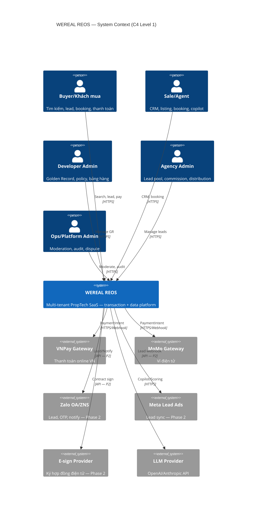

### 2.2 C4 Level 2 — Container Diagram

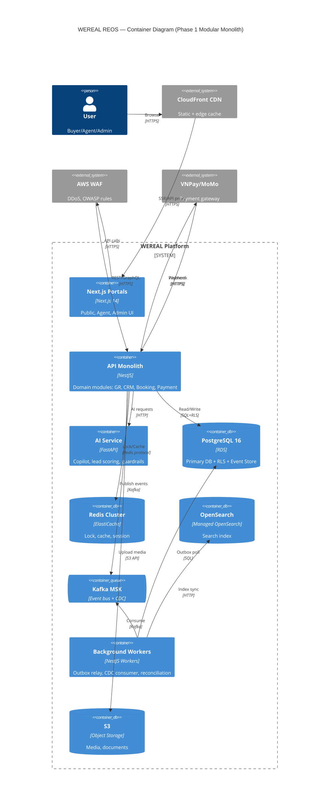

### 2.3 C4 Level 3 — Component Diagram (API Monolith)

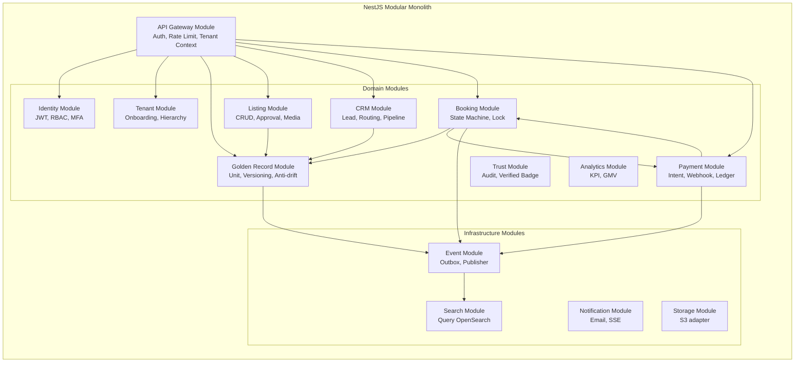

### 2.4 Giải thích Container

| Container | Trách nhiệm | FR chính |
|-----------|-------------|----------|
| Next.js Portals | UI Public, Agent, Admin; SSR; SSE client | FR-UX-01→07 |
| NestJS API Monolith | Business logic, REST API, module boundary | FR-GR, FR-BK, FR-PAY... |
| FastAPI AI Service | LLM gateway, scoring, guardrails | FR-AI-01→04 |
| PostgreSQL 16 | ACID, RLS, event store, outbox table | FR-ID-03, FR-BK-04 |
| Redis | Distributed lock, session, rate limit | FR-BK-02, NFR-P08 |
| OpenSearch | Full-text, facet, geo search | FR-LS-02, FR-LS-06 |
| Kafka MSK | Event bus, CDC stream | FR-BK-04, FR-GR-08 |
| Background Workers | Outbox relay, index sync, reconciliation | FR-PAY-04, FR-LS-06 |
| S3 | Media, contract PDF, export | FR-LS-03 |

---

## 3. Kiến trúc 9 lớp chi tiết (L1–L9)

### 3.1 L1 — Experience Layer

**Trách nhiệm:** Giao diện người dùng đa kênh

**Thành phần:**

- Public Portal (Next.js)
- Agent Portal
- Admin/Ops Portal
- Developer Portal (P2)
- Mobile App (P2)
- Buyer App (P3)
- SSE/WebSocket real-time

**Ánh xạ FR:**

- FR-UX-01: Public search UX
- FR-UX-02: Agent workflow ≤5 phút
- FR-UX-03: Lead form ≤3 click
- FR-UX-04: Responsive 320px+
- FR-UX-05: Real-time unit status
- FR-UX-06: Admin dashboard
- FR-UX-07: Compare products

**Ghi chú kiến trúc:** Portal gọi API qua BFF pattern nhẹ; JWT trong httpOnly cookie; tenant subdomain optional P2.

### 3.2 L2 — Identity & Access Layer

**Trách nhiệm:** Xác thực, phân quyền, tenant context

**Thành phần:**

- Auth Service (JWT+refresh)
- RBAC Engine
- ABAC Policy (Casbin/OPA P3)
- MFA/OTP Service
- Tenant Context Middleware
- KYC/KYB Adapter (P2)
- SSO SAML/OIDC (P4)

**Ánh xạ FR:**

- FR-ID-01: Multi-tenant hierarchy
- FR-ID-02: RBAC + ABAC
- FR-ID-03: Tenant isolation RLS
- FR-ID-04: MFA/OTP sensitive
- FR-ID-05: KYC/KYB (P2)
- FR-ID-06: SSO Enterprise (P4)

**Ghi chú kiến trúc:** Mọi request phải có tenant_id trong JWT claims; middleware set PostgreSQL session variable cho RLS.

### 3.3 L3 — Domain Application Layer

**Trách nhiệm:** Business logic và bounded contexts

**Thành phần:**

- Golden Record Service
- Listing Service
- CRM Service
- Booking/Transaction Engine
- Payment Orchestrator
- Commission Service (P2)
- Marketplace Service (P2)
- Workflow Engine (P4)

**Ánh xạ FR:**

- FR-GR-01→08
- FR-LS-01→06
- FR-CRM-01→09
- FR-BK-01→08
- FR-PAY-01→10
- FR-COM-01→05
- FR-MKT-01→03
- FR-TR-01→05
- FR-AN-01→05
- FR-AI-01→10

**Ghi chú kiến trúc:** Module trong monolith P1; mỗi module có repository, domain model, application service, API controller riêng.

### 3.4 L4 — Data & Workflow Layer

**Trách nhiệm:** Persistence, events, search, cache

**Thành phần:**

- PostgreSQL 16 + RLS
- Event Store (append-only)
- Outbox Table
- Kafka MSK
- Debezium CDC
- OpenSearch Cluster
- Redis Cluster
- S3 Object Storage
- Data Warehouse (P3)

**Ánh xạ FR:**

- FR-BK-04: Event store
- FR-LS-06: Search CDC
- FR-GR-08: Real-time push
- NFR-P04: Sync lag ≤5s
- NFR-S03: Audit immutability

**Ghi chú kiến trúc:** Transactional outbox: INSERT event + business row trong cùng transaction; worker poll và publish Kafka.

### 3.5 L5 — AI Layer

**Trách nhiệm:** AI workforce với guardrails

**Thành phần:**

- AI Gateway (FastAPI)
- Prompt Registry
- Lead Scoring Engine
- Content Copilot
- RAG Pipeline (P2)
- Vector DB (P2)
- AI Agents (P3)
- Feature Store (P3)
- Eval Pipeline

**Ánh xạ FR:**

- FR-AI-01: Content copilot
- FR-AI-02: Lead scoring
- FR-AI-03: RAG assistant (P2)
- FR-AI-04: Guardrails + disclaimer
- FR-AI-05→10: Agents, matching (P2-3)

**Ghi chú kiến trúc:** AI không truy cập DB trực tiếp — chỉ qua API read-only; human-in-the-loop trước publish/send.

### 3.6 L6 — Payment & Finance Layer

**Trách nhiệm:** Thanh toán, ledger, settlement

**Thành phần:**

- Payment Orchestrator
- Gateway Adapters (VNPay, MoMo)
- PaymentIntent Manager
- Double-entry Ledger
- Webhook Idempotency Handler
- Reconciliation Engine
- Refund Service
- Settlement Batch (P2)
- Escrow/BNPL (P5)

**Ánh xạ FR:**

- FR-PAY-01→10
- NFR-P07: Webhook ≤2s
- NFR-CM03: Gateway swap ≤2 sprint
- BR-04: Daily reconciliation

**Ghi chú kiến trúc:** Ledger entries immutable; mọi PaymentConfirmed tạo debit/credit cân bằng; idempotency key trên webhook.

### 3.7 L7 — Intelligence Layer

**Trách nhiệm:** Analytics, BI, forecasting

**Thành phần:**

- KPI Dashboard
- GMV Tracker
- Funnel Analytics
- Absorption Report (P2)
- Campaign Attribution (P3)
- Forecast Engine (P3)
- Executive Reports (P4)
- Market Data Product (P6)

**Ánh xạ FR:**

- FR-AN-01→05
- BR-11: GMV north star

**Ghi chú kiến trúc:** Phase 1: Metabase on read replica; Phase 3: warehouse + dbt + feature store feed.

### 3.8 L8 — Trust & Compliance Layer

**Trách nhiệm:** Audit, verification, dispute

**Thành phần:**

- Verified Listing Engine
- Audit Trail Service
- Document Vault (P2)
- Dispute Center (P3)
- Regulatory Export (P4)
- Anti-fraud Graph (P3)
- AI Action Audit Log

**Ánh xạ FR:**

- FR-TR-01→05
- NFR-C01→05
- BR-08: Audit trail dispute
- BR-24: Retention ≥5 năm

**Ghi chú kiến trúc:** Event store là nguồn audit chính; audit table không UPDATE/DELETE (NFR-S03).

### 3.9 L9 — Network & Ecosystem Layer

**Trách nhiệm:** Omnichannel, partners, API marketplace

**Thành phần:**

- Omnichannel Hub
- Zalo OA/ZNS Connector (P2)
- Meta Lead Ads Connector (P2)
- Webhook Platform (P3)
- API Marketplace (P4)
- Partner Adapters (Bank, E-sign, Valuation)

**Ánh xạ FR:**

- FR-CRM-06: Zalo integration
- FR-CRM-07: Meta Lead Ads
- FR-MKT-01→03
- BR-05: Auto lead sync

**Ghi chú kiến trúc:** Adapter pattern cho mọi partner; circuit breaker + retry; webhook signature verify.

---

## 4. Triển khai Phase 1 — Modular Monolith AWS

### 4.1 Deployment Diagram — AWS ap-southeast-1

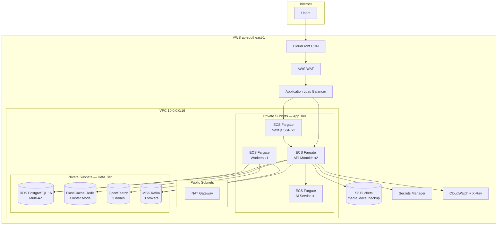

### 4.2 Thông số triển khai Phase 1

| Thành phần | Spec | HA | Ghi chú |
|------------|------|-----|---------|
| ECS Fargate API | 2 tasks, 2 vCPU, 4GB | Multi-AZ | Auto-scale 2–6 |
| ECS Fargate Workers | 1 task, 1 vCPU, 2GB | Multi-AZ | Outbox, CDC, reconcile |
| RDS PostgreSQL 16 | db.r6g.large, Multi-AZ | 99.95% | RLS enabled |
| ElastiCache Redis | cache.r6g.large x3 | Cluster | Lock + session |
| OpenSearch | r6g.large.search x3 | 3-AZ | 1 shard/replica min |
| MSK Kafka | kafka.m5.large x3 | 3 brokers | 7-day retention P1 |
| CloudFront | Global edge | — | Cache static 24h |
| WAF | Managed rules + custom | — | Rate limit, geo block |

### 4.3 CI/CD Pipeline

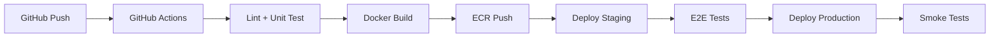

### 4.4 Environment Strategy

| Environment | Mục đích | Data | URL pattern |
|-------------|----------|------|-------------|
| dev | Developer local + shared | Synthetic | localhost / dev.wereal.internal |
| staging | UAT, integration test | Anonymized pilot | staging.wereal.vn |
| production | Pilot go-live | Real tenant data | app.wereal.vn |

---

## 5. Chiến lược tách dịch vụ Phase 2–3

### 5.1 Service Split Diagram — Phase 2–3

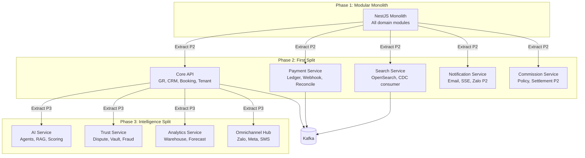

### 5.2 Nguyên tắc tách service

| # | Nguyên tắc | Mô tả |
|---|----------|-------|
| 1 | **Strangler Fig** | Tách từng module khi load/team size đòi hỏi |
| 2 | **Database per service (P3+)** | Payment, Search có DB riêng; sync qua events |
| 3 | **API Gateway** | Kong/AWS API GW trước services P2 |
| 4 | **Event-first communication** | Inter-service qua Kafka, không sync chain dài |
| 5 | **Backward compatible** | Monolith API deprecated 2 sprint trước khi remove |

### 5.3 Thứ tự tách ưu tiên

| Phase | Service | Lý do tách | Sprint ước tính |
|-------|---------|------------|-----------------|
| P2 | Payment Service | PCI scope, webhook isolation, scale độc lập | 4 sprint |
| P2 | Search Service | Read-heavy, OpenSearch tuning riêng | 3 sprint |
| P2 | Notification Service | Fan-out, Zalo/Meta integration | 2 sprint |
| P2 | Commission Service | Settlement batch, payout compliance | 3 sprint |
| P3 | AI Service | GPU, LLM cost isolation | 2 sprint |
| P3 | Trust Service | Dispute, vault, compliance boundary | 3 sprint |
| P3 | Analytics Service | Warehouse ETL, không ảnh hưởng OLTP | 4 sprint |

---

## 6. Topology mạng

### 6.1 Network Architecture Diagram

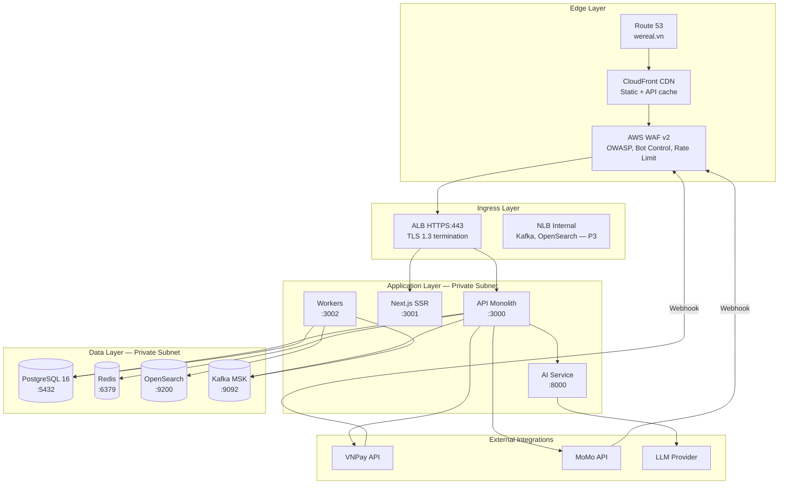

### 6.2 Security Groups và Network ACL

| Source | Destination | Port | Protocol | Mục đích |
|--------|-------------|------|----------|----------|
| 0.0.0.0/0 | ALB | 443 | HTTPS | Public ingress |
| ALB SG | App SG | 3000-3002 | TCP | API routing |
| App SG | RDS SG | 5432 | TCP | Database |
| App SG | Redis SG | 6379 | TCP | Cache/Lock |
| App SG | MSK SG | 9092 | TCP | Kafka |
| App SG | OS SG | 9200 | TCP | Search query |
| Worker SG | OS SG | 9200 | TCP | Index write |
| VNPay IP range | WAF | 443 | HTTPS | Payment webhook |

### 6.3 DNS và Certificate

- **Route 53:** `app.wereal.vn`, `api.wereal.vn`, `staging.wereal.vn`
- **ACM Certificate:** Wildcard `*.wereal.vn`, auto-renew
- **CloudFront:** Origin ALB với custom header validation

---

## 7. Sơ đồ tuần tự (Sequence Diagrams)

### 7.1 Login Flow

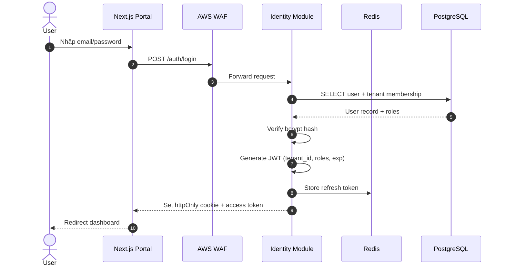

**FR liên kết:** FR-ID-01, FR-ID-02 | **NFR:** NFR-S06 (TLS), NFR-S09 (session timeout)

### 7.2 Lead Capture Flow

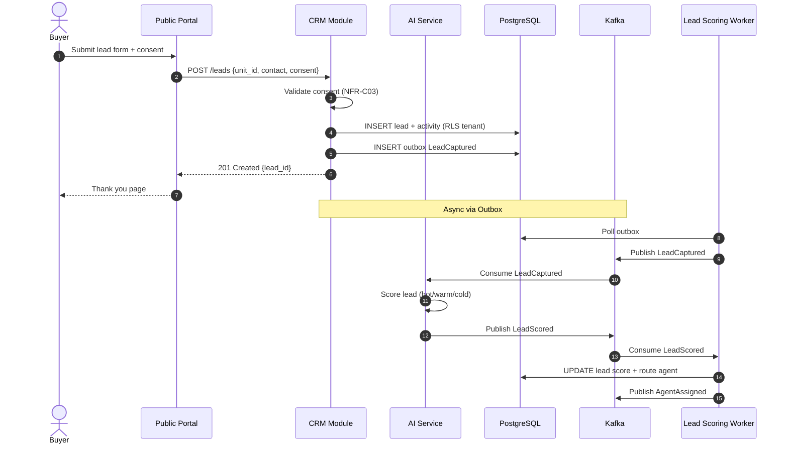

**FR liên kết:** FR-CRM-01, FR-CRM-02, FR-CRM-03, FR-AI-02 | **Events:** LeadCaptured, LeadScored, AgentAssigned

### 7.3 Listing Create + Approve Flow

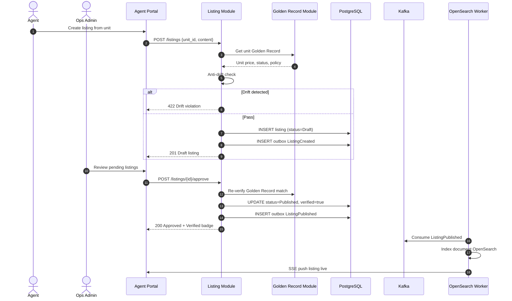

**FR liên kết:** FR-LS-01, FR-GR-04, FR-GR-05, FR-TR-01 | **Events:** ListingCreated, ListingPublished, ListingDriftDetected

### 7.4 Booking + Atomic Lock Flow

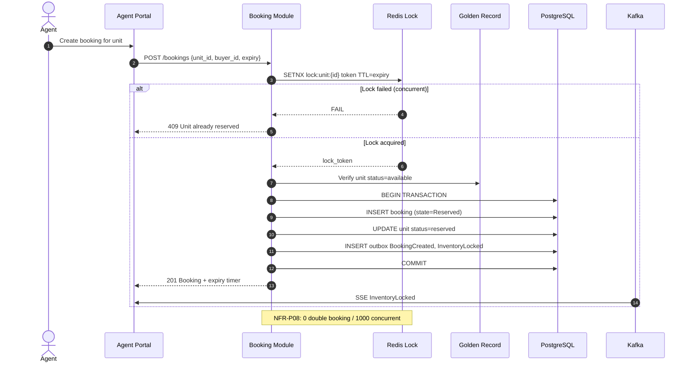

**FR liên kết:** FR-BK-01, FR-BK-02, FR-BK-03 | **Events:** BookingCreated, InventoryLocked | **State:** Scheduled → Reserved

### 7.5 Payment Webhook Flow

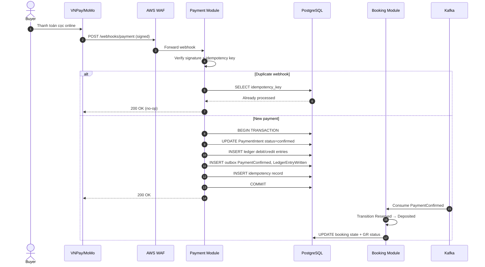

**FR liên kết:** FR-PAY-01, FR-PAY-03, FR-PAY-04, FR-PAY-05 | **NFR:** NFR-P07 (≤2s) | **Events:** PaymentConfirmed, LedgerEntryWritten

### 7.6 AI Copilot Flow

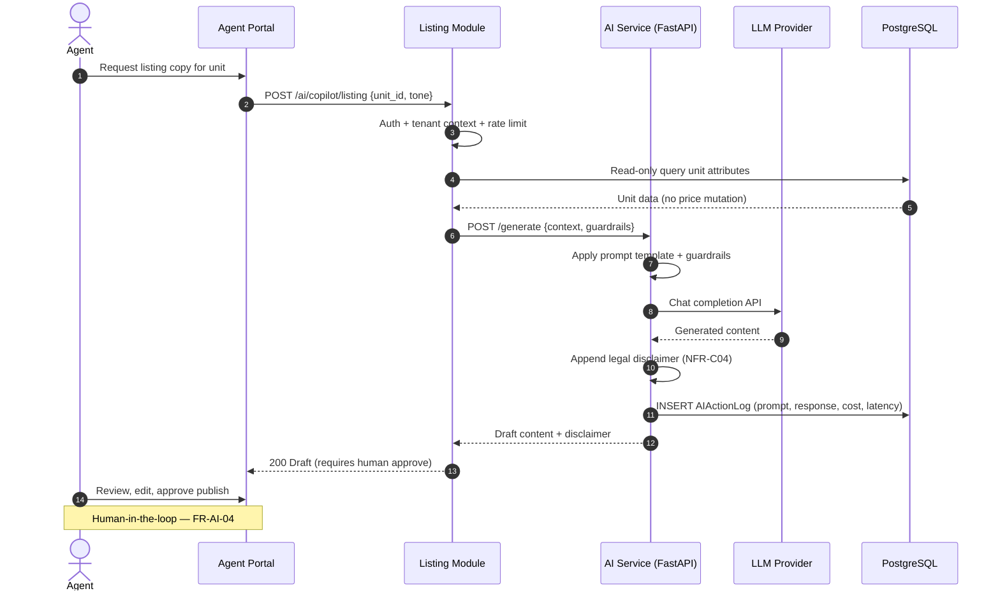

**FR liên kết:** FR-AI-01, FR-AI-04 | **NFR:** NFR-P05 (≤8s P95), NFR-C04 (disclaimer)

---

## 8. Luồng dữ liệu (Data Flow)

### 8.1 CDC Golden Record → Search Index

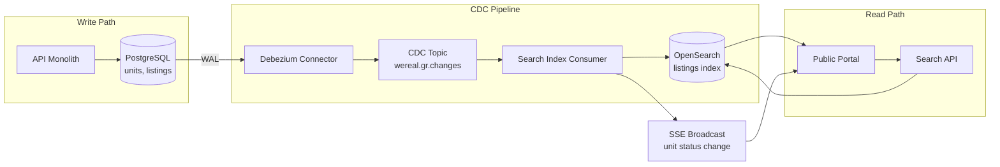

**SLA:** NFR-P04 — lag ≤ 5 giây (Phase 1); ≤ 1 giây (Phase 3 CQRS)

**CDC Event Types:**

| Table | Operation | Index Action |
|-------|-----------|--------------|
| units | INSERT/UPDATE | Upsert listing doc (denormalized) |
| units | status change | Update availability facet + SSE |
| listings | INSERT/UPDATE | Upsert marketing fields |
| listings | DELETE | Soft-delete from index |

### 8.2 Event Bus Flows

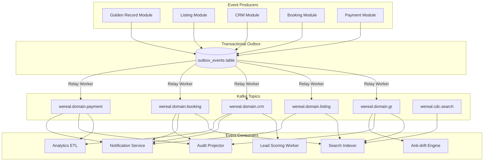

### 8.3 Event Store vs Kafka

| Khía cạnh | Event Store (PostgreSQL) | Kafka |
|-----------|-------------------------|-------|
| **Mục đích** | Source of truth, replay, dispute audit | Async fan-out, integration |
| **Retention** | ≥ 5 năm (BR-24, NFR-S03) | 7 ngày P1; 30 ngày P3 |
| **Query** | SQL timeline by aggregate_id | Consumer group offset |
| **Consistency** | Same transaction as business row | At-least-once + idempotent consumer |

---

## 9. Kiến trúc bảo mật

### 9.1 Security Architecture Diagram

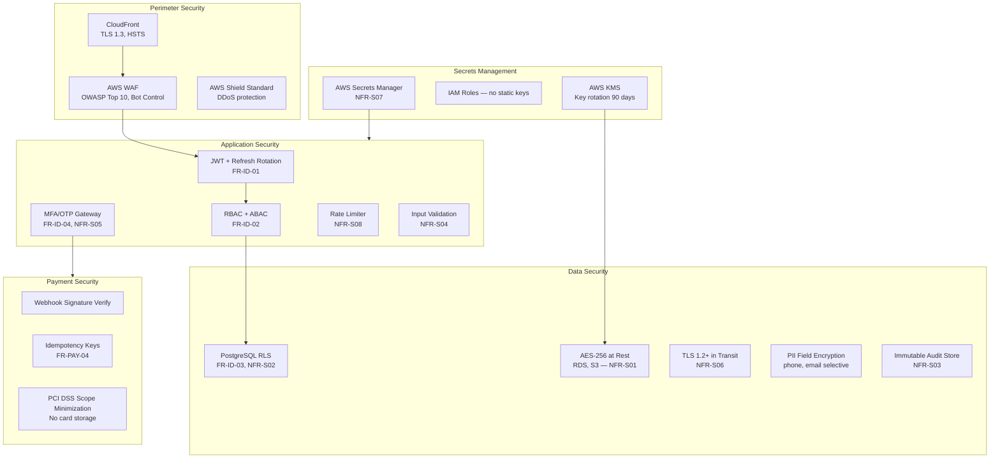

### 9.2 Security Controls Matrix

| Layer | Control | NFR/FR | Implementation |
|-------|---------|--------|----------------|
| Edge | WAF managed rules | NFR-S04 | AWS WAF OWASP 3.2 |
| Edge | Rate limiting | NFR-S08 | WAF + Redis token bucket |
| App | JWT short-lived | NFR-S09 | Access 15m, refresh 7d |
| App | MFA payment/admin | NFR-S05, FR-ID-04 | TOTP + SMS OTP |
| Data | Tenant RLS | NFR-S02, FR-ID-03 | PostgreSQL policy per tenant |
| Data | Audit immutability | NFR-S03 | Append-only, no DELETE |
| Payment | Webhook verify | FR-PAY-04 | HMAC-SHA256 signature |
| AI | Guardrails | FR-AI-04 | Read-only API, action log |

### 9.3 Threat Model (STRIDE Summary)

| Threat | Mitigation | Priority |
|--------|------------|----------|
| Spoofing (fake webhook) | Signature verify + IP allowlist | P0 |
| Tampering (price drift) | Anti-drift engine + Golden Record | P0 |
| Repudiation | Event store + audit trail 5 năm | P0 |
| Info Disclosure (cross-tenant) | RLS + tenant context middleware | P0 |
| DoS | WAF + rate limit + auto-scale | P1 |
| Elevation of privilege | RBAC + ABAC + MFA | P0 |

---

## 10. Cách ly Multi-Tenant

### 10.1 Multi-Tenant Isolation Diagram

```mermaid
flowchart TB
    subgraph Tenants["Tenant Hierarchy"]
        PLT[Platform Tenant<br/>tenant_id=platform]
        DEV1[Developer Tenant A<br/>tenant_id=dev-a]
        DEV2[Developer Tenant B<br/>tenant_id=dev-b]
        AGY1[Agency Tenant X<br/>tenant_id=agy-x]
        AGY2[Agency Tenant Y<br/>tenant_id=agy-y]
        BR1[Branch<br/>parent=agy-x]
    end
    subgraph Request["Request Flow"]
        REQ[HTTP Request] --> MW[Tenant Context Middleware]
        MW --> JWT[Extract tenant_id from JWT]
        JWT --> SET[SET app.current_tenant = tenant_id]
        SET --> API[Domain API Handler]
    end
    subgraph DB["PostgreSQL RLS"]
        API --> PG[(Shared Database)]
        PG --> POL1[Policy: tenant_id = current_setting]
        PG --> POL2[Policy: platform admin bypass]
        PG --> POL3[Policy: cross-tenant via distribution grant]
    end
    subgraph Cache["Redis Namespace"]
        API --> REDIS[Key prefix: tenant:{id}:*]
    end
    subgraph Search["OpenSearch"]
        API --> OS[Index alias per tenant<br/>listings_{tenant_id}]
    end
    DEV1 --> PG
    AGY1 --> PG
    PLT --> POL2
```

### 10.2 Tenant Isolation Rules

| # | Quy tắc | Enforcement | Test |
|---|---------|-------------|------|
| 1 | Mọi bảng business có `tenant_id` NOT NULL | DB constraint + migration lint | Integration test |
| 2 | API middleware reject missing tenant | 401 Unauthorized | Unit test |
| 3 | RLS policy trên mọi table P1 | PostgreSQL ENABLE ROW LEVEL SECURITY | Pen test NFR-S02 |
| 4 | Redis key namespace `{tenant_id}:` | Application convention | Load test |
| 5 | OpenSearch index alias per tenant | Search module filter | Query test |
| 6 | S3 prefix `s3://bucket/{tenant_id}/` | IAM policy + app validation | Access test |
| 7 | Kafka message header `tenant_id` | Producer interceptor | Consumer test |
| 8 | AI vector index isolated per tenant | Separate collection P2 | Isolation test |

### 10.3 Cross-Tenant Access (Distribution Policy)

Agency tenant có thể **read** Golden Record unit thuộc Developer tenant khi có Distribution Policy active:

```sql
-- RLS policy example (simplified)
CREATE POLICY agency_read_gr ON units FOR SELECT
USING (
  tenant_id = current_setting('app.current_tenant')::uuid
  OR EXISTS (
    SELECT 1 FROM distribution_grants dg
    WHERE dg.agency_tenant_id = current_setting('app.current_tenant')::uuid
    AND dg.developer_tenant_id = units.tenant_id
    AND dg.project_id = units.project_id
    AND dg.status = 'active'
  )
);
```

---

## 11. Đồ thị phụ thuộc module

### 11.1 Module Dependency Graph

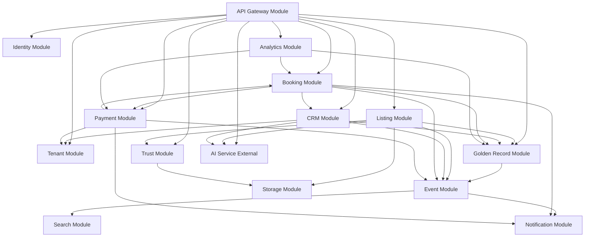

### 11.2 Dependency Rules

| Rule | Mô tả | Violation Action |
|------|-------|------------------|
| **No circular domain deps** | BK→PAY OK; PAY→BK chỉ qua events | CI lint fail |
| **GR is upstream** | GR không depend Listing/CRM | Architecture review |
| **Event Module is leaf infra** | Domain modules publish, không subscribe cross-module sync | Code review |
| **AI is external** | AI Service gọi qua HTTP, không import domain code | Module boundary test |
| **Search is read-only consumer** | Search module không write PostgreSQL business tables | Integration test |

### 11.3 NestJS Module Structure (Phase 1)

```
src/
├── main.ts
├── app.module.ts
├── common/           # Shared: guards, filters, interceptors
├── infrastructure/   # Event, Search, Storage, Notification
└── modules/
    ├── identity/
    ├── tenant/
    ├── golden-record/
    ├── listing/
    ├── crm/
    ├── booking/
    ├── payment/
    ├── trust/
    └── analytics/
```

---

## 12. Bối cảnh tích hợp (Integration Landscape)

### 12.1 Integration Landscape Diagram

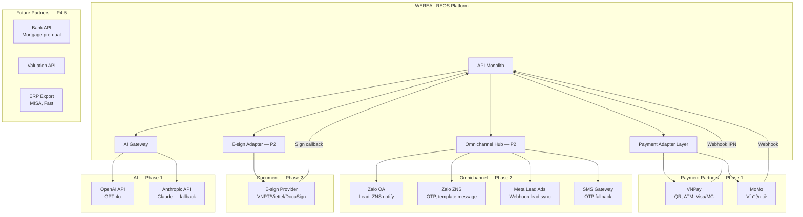

### 12.2 Payment Integration — VNPay / MoMo

| Khía cạnh | VNPay | MoMo |
|-----------|-------|------|
| **Phase** | 1 (primary) | 1 (secondary) |
| **Methods** | QR, ATM, Visa/MC | Ví MoMo |
| **Flow** | PaymentIntent → redirect URL → IPN webhook | App invoke → callback webhook |
| **Idempotency** | `vnp_TxnRef` = PaymentIntent ID | `orderId` = PaymentIntent ID |
| **Signature** | HMAC-SHA512 `vnp_SecureHash` | HMAC-SHA256 `signature` |
| **Reconciliation** | Daily CSV/API match | Daily API match |
| **FR** | FR-PAY-01, FR-PAY-04 | FR-PAY-01, FR-PAY-04 |
| **NFR** | NFR-P07 (≤2s webhook), NFR-CM03 | NFR-P07, NFR-CM03 |

**Adapter Interface (NestJS):**

```typescript
interface PaymentGatewayAdapter {
  createPaymentIntent(intent: PaymentIntentDto): Promise<PaymentRedirect>;
  verifyWebhook(payload: unknown, signature: string): WebhookResult;
  queryStatus(transactionRef: string): Promise<PaymentStatus>;
  refund(paymentId: string, amount: number): Promise<RefundResult>;
}
```

### 12.3 Zalo Integration — Phase 2

| Use Case | API | Direction | FR |
|----------|-----|-----------|-----|
| Lead từ Zalo OA | Zalo OA Message API | Inbound webhook | FR-CRM-06 |
| Gửi OTP/MFA | ZNS Template Message | Outbound | FR-ID-04 |
| Booking confirmation | ZNS Template | Outbound | FR-CRM-06 |
| SLA reminder | ZNS Template | Outbound | FR-CRM-08 |

### 12.4 Meta Lead Ads — Phase 2

- **Webhook:** Meta Leadgen webhook → Omnichannel Hub → normalize → CRM LeadCaptured
- **Attribution:** UTM + `campaign_id` + `ad_id` lưu vào lead record
- **Consent:** Map Meta lead field consent → NFR-C03 compliance
- **FR:** FR-CRM-07, BR-05

### 12.5 E-sign Integration — Phase 2

| Step | Action | Event |
|------|--------|-------|
| 1 | ContractGenerated → send to e-sign provider | ContractGenerated |
| 2 | Buyer receives sign link (MFA required) | — |
| 3 | Provider callback on complete | ContractSigned |
| 4 | Update booking state → ContractSigned | State transition #11 |
| 5 | Store signed PDF in Document Vault | FR-TR-02 |

### 12.6 LLM Integration — Phase 1

| Capability | Provider | Guardrail | FR |
|------------|----------|-----------|-----|
| Listing copy copilot | OpenAI GPT-4o | Human approve before publish | FR-AI-01 |
| Lead scoring | OpenAI + rules hybrid | No PII in prompt log | FR-AI-02 |
| Legal disclaimer | Template append | Mandatory NFR-C04 | FR-AI-04 |
| RAG assistant | OpenAI + Vector DB | Citation required P2 | FR-AI-03 |

**Cost control:** Token budget per tenant per month; circuit breaker khi vượt 120% quota.

---

## 13. Ánh xạ NFR, ADR và vận hành

### 13.1 NFR Mapping to Architecture

| NFR ID | Category | Target | Architectural Component |
|--------|----------|--------|------------------------|
| NFR-P01 | Performance | API read P95 ≤500ms | ALB + ECS auto-scale + Redis cache |
| NFR-P02 | Performance | API write P95 ≤800ms | PostgreSQL tuning + connection pool |
| NFR-P03 | Performance | Search P95 ≤200ms | OpenSearch cluster + CDN cache |
| NFR-P04 | Performance | GR→Search lag ≤5s | Debezium CDC + Kafka consumer |
| NFR-P05 | Performance | AI copilot P95 ≤8s | FastAPI async + LLM timeout 7s |
| NFR-P06 | Performance | Lead scoring ≤3s | Async Kafka consumer |
| NFR-P07 | Performance | Webhook processing ≤2s | Idempotent handler + DB index |
| NFR-P08 | Performance | Zero double booking | Redis SETNX distributed lock |
| NFR-S01 | Security | AES-256 at rest | RDS encryption + S3 SSE-KMS |
| NFR-S02 | Security | Zero cross-tenant | PostgreSQL RLS + middleware |
| NFR-S03 | Security | Audit immutability | Append-only event store |
| NFR-S04 | Security | OWASP Top 10 | WAF + input validation + SAST |
| NFR-S05 | Security | MFA 100% sensitive | MFA service + payment gate |
| NFR-S06 | Security | TLS 1.2+ | ACM cert + ALB policy |
| NFR-S07 | Security | No secrets in code | Secrets Manager + IAM roles |
| NFR-S08 | Security | Rate limiting | WAF + Redis token bucket |
| NFR-S09 | Security | Session timeout ≤8h | JWT exp + refresh rotation |
| NFR-SC01 | Scalability | 500 concurrent P1 | ECS 2-6 tasks + RDS read replica |
| NFR-A01 | Availability | 99.5% uptime | Multi-AZ RDS + ECS + health checks |
| NFR-A02 | Availability | RPO ≤24h | RDS automated backup daily |
| NFR-A03 | Availability | RTO ≤4h | Runbook + Terraform IaC |
| NFR-O01 | Operability | JSON structured logs | OpenTelemetry + CloudWatch |
| NFR-O02 | Operability | P0 alert ≤15min | PagerDuty + on-call rotation |
| NFR-O03 | Operability | Daily reconcile 06:00 ICT | Cron worker + report S3 |
| NFR-O04 | Operability | Feature flags | LaunchDarkly / custom flag service |
| NFR-M01 | Maintainability | 70% coverage critical | Jest + integration test CI |
| NFR-M02 | Maintainability | OpenAPI 100% endpoints | Swagger auto-gen NestJS |
| NFR-M03 | Maintainability | ADR cross-cutting | ADR repo `/docs/adr/` |
| NFR-C03 | Compliance | PDPA consent | Lead form middleware validation |
| NFR-C04 | Compliance | AI disclaimer | AI service response wrapper |

### 13.2 Architecture Decision Records (ADR)

| ADR ID | Title | Status | Decision Summary |
|--------|-------|--------|------------------|
| ADR-001 | Golden Record as Source of Truth | Accepted | Developer unit master; Agency marketing layer only; anti-drift mandatory |
| ADR-002 | Event Sourcing for Transactions | Accepted | 24 domain events; append-only store; state machine projection |
| ADR-003 | Modular Monolith Phase 1 | Accepted | Single deployable; module boundary for future extraction |
| ADR-004 | PostgreSQL RLS for Tenant Isolation | Accepted | DB-level isolation; not app-filter only |
| ADR-005 | Transactional Outbox Pattern | Accepted | Reliable Kafka publish; no dual-write |
| ADR-006 | Redis Distributed Lock for Booking | Accepted | SETNX + TTL; release on expiry/cancel |
| ADR-007 | Debezium CDC for Search Sync | Accepted | WAL-based; ≤5s lag Phase 1 |
| ADR-008 | Payment Adapter Pattern | Accepted | Interface per gateway; VNPay P1 primary |
| ADR-009 | FastAPI for AI Service | Accepted | Isolate LLM cost/latency; guardrails layer |
| ADR-010 | AWS ap-southeast-1 Primary Region | Accepted | Latency VN; DR plan Phase 4 multi-region |
| ADR-011 | NestJS for Domain API | Accepted | TypeScript full-stack; module DI; OpenAPI |
| ADR-012 | Kafka over RabbitMQ | Accepted | Event retention; CDC; scale P2+ |
| ADR-013 | OpenSearch over Elasticsearch | Accepted | AWS managed; cost; OSS compatibility |
| ADR-014 | Human-in-the-loop AI | Accepted | No auto-publish; AIActionLog mandatory |
| ADR-015 | No Blockchain for Audit | Accepted | Event store sufficient; EX-02 out of scope |

### 13.3 Operational Concerns

#### 13.3.1 Observability Stack

| Signal | Tool | Alert Threshold |
|--------|------|-----------------|
| Logs | CloudWatch Logs + structured JSON | Error rate >1% / 5min |
| Metrics | CloudWatch + Grafana | API P95 >500ms / 5min |
| Traces | AWS X-Ray + OpenTelemetry | Trace error >5% |
| Uptime | Route 53 health check | 2 consecutive failures |
| Business | Custom GMV/booking counters | Booking failure rate >2% |

#### 13.3.2 Runbooks (Top 10 Incidents)

| # | Incident | Runbook | RTO Target |
|---|----------|---------|------------|
| 1 | PostgreSQL failover | RDS Multi-AZ auto failover | <5 min |
| 2 | Redis cluster node down | ElastiCache auto recovery | <10 min |
| 3 | Payment webhook storm | Enable idempotency + rate limit | <15 min |
| 4 | Double booking detected | Manual lock audit + GR reconcile | <30 min |
| 5 | CDC lag >30s | Restart Debezium connector | <20 min |
| 6 | OpenSearch cluster red | Shard reallocation | <30 min |
| 7 | Kafka consumer lag | Scale worker tasks | <15 min |
| 8 | LLM provider outage | Failover Anthropic fallback | <5 min |
| 9 | WAF false positive block | Rule exception + IP whitelist | <10 min |
| 10 | Cross-tenant data leak suspicion | Disable tenant + forensics | <60 min |

#### 13.3.3 Backup & DR

| Component | Backup Strategy | Retention | RPO |
|-----------|----------------|-----------|-----|
| PostgreSQL | Automated daily snapshot + WAL | 35 days | ≤24h |
| Redis | Daily RDB snapshot | 7 days | ≤24h |
| S3 | Versioning enabled | 90 days | 0 |
| Kafka | Mirror to S3 (P3) | 7 days P1 | ≤1h P3 |
| Event Store | Included in PG backup | 5+ years archive P2 | ≤24h |

#### 13.3.4 Capacity Planning Phase 1

| Metric | Pilot Target | Scale Trigger |
|--------|--------------|---------------|
| Tenants | 3 (1 Dev, 2 Agency) | >10 tenants → review |
| Units (GR) | 5,000 | >20,000 → read replica |
| Concurrent users | 500 | >400 → scale ECS |
| Bookings/day | 100 | >500 → booking module perf test |
| Events/day | 50,000 | >200,000 → Kafka partition increase |

---

## 14. State Machine & Domain Events

### 14.1 Booking State Machine — 15 Trạng thái

State machine định nghĩa lifecycle giao dịch end-to-end, map 1:1 với CRM pipeline và event store.

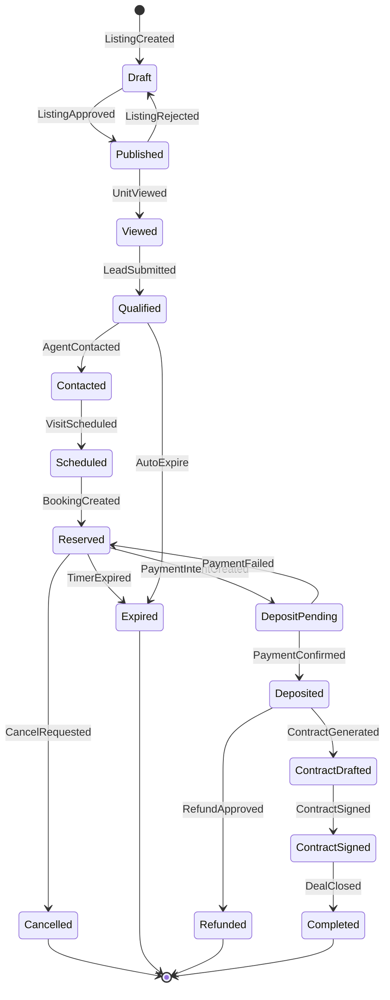

### 14.2 Bảng 15 Trạng thái chính

| # | State | Mô tả | Actor chính | FR |
|---|-------|-------|-------------|-----|
| 1 | Draft | Listing mới tạo, chưa duyệt | Agent | FR-LS-01 |
| 2 | Published | Listing live, indexed search | Ops Admin | FR-LS-01, FR-GR-05 |
| 3 | Viewed | Buyer xem chi tiết unit | Buyer | FR-LS-02 |
| 4 | Qualified | Lead hợp lệ + consent | Buyer | FR-CRM-01 |
| 5 | Contacted | Agent đã liên hệ | Agent | FR-CRM-04 |
| 6 | Scheduled | Lịch hẹn xem nhà | Agent | FR-CRM-04 |
| 7 | Reserved | Giữ chỗ — lock active | Agent | FR-BK-01, FR-BK-02 |
| 8 | DepositPending | Chờ thanh toán cọc | System | FR-PAY-05 |
| 9 | Deposited | Cọc confirmed + ledger | System | FR-PAY-03 |
| 10 | ContractDrafted | Hợp đồng generated | System | FR-BK-05 |
| 11 | ContractSigned | E-sign hoàn tất | Buyer | FR-BK-06 |
| 12 | Completed | Deal chốt | System | FR-COM-02 |
| 13 | Cancelled | Hủy booking | Agent/Ops | FR-BK-07 |
| 14 | Expired | Hết hạn giữ chỗ/SLA | System | FR-BK-01, BR-17 |
| 15 | Refunded | Hoàn tiền + ledger reversal | Ops Admin | FR-BK-07, FR-PAY-06 |

### 14.3 Transition Rules (18 transitions — SRS §6.3)

| # | From | Trigger | To | Guard | Side Effect |
|---|------|---------|-----|-------|-------------|
| 1 | — | ListingCreated | Draft | Unit available | Create listing |
| 2 | Draft | ListingApproved | Published | Anti-drift pass | Index search, SSE |
| 3 | Published | UnitViewed | Viewed | Buyer opens detail | Log view |
| 4 | Viewed | LeadSubmitted | Qualified | Consent OK | Create lead, AI score |
| 5 | Qualified | AgentContacted | Contacted | Agent logs activity | SLA timer |
| 6 | Contacted | VisitScheduled | Scheduled | Meeting booked | Calendar event |
| 7 | Scheduled | BookingCreated | Reserved | Lock success | Lock unit, timer |
| 8 | Reserved | PaymentIntentCreated | DepositPending | Min deposit met | Payment link |
| 9 | DepositPending | PaymentConfirmed | Deposited | Webhook verified | Ledger, GR reserved |
| 10 | Deposited | ContractGenerated | ContractDrafted | Template merged | Doc vault |
| 11 | ContractDrafted | ContractSigned | ContractSigned | E-sign + MFA | Audit trail |
| 12 | ContractSigned | DealClosed | Completed | All conditions met | Commission snapshot |
| 13 | Reserved | TimerExpired | Expired | expiry_at passed | Release lock |
| 14 | DepositPending | PaymentFailed | Reserved | Gateway fail | Notify agent |
| 15 | Any pre-Completed | CancelRequested | Cancelled | Policy allows | Release lock |
| 16 | Deposited | RefundApproved | Refunded | Refund processed | Ledger reversal |
| 17 | Published | ListingRejected | Draft | Ops reject | Notify agent |
| 18 | Qualified | AutoExpire | Expired | SLA breach | Re-route lead |

### 14.4 Domain Events — 24 Events (SRS §6.4)

| # | Event | Payload chính | Emitter | Consumer |
|---|-------|---------------|---------|----------|
| 1 | UnitCreated | unit_id, project_id, attributes, version | GR Service | Search CDC, Audit |
| 2 | UnitPriceChanged | unit_id, old_price, new_price, version_id | GR Service | Anti-drift, SSE, Search |
| 3 | UnitStatusChanged | unit_id, old_status, new_status | GR Service | SSE, Search, Listing |
| 4 | ListingCreated | listing_id, unit_id, agent_id | Listing Service | Anti-drift check |
| 5 | ListingPublished | listing_id, verified | Listing Service | Search index, Portal |
| 6 | ListingDriftDetected | listing_id, violations[] | Anti-drift Engine | Ops alert, Block |
| 7 | LeadCaptured | lead_id, source, campaign, unit_id | CRM Service | AI Scoring, Routing |
| 8 | LeadScored | lead_id, score, tier | AI Service | CRM, Routing |
| 9 | AgentAssigned | lead_id, agent_id, rule | CRM Service | Notification |
| 10 | BookingCreated | booking_id, unit_id, buyer_id, expiry | Booking Service | Inventory Lock |
| 11 | InventoryLocked | unit_id, booking_id, lock_token | Booking Service | GR status, SSE |
| 12 | InventoryReleased | unit_id, booking_id, reason | Booking Service | GR status, SSE |
| 13 | PaymentIntentCreated | intent_id, booking_id, amount | Payment Service | Notification |
| 14 | PaymentConfirmed | intent_id, gateway_ref, amount | Payment Service | Booking, Ledger, GR |
| 15 | PaymentFailed | intent_id, reason, retry_count | Payment Service | Booking, Alert |
| 16 | LedgerEntryWritten | entry_id, debit, credit, ref | Ledger Service | Reconciliation, AN |
| 17 | ContractGenerated | contract_id, booking_id, template_ver | Contract Service | Doc Vault |
| 18 | ContractSigned | contract_id, signer, timestamp | E-sign Adapter | Booking state |
| 19 | DealCompleted | deal_id, booking_id, final_amount | Booking Service | Commission, AN |
| 20 | CommissionCalculated | deal_id, snapshot_id, splits[] | Commission Service | Settlement |
| 21 | SettlementTriggered | batch_id, period, total | Payment Service | Payout, Export |
| 22 | BookingCancelled | booking_id, reason, actor | Booking Service | Lock release, Notify |
| 23 | RefundProcessed | refund_id, original_payment, amount | Payment Service | Ledger reversal |
| 24 | DisputeOpened | case_id, deal_id, evidence_refs[] | Trust Service | Holdback COM, Ops |

### 14.5 Event Schema Convention

```json
{
  "event_id": "uuid",
  "event_type": "BookingCreated",
  "aggregate_type": "booking",
  "aggregate_id": "booking-uuid",
  "tenant_id": "tenant-uuid",
  "version": 1,
  "occurred_at": "2026-07-28T10:00:00Z",
  "actor_id": "user-uuid",
  "correlation_id": "trace-uuid",
  "payload": { "unit_id": "...", "expiry": "..." }
}
```

**Kafka Topic Mapping:**

| Topic | Events | Partitions P1 |
|-------|--------|---------------|
| wereal.domain.gr | UnitCreated, UnitPriceChanged, UnitStatusChanged | 6 |
| wereal.domain.listing | ListingCreated, ListingPublished, ListingDriftDetected | 6 |
| wereal.domain.crm | LeadCaptured, LeadScored, AgentAssigned | 6 |
| wereal.domain.booking | BookingCreated, InventoryLocked, InventoryReleased, BookingCancelled, DealCompleted | 12 |
| wereal.domain.payment | PaymentIntentCreated, PaymentConfirmed, PaymentFailed, LedgerEntryWritten, RefundProcessed, SettlementTriggered | 12 |
| wereal.domain.contract | ContractGenerated, ContractSigned | 3 |
| wereal.domain.commission | CommissionCalculated | 3 |
| wereal.domain.trust | DisputeOpened | 3 |

---

## 15. Phụ lục — Ma trận truy vết

### 15.1 Ma trận truy vết FR → Layer → Component

| Module | FR Range | Layer/Component | ADR | Phase 1 |
|--------|----------|-----------------|-----|---------|
| Golden Record (GR) | FR-GR-01→08 | L3 GR Module, L4 CDC | ADR-001, ADR-007 | P1: 6 Must |
| Identity (ID) | FR-ID-01→06 | L2 Identity Module, L4 RLS | ADR-004 | P1: 4 Must |
| Listing & Search (LS) | FR-LS-01→06 | L3 Listing, L4 OpenSearch | ADR-007 | P1: 4 Must |
| CRM (CRM) | FR-CRM-01→09 | L3 CRM, L9 Omnichannel | ADR-012 | P1: 5 Must |
| Booking (BK) | FR-BK-01→08 | L3 Booking, L4 Event Store | ADR-002, ADR-006 | P1: 5 Must |
| Payment (PAY) | FR-PAY-01→10 | L6 Payment, L4 Ledger | ADR-008 | P1: 5 Must |
| Commission (COM) | FR-COM-01→05 | L3 Commission (P2) | ADR-002 | P2: 2 Must |
| AI (AI) | FR-AI-01→10 | L5 AI Gateway | ADR-009, ADR-014 | P1: 4 Must |
| Trust (TR) | FR-TR-01→05 | L8 Trust Layer | ADR-002 | P1: 2 Must |
| Analytics (AN) | FR-AN-01→05 | L7 Intelligence | — | P1: 1 Must |
| Marketplace (MKT) | FR-MKT-01→03 | L3 Marketplace (P2) | — | P2 |
| Experience (UX) | FR-UX-01→07 | L1 Portals | ADR-011 | P1: 3 Must |

### 15.2 Ma trận truy vết NFR → Infrastructure

| NFR | Target | Infrastructure | Verification |
|-----|--------|----------------|--------------|
| NFR-P01 | API read P95 ≤500ms | ECS + Redis cache | k6 load test |
| NFR-P04 | CDC lag ≤5s | Debezium + Kafka + OS consumer | Integration test |
| NFR-P08 | Zero double booking | Redis SETNX lock | 1000 concurrent test |
| NFR-S02 | Zero cross-tenant | PostgreSQL RLS | Pen test |
| NFR-S03 | Audit immutable | Event store append-only | DB permission audit |
| NFR-A01 | 99.5% uptime | Multi-AZ all tiers | Monthly SLA report |
| NFR-O03 | Daily reconcile 06:00 | Cron worker + S3 report | Monitor job success |

### 15.3 Ma trận truy vết Business Rule → Architecture

| BR | Mô tả | Component | FR/NFR |
|----|-------|-----------|--------|
| BR-01 | Golden Record do Developer quản lý | GR Module + anti-drift | FR-GR-01,03,04 |
| BR-02 | Giao dịch qua platform | Booking + Payment mandatory | FR-BK-01, FR-PAY-05 |
| BR-03 | Chống double booking | Redis lock + GR status | FR-BK-02, NFR-P08 |
| BR-04 | Đối soát tự động hàng ngày | Reconciliation worker | FR-PAY-03,04 |
| BR-08 | Audit trail tranh chấp | Event store 5 năm | FR-BK-04, NFR-S03 |
| BR-14 | MFA payment action | MFA service gate | FR-ID-04, NFR-S05 |
| BR-17 | Booking expiry auto release | Timer worker + InventoryReleased | FR-BK-01 |
| BR-20 | Search sync ≤5s | CDC pipeline | FR-LS-06, NFR-P04 |
| BR-21 | Webhook idempotent | Idempotency table | FR-PAY-04 |
| BR-24 | Event retention ≥5 năm | Event store archive | FR-BK-04, NFR-S03 |

### 15.4 Ma trận truy vết Use Case → Sequence Diagram

| Use Case | Sequence Diagram | Section |
|----------|------------------|---------|
| UC-ID-01 Login | Login Flow | §7.1 |
| UC-CRM-01 Lead capture | Lead Capture Flow | §7.2 |
| UC-LS-01 Create listing | Listing Create + Approve | §7.3 |
| UC-BK-01 Create booking | Booking + Atomic Lock | §7.4 |
| UC-PAY-01 Payment webhook | Payment Webhook Flow | §7.5 |
| UC-AI-01 Content copilot | AI Copilot Flow | §7.6 |
| UC-GR-01 Manage unit | CDC Golden Record → Search | §8.1 |
| UC-BK-03 Event timeline | Event Bus Flows | §8.2 |

### 15.5 Database Schema Overview (Phase 1 Core Tables)

| Table Group | Tables | RLS | Event Sourced |
|-------------|--------|-----|---------------|
| Tenant | tenants, organizations, users, roles, permissions | ✓ | — |
| Golden Record | projects, phases, buildings, units, price_versions, inventory_snapshots | ✓ | Version history |
| Listing | listings, media_assets, listing_approvals | ✓ | — |
| CRM | leads, crm_activities, campaigns, lead_assignments | ✓ | — |
| Booking | bookings, reservations, booking_state_history | ✓ | ✓ State machine |
| Payment | payment_intents, payments, refunds, ledger_entries, idempotency_keys | ✓ | ✓ Ledger |
| Event | domain_events, outbox_events | ✓ | ✓ Append-only |
| Trust | audit_logs, verified_listings, ai_action_logs | ✓ | ✓ Immutable |

### 15.6 API Endpoint Groups (Phase 1)

| Prefix | Module | Auth | Rate Limit |
|--------|--------|------|------------|
| `/api/v1/auth/*` | Identity | Public/Authenticated | 10/min login |
| `/api/v1/tenants/*` | Tenant | Platform Admin | 100/min |
| `/api/v1/units/*` | Golden Record | Dev Admin, Agent read | 200/min |
| `/api/v1/listings/*` | Listing | Agent, Ops | 100/min |
| `/api/v1/leads/*` | CRM | Agent, Public create | 50/min |
| `/api/v1/bookings/*` | Booking | Agent | 50/min |
| `/api/v1/payments/*` | Payment | Agent, Buyer | 30/min |
| `/api/v1/webhooks/payment` | Payment | Gateway IP whitelist | 1000/min |
| `/api/v1/search/*` | Search | Public read | 500/min |
| `/api/v1/ai/*` | AI Proxy | Agent | 20/min |
| `/api/v1/analytics/*` | Analytics | Admin | 100/min |
| `/api/v1/audit/*` | Trust | Ops Admin | 50/min |

### 15.7 Phase Gate Architecture Checklist

| Gate | Phase | Architecture Criteria | Status |
|------|-------|----------------------|--------|
| G1 | P1 MVP | Modular monolith deployed Multi-AZ | ☐ Pending |
| G1 | P1 MVP | RLS pen test passed (0 cross-tenant) | ☐ Pending |
| G1 | P1 MVP | Double booking test 1000 concurrent = 0 | ☐ Pending |
| G1 | P1 MVP | CDC lag P95 ≤5s | ☐ Pending |
| G1 | P1 MVP | Payment webhook idempotent verified | ☐ Pending |
| G1 | P1 MVP | Event store retention policy configured | ☐ Pending |
| G2 | P2 Scale | Payment service extracted | ☐ Pending |
| G2 | P2 Scale | Zalo/Meta integration live | ☐ Pending |
| G2 | P2 Scale | Commission settlement batch | ☐ Pending |
| G3 | P3 Intelligence | CQRS search lag ≤1s | ☐ Pending |
| G3 | P3 Intelligence | Data warehouse pipeline | ☐ Pending |
| G3 | P3 Intelligence | Trust layer dispute center | ☐ Pending |

### 15.8 Tài liệu tham chiếu chéo

| Tài liệu | Mã | Mối quan hệ |
|----------|-----|-------------|
| Tài liệu Yêu cầu Phần mềm | WEREAL-SRS-2026-v2.0 | Baseline FR/NFR/state machine/events |
| Phạm vi Công việc | Pham-vi-cong-viec.md v2.0 | In-scope theo 9 lớp |
| Kế hoạch Dự án | Ke-hoach-du-an.md v2.0 | Roadmap 6 phase, stack |
| Danh sách Use Case | Danh-sach-use-case-user-story.md | UC traceability §15.4 |
| Tiêu chí Chấp nhận | Tieu-chi-chap-nhan.md | Test criteria per FR |
| Yêu cầu Đã Xác nhận | Yeu-cau-da-xac-nhan.md | Sign-off tracking |
| Danh sách Rủi ro | Danh-sach-rui-ro.md | Risk → architecture mitigation |
| Timeline Sơ bộ | Timeline-so-bo.md | Sprint alignment |

### 15.9 Glossary bổ sung — Infrastructure

| Thuật ngữ | Định nghĩa |
|-----------|------------|
| **ECS Fargate** | AWS container service không quản lý EC2 — dùng cho API monolith P1 |
| **MSK** | Amazon Managed Streaming for Apache Kafka |
| **ALB** | Application Load Balancer — L7 HTTP routing |
| **Multi-AZ** | Triển khai across multiple Availability Zones cho HA |
| **Debezium** | Open-source CDC platform — PostgreSQL WAL → Kafka |
| **SETNX** | Redis SET if Not eXists — atomic lock primitive |
| **IPN** | Instant Payment Notification — VNPay webhook terminology |
| **ZNS** | Zalo Notification Service — template message API |
| **Metabase** | Open-source BI tool — Phase 1 analytics dashboard |
| **dbt** | Data build tool — Phase 3 warehouse transformations |

---

## Kết luận

Tài liệu **WEREAL-ARCH-2026-v1.0** mô tả kiến trúc toàn diện cho WEREAL REOS, căn chỉnh với SRS v2.0, Phạm vi Công việc v2.0, và Kế hoạch Dự án v2.0. Kiến trúc 9 lớp (L1–L9) hỗ trợ triển khai **modular monolith Phase 1** trên AWS ap-southeast-1, với lộ trình tách microservice Phase 2–3 theo bounded context. Ba trụ cột kỹ thuật — **Golden Record**, **Event-Sourced Transaction Engine**, và **Multi-Tenant Isolation** — là nền tảng cho ba hào kinh doanh Data, Transaction, và Network.

**North Star:** GMV đi qua platform — kiến trúc được thiết kế để mọi booking, payment, và commission đi qua transaction engine, không bypass.

---

*— Hết tài liệu WEREAL-ARCH-2026-v1.0 —*
