# Tài liệu Thiết kế Hệ thống (SDD) — WEREAL REOS

> **Dự án:** WEREAL — Real Estate Operating System (REOS)  
> **Phiên bản tài liệu:** 1.0  
> **Ngày phát hành:** 28/07/2026  
> **Trạng thái:** Draft — chờ Architecture Review Board sign-off  
> **Baseline ID:** WEREAL-SDD-2026-v1.0  
> **Tham chiếu SRS:** WEREAL-SRS-2026-v2.0 (82 FR, 9 lớp kiến trúc)

---

## Mục lục

0. [Kiểm soát tài liệu](#0-kiểm-soat-tai-lieu)
1. [Tóm tắt điều hành](#1-tom-tat-dieu-hanh)
2. [Nguyên tắc thiết kế](#2-nguyen-tac-thiet-ke)
3. [Tổng quan kiến trúc — 9 lớp](#3-tong-quan-kien-truc--9-lop)
4. [Lựa chọn technology stack](#4-lua-chon-technology-stack)
5. [Phân rã module](#5-phan-ra-module)
6. [Thiết kế theo lớp L1–L9](#6-thiet-ke-theo-lop-l1l9)
7. [Mô tả sơ đồ component](#7-mo-ta-so-do-component)
8. [Kiến trúc triển khai](#8-kien-truc-trien-khai)
9. [Thiết kế bảo mật](#9-thiet-ke-bao-mat)
10. [Ma trận phân quyền](#10-ma-tran-phan-quyen)
11. [Thiết kế luồng dữ liệu](#11-thiet-ke-luong-du-lieu)
12. [Thiết kế tích hợp](#12-thiet-ke-tich-hop)
13. [Thiết kế kiến trúc AI](#13-thiet-ke-kien-truc-ai)
14. [Thiết kế real-time](#14-thiet-ke-real-time)
15. [Thiết kế event sourcing](#15-thiet-ke-event-sourcing)
16. [Thiết kế state machine](#16-thiet-ke-state-machine)
17. [Chiến lược mở rộng Phase 1–6](#17-chien-luoc-mo-rong-phase-16)
18. [Tóm tắt ADR](#18-tom-tat-adr)
19. [Truy vết SRS FR → Module thiết kế](#19-truy-vet-srs-fr--module-thiet-ke)
20. [Phụ lục](#20-phu-luc)

---

## 0. Kiểm soát tài liệu

### 0.1 Thông tin phiên bản

| Thuộc tính | Giá trị |
|------------|---------|
| **Tên tài liệu** | Tài liệu Thiết kế Hệ thống (System Design Document) — WEREAL REOS |
| **Mã tài liệu** | WEREAL-SDD-001 |
| **Document ID** | WEREAL-SDD-2026-v1.0 |
| **Phiên bản** | 1.0 |
| **Trạng thái** | Draft — Internal Review |
| **Phân loại** | Confidential — Nội bộ dự án |
| **Ngôn ngữ** | Tiếng Việt (thuật ngữ kỹ thuật giữ nguyên EN khi cần) |
| **Kiến trúc tham chiếu** | WEREAL Architecture v2.0 — 9 lớp |
| **SRS baseline** | WEREAL-SRS-2026-v2.0 |
| **Go-live Phase 1 MVP** | 31/12/2026 |

### 0.2 Tác giả và phê duyệt

| Vai trò | Họ tên | Chức danh | Trách nhiệm | Trạng thái |
|---------|--------|-----------|-------------|------------|
| **Principal Architect** | [TBD] | Tech Lead / Architect | Chủ trì thiết kế, ADR, module boundary | Pending |
| **Backend Lead** | [TBD] | Senior Backend Engineer | NestJS modules, event store, RLS | Pending |
| **Frontend Lead** | [TBD] | Senior Frontend Engineer | Next.js portals, SSE client | Pending |
| **AI Lead** | [TBD] | Head of AI/ML | AI Gateway, guardrails, RAG | Pending |
| **DevOps Lead** | [TBD] | Platform Engineer | Deployment, observability, CI/CD | Pending |
| **Security Lead** | [TBD] | AppSec Engineer | Auth, OWASP, pen test alignment | Pending |
| **Product Owner** | [TBD] | Head of Product | Scope alignment, phase gate | Pending |

### 0.3 Lịch sử thay đổi

| Version | Ngày | Mô tả thay đổi | Author | Reviewer |
|---------|------|----------------|--------|----------|
| **1.0** | **28/07/2026** | Khởi tạo SDD v1.0: kiến trúc 9 lớp, 18 modules, tech stack, security, data flow, ADR, traceability 82 FR | Architecture Team | ARB (Pending) |

### 0.4 Phân phối tài liệu

| Nhóm nhận | Mục đích sử dụng |
|-----------|------------------|
| Engineering (BE/FE/Mobile/AI/DevOps) | Implementation reference, module ownership |
| QA / Security | Test design, pen test scope, NFR verification |
| Product / BA | Scope validation, FR traceability |
| Steering Committee | Architecture sign-off trước Sprint S1 |
| Pilot Developer / Agency | Technical overview (executive summary only) |

### 0.5 Tài liệu liên quan

| # | Tài liệu | File | Mối quan hệ |
|---|----------|------|-------------|
| REF-SRS | Tài liệu Yêu cầu Phần mềm v2.0 | [`Tai-lieu-yeu-cau-phan-mem.md`](./Tai-lieu-yeu-cau-phan-mem.md) | Input — 82 FR, 52 NFR, state machine |
| REF-API | Thiết kế API | [`Thiet-ke-API.md`](./Thiet-ke-API.md) | Output chi tiết — OpenAPI contract |
| REF-DB | Sơ đồ CSDL | [`So-do-CSDL.md`](./So-do-CSDL.md) | Output chi tiết — ERD, RLS policies |
| REF-ARCH | Sơ đồ Kiến trúc | [`So-do-kien-truc.md`](./So-do-kien-truc.md) | Output — C4, deployment diagrams |
| REF-UI | Mockup UI mẫu | [`Mockup-UI-mau.md`](./Mockup-UI-mau.md) | Output — wireframe, design system |
| REF-SCOPE | Phạm vi công việc | [`Pham-vi-cong-viec.md`](./Pham-vi-cong-viec.md) | Scope 9 lớp, deliverables |
| REF-AC | Tiêu chí chấp nhận | [`Tieu-chi-chap-nhan.md`](./Tieu-chi-chap-nhan.md) | Verification criteria |
| REF-UC | Use Case & User Story | [`Danh-sach-use-case-user-story.md`](./Danh-sach-use-case-user-story.md) | Actor, UC traceability |

---

## 1. Tóm tắt điều hành

### 1.1 Mục đích tài liệu SDD

Tài liệu Thiết kế Hệ thống (SDD) v1.0 mô tả **kiến trúc kỹ thuật** cho WEREAL REOS — nền tảng PropTech SaaS đa tenant phục vụ chuỗi giá trị **Developer → Agency → Agent → Buyer**. SDD là cầu nối giữa SRS v2.0 (yêu cầu nghiệp vụ) và các tài liệu thiết kế chi tiết (API, CSDL, sơ đồ kiến trúc, mockup UI).

SDD trả lời các câu hỏi kiến trúc cốt lõi:

- Hệ thống được **cấu trúc thành những module nào**, ranh giới trách nhiệm ra sao?
- **Công nghệ nào** được chọn cho từng lớp, vì sao?
- **Dữ liệu và sự kiện** di chuyển qua hệ thống như thế nào (Golden Record sync, booking, payment)?
- **Bảo mật, phân quyền, cô lập tenant** được đảm bảo ở những điểm nào?
- **Mở rộng** theo 6 phase roadmap mà không phá vỡ kiến trúc ban đầu?

### 1.2 Bối cảnh sản phẩm

WEREAL REOS không phải marketplace đăng tin truyền thống. Đây là **Real Estate Operating System** — hệ điều hành giao dịch BĐS với ba hào kinh doanh:

| Hào | Thành phần kiến trúc | Phase |
|-----|----------------------|-------|
| **Data Moat** | Golden Record + Product Graph + anti-drift + versioning | 1 |
| **Transaction Moat** | Booking state machine + atomic lock + payment + ledger | 1 |
| **Network Moat** | Developer–Agency marketplace + distribution policy | 2–6 |

**North Star Metric:** GMV đi qua platform — không phải số lượng listing.

### 1.3 Mục tiêu thiết kế (Design Goals)

| # | Mục tiêu | Mô tả | Metric đo lường |
|---|----------|-------|-----------------|
| DG-01 | **Single Source of Truth** | Golden Record là nguồn chuẩn duy nhất cho giá, tồn kho, policy | 0 listing drift giá khi publish (FR-GR-04) |
| DG-02 | **Zero Double Booking** | Atomic inventory lock dưới tải đồng thời | 0/1000 concurrent lock fail (NFR-P08) |
| DG-03 | **Audit Defensibility** | Event-sourced timeline cho mọi giao dịch | Replay 100% booking timeline (FR-BK-04) |
| DG-04 | **Tenant Isolation** | Cô lập dữ liệu đa tenant end-to-end | 0 cross-tenant leak (NFR-S02) |
| DG-05 | **API-First** | Mọi capability expose qua REST API versioned | OpenAPI 100% public endpoints (NFR-M02) |
| DG-06 | **AI Safe-by-Design** | AI read-only domain; human-in-the-loop publish | 100% block AI mutate price/inventory (FR-AI-03) |
| DG-07 | **Payment Integrity** | Double-entry ledger + idempotent webhook | 100% daily reconciliation (FR-PAY-04) |
| DG-08 | **Real-time Inventory** | GR→Search/SSE sync trong SLA | Lag ≤ 5s Phase 1 (NFR-P04) |
| DG-09 | **Modular Evolution** | Modular monolith Phase 1 → selective split Phase 2–4 | Service extract ≤ 2 sprint/module |
| DG-10 | **Go-live 31/12/2026** | Phase 1 MVP E2E transaction | 39 FR Must pass UAT |

### 1.4 Ràng buộc từ SRS v2.0

#### 1.4.1 Ràng buộc chức năng (Functional Constraints)

| Ràng buộc | Mô tả | FR liên quan |
|-----------|-------|--------------|
| CON-F01 | Golden Record chỉ Developer Admin mutate giá/trạng thái | FR-GR-01, FR-GR-02 |
| CON-F02 | Agent listing marketing không override giá gốc | FR-GR-03, FR-GR-04 |
| CON-F03 | Booking lifecycle 15 states + 3 terminal states | FR-BK-03 |
| CON-F04 | Mọi state transition phát domain event append-only | FR-BK-04 |
| CON-F05 | Payment webhook idempotent + signature verify | FR-PAY-04 |
| CON-F06 | MFA bắt buộc payment, e-sign, admin action | FR-ID-04 |
| CON-F07 | AI không mutate giá, tồn kho, booking trực tiếp | FR-AI-03 |
| CON-F08 | Audit trail retention ≥ 5 năm | FR-TR-01, NFR-S03 |

#### 1.4.2 Ràng buộc phi chức năng (NFR Constraints — Phase 1 Gate)

| NFR ID | Metric | Ngưỡng Phase 1 | Ảnh hưởng thiết kế |
|--------|--------|----------------|-------------------|
| NFR-P01 | API read P95 | ≤ 500ms @ 100 concurrent | Cache Redis, read replica prep |
| NFR-P02 | API write P95 | ≤ 800ms @ 50 concurrent | Async event publish, outbox |
| NFR-P03 | Search P95 | ≤ 200ms @ 10K docs | OpenSearch dedicated cluster |
| NFR-P04 | Inventory sync lag | ≤ 5 giây | CDC + SSE push |
| NFR-P07 | Webhook processing | ≤ 2 giây E2E | Dedicated webhook handler queue |
| NFR-P08 | Zero double booking | 0/1000 concurrent | Redis Redlock + DB constraint |
| NFR-S02 | Tenant isolation | 0 cross-tenant | PostgreSQL RLS + middleware |
| NFR-A01 | Uptime SLA | ≥ 99.5% monthly | HA LB, health checks, DR plan |
| NFR-SC01 | Concurrent users | 500 concurrent P1 | 2+ API instances behind LB |

#### 1.4.3 Ràng buộc kỹ thuật (Technical Constraints)

| ID | Ràng buộc | Lý do |
|----|-----------|-------|
| CON-T01 | Phase 1: **Modular Monolith** NestJS — không microservices | Team size, velocity, go-live deadline |
| CON-T02 | PostgreSQL 16 + RLS là DB chính duy nhất Phase 1 | ACID, RLS native, event store cùng cluster |
| CON-T03 | Không tự xây payment gateway | Dùng VNPay/MoMo adapter (EX-01 SRS) |
| CON-T04 | Không self-host LLM foundation model | LLM provider API + gateway abstraction |
| CON-T05 | UI tiếng Việt 100% Phase 1 | NFR-U01 |
| CON-T06 | Việt Nam only Phase 1–5; multi-country prep Phase 6 | Phạm vi địa lý SRS |
| CON-T07 | Event store append-only — không blockchain | EX-02 SRS |

#### 1.4.4 Ràng buộc thời gian và phạm vi Phase 1

| Hạng mục | Phase 1 MVP (31/12/2026) | Phase sau |
|----------|------------------------|-----------|
| Portals | Public, Agent, Admin | Developer (P2), Mobile (P2), Buyer App (P3) |
| FR Must | 39/82 FR | 43 FR còn lại phân bổ P2–P6 |
| Payment gateway | 1 gateway (VNPay hoặc MoMo) | Multi-gateway P3 |
| Commission OS | Không (P2) | Settlement batch P2 |
| Omnichannel | Form + portal lead only | Zalo/Meta P2 |
| AI | Copilot + lead scoring + guardrails | RAG, Agents P2–P3 |

### 1.5 Phạm vi SDD v1.0

| Trong phạm vi | Ngoài phạm vi (tài liệu riêng) |
|---------------|-------------------------------|
| Kiến trúc 9 lớp và module decomposition | Chi tiết OpenAPI endpoint → `Thiet-ke-API.md` |
| Technology stack selection và ADR | ERD chi tiết, migration scripts → `So-do-CSDL.md` |
| Security design, auth flow, RBAC/ABAC | C4 diagrams visual → `So-do-kien-truc.md` |
| Data flow: Golden Record, booking, payment | Wireframe, component UI → `Mockup-UI-mau.md` |
| Event sourcing schema, state machine | Sprint backlog, task breakdown |
| Deployment topology staging/production | Runbook chi tiết (Ops doc) |
| Traceability 82 FR → design module | Test case chi tiết → `Tieu-chi-chap-nhan.md` |

### 1.6 Tóm tắt kiến trúc cấp cao

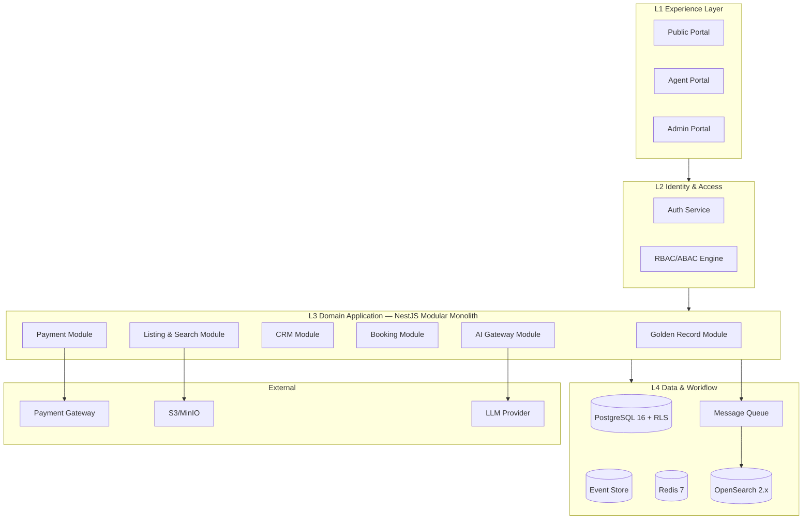

---

## 2. Nguyên tắc thiết kế

### 2.1 Tổng quan nguyên tắc

| # | Nguyên tắc | Mô tả | Áp dụng |
|---|------------|-------|---------|
| P-01 | **API-First** | Thiết kế contract trước implementation; OpenAPI là source of truth | Mọi module expose REST API; frontend chỉ consume API |
| P-02 | **Modular Monolith (Phase 1)** | Single deployable unit với module boundary rõ ràng | NestJS modules tách biệt; import chỉ qua public interface |
| P-03 | **Tenant Isolation by Default** | Mọi query/filter scoped tenant_id; RLS ở DB layer | Middleware + RLS policy + integration test |
| P-04 | **Event Sourcing (Transaction Domain)** | Booking, payment, GR mutation lưu event append-only | Event store table; projection cho read model |
| P-05 | **CQRS Preparation** | Tách write model (PostgreSQL) và read model (OpenSearch) | Phase 1: async sync; Phase 3: full CQRS + CDC |
| P-06 | **Domain-Driven Design Lite** | Bounded context theo module nghiệp vụ | GR, Booking, Payment là aggregate roots riêng |
| P-07 | **Fail-Safe Defaults** | Deny-by-default authorization; explicit allow | RBAC + ABAC; 403 thay vì empty result khi unauthorized |
| P-08 | **Idempotency Everywhere** | Webhook, payment, event publish đều idempotent | Idempotency-Key header; dedup table |
| P-09 | **Observability Built-In** | Structured log, trace, metric từ day 1 | OpenTelemetry trace_id xuyên suốt request |
| P-10 | **Security in Depth** | AuthN ở gateway; AuthZ ở service; RLS ở DB | 3 lớp defense |
| P-11 | **Evolution over Revolution** | Thiết kế cho split service sau này, không over-engineer P1 | Module interface stable; internal refactor free |
| P-12 | **Human-in-the-Loop AI** | AI suggest, human approve trước publish/send | Guardrails middleware; AI action log |

### 2.2 API-First Design

#### 2.2.1 Quy ước API

| Quy ước | Chi tiết |
|---------|----------|
| **Base URL** | `https://api.wereal.vn/v1` (production); `https://api-staging.wereal.vn/v1` |
| **Versioning** | URL path versioning (`/v1/`); breaking change → `/v2/` |
| **Authentication** | Bearer JWT access token; refresh token rotation |
| **Tenant context** | Header `X-Tenant-ID` + JWT claim `tenant_id` (must match) |
| **Idempotency** | Header `Idempotency-Key` cho POST payment, booking |
| **Pagination** | Cursor-based (`cursor`, `limit`); default limit=20, max=100 |
| **Error format** | RFC 7807 Problem Details JSON |
| **Rate limit** | Per-tenant: 1000 req/min read, 200 req/min write (NFR-S08) |

#### 2.2.2 Contract-First Workflow

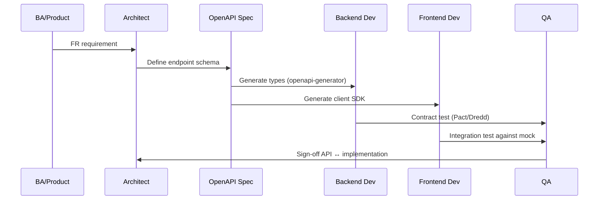

### 2.3 Modular Monolith — Phase 1 Strategy

Phase 1 triển khai **một NestJS application** duy nhất (`wereal-api`) với các module độc lập. Mỗi module tuân thủ:

| Quy tắc module | Mô tả |
|----------------|-------|
| **Single responsibility** | Một module = một bounded context nghiệp vụ |
| **Public interface** | Export chỉ qua `*.module.ts` providers và `*.facade.ts` |
| **No circular dependency** | Dependency graph DAG; vi phạm → refactor |
| **Own entities** | Module sở hữu TypeORM entities của domain mình |
| **Cross-module communication** | Domain events (in-process Phase 1); message queue Phase 2+ |
| **No shared mutable state** | Redis keys namespaced `{tenant}:{module}:{key}` |

**Lộ trình tách service (Phase 2–4):**

| Module | Tách service | Trigger | Phase |
|--------|-------------|---------|-------|
| Payment + Ledger | `wereal-payment` | PCI scope, independent scaling | 2 |
| Search + Indexer | `wereal-search` | OpenSearch cluster scale | 2 |
| Notification + Realtime | `wereal-notification` | SSE/WebSocket fan-out scale | 2 |
| AI Gateway | `wereal-ai` (FastAPI sidecar) | GPU/LLM latency isolation | 2–3 |
| Analytics + ETL | `wereal-analytics` | Warehouse workload isolation | 3 |

### 2.4 Tenant Isolation Design

Tenant isolation được enforce ở **4 lớp**:

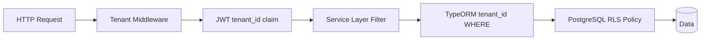

| Lớp | Cơ chế | Fail mode |
|-----|--------|-----------|
| **L1 — API Gateway** | Validate `X-Tenant-ID` header presence | 400 Bad Request |
| **L2 — Auth Middleware** | JWT `tenant_id` must match header | 403 Forbidden |
| **L3 — ORM Global Filter** | Auto-append `WHERE tenant_id = :ctx` | Empty result set |
| **L4 — PostgreSQL RLS** | `SET app.current_tenant = :id` per connection | 0 rows (DB-level) |

**Tenant hierarchy:**

```
Platform (root)
├── Developer Tenant
│   ├── Project A
│   └── Project B
├── Agency Tenant
│   ├── Branch 1
│   └── Branch 2
└── Platform Ops Tenant
```

### 2.5 Event Sourcing & CQRS Preparation

#### 2.5.1 Event Sourcing Scope

| Domain | Event Sourced | Lý do |
|--------|---------------|-------|
| Booking/Transaction | ✅ Yes | Dispute replay, state machine audit |
| Golden Record mutations | ✅ Yes | Time-travel query, price history |
| Payment/Ledger | ✅ Yes | Financial audit, reconciliation |
| Listing marketing | ⚠️ Partial | Status changes event; content CRUD standard |
| CRM Lead | ⚠️ Partial | Activity timeline; lead CRUD standard |
| User/Auth | ❌ No | Standard CRUD + audit log |

#### 2.5.2 CQRS Roadmap

| Phase | Write Model | Read Model | Sync Mechanism |
|-------|-------------|------------|----------------|
| **P1** | PostgreSQL (source of truth) | OpenSearch (search index) | Outbox → worker → bulk index |
| **P2** | PostgreSQL + Event Store | OpenSearch + Redis cache | Outbox + CDC (Debezium prep) |
| **P3** | PostgreSQL + Event Store | OpenSearch + Redis + DW | Full CDC < 1s lag |
| **P4+** | Per-service DB (split) | Dedicated read replicas | Event bus (Kafka) |

---

## 3. Tổng quan kiến trúc — 9 lớp

### 3.1 Mô hình 9 lớp WEREAL Architecture v2.0

Kiến trúc WEREAL REOS được tổ chức thành **9 lớp logic** (L1–L9), mỗi lớp có trách nhiệm riêng biệt và giao tiếp qua interface được định nghĩa. Phase 1 triển khai đầy đủ L1–L6 và phần L7–L8 cơ bản; L9 mở rộng Phase 2+.

```
┌─────────────────────────────────────────────────────────────────┐
│ L1 Experience    │ Public │ Agent │ Admin │ Dev(P2) │ Mobile(P2) │
├─────────────────────────────────────────────────────────────────┤
│ L2 Identity      │ JWT Auth │ RBAC/ABAC │ MFA │ Tenant Context  │
├─────────────────────────────────────────────────────────────────┤
│ L3 Domain Apps   │ GR │ Listing │ CRM │ Booking │ Payment │ COM  │
├─────────────────────────────────────────────────────────────────┤
│ L4 Data/Workflow │ PG+RLS │ EventStore │ Redis │ OpenSearch │ MQ│
├─────────────────────────────────────────────────────────────────┤
│ L5 AI Layer      │ Gateway │ Guardrails │ Copilot │ Scoring │ RAG│
├─────────────────────────────────────────────────────────────────┤
│ L6 Payment       │ Orchestrator │ Ledger │ Webhook │ Reconcile  │
├─────────────────────────────────────────────────────────────────┤
│ L7 Intelligence  │ KPI │ GMV │ Absorption │ Forecast │ Attribution│
├─────────────────────────────────────────────────────────────────┤
│ L8 Trust         │ Audit │ Verified Badge │ Vault │ Dispute(P3)  │
├─────────────────────────────────────────────────────────────────┤
│ L9 Network       │ Zalo(P2) │ Meta(P2) │ Webhook(P3) │ API Mkt(P4)│
└─────────────────────────────────────────────────────────────────┘
```

### 3.2 Ánh xạ 9 lớp → NestJS Modules & Infrastructure

| Lớp | Thành phần chính | Module / Service | Infrastructure | Phase |
|-----|------------------|------------------|----------------|-------|
| **L1** | Public Portal | `apps/public-web` (Next.js) | CDN, Vercel/VPS | 1 |
| **L1** | Agent Portal | `apps/agent-web` (Next.js) | CDN | 1 |
| **L1** | Admin Portal | `apps/admin-web` (Next.js) | CDN | 1 |
| **L2** | Auth & IAM | `modules/identity` | PostgreSQL, Redis session | 1 |
| **L2** | RBAC/ABAC | `modules/authorization` | PostgreSQL roles | 1–2 |
| **L3** | Golden Record | `modules/golden-record` | PostgreSQL, Event Store | 1 |
| **L3** | Listing | `modules/listing` | PostgreSQL, S3 | 1 |
| **L3** | CRM | `modules/crm` | PostgreSQL | 1 |
| **L3** | Booking | `modules/booking` | PostgreSQL, Redis lock | 1 |
| **L3** | Payment | `modules/payment` | PostgreSQL, Gateway API | 1 |
| **L3** | Commission | `modules/commission` | PostgreSQL | 2 |
| **L3** | Marketplace | `modules/marketplace` | PostgreSQL | 2 |
| **L4** | Event Store | `modules/event-store` | PostgreSQL append-only | 1 |
| **L4** | Search Indexer | `modules/search-indexer` | OpenSearch, MQ worker | 1 |
| **L4** | Cache & Lock | `modules/infrastructure/redis` | Redis 7 | 1 |
| **L4** | Media Storage | `modules/media` | S3/MinIO | 1 |
| **L5** | AI Gateway | `modules/ai-gateway` | LLM API, FastAPI sidecar | 1 |
| **L6** | Ledger | `modules/ledger` (trong payment) | PostgreSQL | 1 |
| **L6** | Reconciliation | `modules/reconciliation` | Cron job | 1 |
| **L7** | Analytics | `modules/analytics` | PostgreSQL views, P2: DW | 1–3 |
| **L8** | Audit & Trust | `modules/audit`, `modules/trust` | PostgreSQL append-only | 1 |
| **L9** | Integration Hub | `modules/integration` | Webhook, partner APIs | 2–4 |

### 3.3 Luồng request end-to-end (Phase 1)

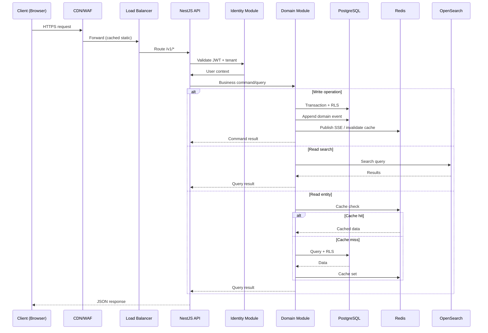

### 3.4 Bounded Context Map

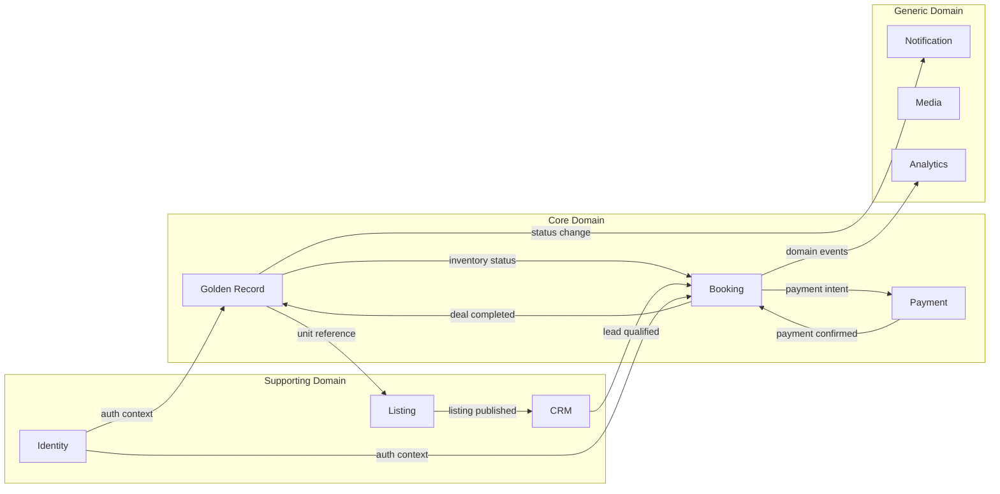

---

## 4. Lựa chọn technology stack

### 4.1 Tổng quan stack Phase 1

| Lớp | Công nghệ | Version | Vai trò |
|-----|-----------|---------|---------|
| Frontend | Next.js + React + Tailwind + shadcn/ui | 14.x / 18.x | Experience Layer portals |
| Backend | NestJS + TypeScript | 10.x / 5.x | Modular monolith API |
| Database | PostgreSQL + RLS | 16.x | Primary data store, event store |
| Cache/Lock | Redis | 7.x | Session, inventory lock, pub/sub |
| Search | OpenSearch | 2.x | Full-text, facet, geo search |
| Queue | RabbitMQ | 3.12.x | Async jobs, outbox consumer |
| Storage | MinIO / AWS S3 | — | Media, documents |
| AI | NestJS module + LLM API | — | Copilot, scoring (FastAPI sidecar P2) |
| Observability | OpenTelemetry + Prometheus + Grafana | — | Traces, metrics, dashboards |
| CI/CD | GitHub Actions + Docker | — | Build, test, deploy |
| API Gateway | Kong / Nginx + rate limit | — | Edge routing, TLS termination |

### 4.2 Bảng justification chi tiết — Frontend

| Tiêu chí | Next.js 14 App Router | Lựa chọn thay thế đã xem xét | Quyết định & lý do |
|----------|------------------------|------------------------------|-------------------|
| **SSR/SSG cho SEO** | ✅ App Router RSC, ISR cho listing pages | Remix, Nuxt | Public Portal cần SEO mạnh cho listing BĐS — Next.js ecosystem PropTech phong phú |
| **Multi-portal monorepo** | ✅ Turborepo + multiple apps | Vite SPA × 3 | 3 portals (Public/Agent/Admin) share component library `@wereal/ui` |
| **TypeScript end-to-end** | ✅ First-class TS | — | Type safety FE↔BE qua OpenAPI generated client |
| **UI component library** | shadcn/ui + Tailwind CSS | MUI, Ant Design | shadcn: copy-paste, customizable, accessible; Tailwind: rapid iteration |
| **Real-time (SSE)** | ✅ Native EventSource + React hooks | Socket.io client | SSE đủ Phase 1 (inventory status); WebSocket Phase 2 mobile |
| **i18n** | next-intl | react-i18next | Phase 1 VI only; next-intl App Router native |
| **Performance** | RSC giảm JS bundle | CRA | NFR-P03 search page LCP target |
| **Team familiarity** | Cao (React ecosystem) | Angular | Velocity go-live 31/12/2026 |
| **PWA/Offline** | next-pwa plugin | — | Phase 2 Agent mobile web offline-read |
| **Rủi ro** | App Router API thay đổi | — | Pin version 14.x; avoid canary |

**Frontend monorepo structure:**

```
apps/
├── public-web/      # L1 Public Portal (buyer-facing)
├── agent-web/       # L1 Agent Portal (CRM, listing, booking)
├── admin-web/       # L1 Admin/Ops Portal
packages/
├── ui/              # shadcn/ui shared components
├── api-client/      # OpenAPI generated TypeScript client
├── auth/            # JWT refresh, tenant context hooks
└── realtime/        # SSE subscription hooks
```

### 4.3 Bảng justification chi tiết — Backend

| Tiêu chí | NestJS Modular Monolith | Lựa chọn thay thế | Quyết định & lý do |
|----------|-------------------------|-------------------|-------------------|
| **Modular architecture** | ✅ Native module system, DI | Express raw, Fastify | Module boundary = future service boundary |
| **TypeScript** | ✅ First-class | Go, Java Spring | Team TS stack; share types với FE |
| **Enterprise patterns** | Guards, Interceptors, Pipes | — | Auth guard, tenant interceptor, validation pipe |
| **ORM integration** | TypeORM / Prisma | Drizzle | TypeORM: mature RLS support, migration tooling |
| **Event-driven** | @nestjs/event-emitter + Bull | — | In-process events P1; Bull queue P2 |
| **OpenAPI** | @nestjs/swagger auto-generate | — | NFR-M02 contract-first |
| **Testing** | Jest + Supertest e2e | — | NFR-M01 70% coverage target |
| **Performance** | Node.js event loop; cluster mode | Go microservices | P1: 500 concurrent đủ; split khi cần |
| **Payment adapter** | DI + interface pattern | — | FR-PAY-01 adapter pattern natural fit |
| **Go-live velocity** | Single deploy, fast iteration | Microservices | CON-T01: monolith Phase 1 bắt buộc |

### 4.4 Bảng justification chi tiết — Database & Storage

| Tiêu chí | PostgreSQL 16 + RLS | Redis 7 | OpenSearch 2.x |
|----------|---------------------|---------|------------------|
| **ACID transactions** | ✅ Booking + payment cùng transaction | — | — |
| **Tenant isolation** | ✅ RLS native policy | Key namespace per tenant | Index per tenant alias |
| **Event store** | ✅ Append-only table + BRIN index | — | — |
| **JSON support** | ✅ JSONB cho flexible attributes | — | ✅ Nested documents |
| **Full-text search** | ⚠️ Basic tsvector | — | ✅ Facet, geo, relevance tuning |
| **Geo search** | PostGIS extension | — | ✅ geo_point, geo_distance |
| **Distributed lock** | Advisory locks (backup) | ✅ Redlock pattern | — |
| **Session/cache** | — | ✅ TTL, pub/sub | — |
| **Inventory lock** | Optimistic locking backup | ✅ Atomic SET NX EX | — |
| **Ops maturity** | ✅ Team familiar; managed RDS | ✅ ElastiCache/self-host | ✅ AWS OpenSearch / self-host |
| **Cost Phase 1** | 1 instance db.r6g.large | 1 node cache.r6g | 1 node r6g.large.search |
| **Scale path** | Read replica → Citus (P4) | Cluster mode | Horizontal shard (P3) |

| Tiêu chí | S3-compatible (MinIO/AWS) | Quyết định |
|----------|---------------------------|------------|
| **Media listing** | Presigned URL upload | Agent upload ảnh/video listing |
| **Document vault** | Server-side encryption AES-256 | Contract PDF, legal docs (P2) |
| **Staging vs Prod** | MinIO local/staging; AWS S3 prod | Cost-effective dev |
| **CDN integration** | CloudFront / Cloudflare origin | NFR-P03 media load |
| **Virus scan** | Lambda/ClamAV on upload | FR-LS-03 requirement |

### 4.5 Bảng justification chi tiết — Message Queue

| Tiêu chí | RabbitMQ 3.12 | Apache Kafka 3.x | **Quyết định: RabbitMQ Phase 1** |
|----------|---------------|------------------|----------------------------------|
| **Operational complexity** | Thấp — single node P1 | Cao — Zookeeper/KRaft | RabbitMQ phù hợp team size P1 |
| **Throughput P1** | 500 events/s đủ | Overkill P1 | NFR-SC04: 500 events/s |
| **Outbox pattern** | ✅ Bull/BullMQ over Redis alt | ✅ | RabbitMQ + outbox table P1 |
| **Delayed messages** | ✅ TTL + DLX | ⚠️ Complex | Booking expiry timer |
| **Event replay** | ⚠️ Limited | ✅ Log retention | Event store PG handles replay |
| **Scale to P3+** | Cluster mode | ✅ Partition, consumer group | **Migration path → Kafka P3** (ADR-003) |
| **Use cases P1** | Search index sync, notification, webhook retry | — | 3 queues đủ |
| **Managed service** | CloudAMQP / Amazon MQ | Amazon MSK | Cost RabbitMQ thấp hơn P1 |

**Queue topology Phase 1:**

| Queue | Producer | Consumer | Message type |
|-------|----------|----------|--------------|
| `wereal.search.index` | Outbox worker | Search indexer | Unit/listing change events |
| `wereal.notification` | Domain modules | Notification worker | Email, SMS, push |
| `wereal.webhook.retry` | Payment module | Webhook handler | Failed webhook retry |
| `wereal.booking.expiry` | Booking module | Expiry worker | TTL reservation expiry |

### 4.6 Bảng justification chi tiết — AI Layer

| Tiêu chí | NestJS AI Module (P1) | FastAPI Sidecar (P2+) | LLM Gateway |
|----------|----------------------|----------------------|-------------|
| **Latency** | Acceptable P1 (<8s NFR-P05) | Python ML ecosystem | Route to provider |
| **Guardrails** | NestJS middleware | Dedicated service | Central policy enforcement |
| **RAG (P2)** | — | ✅ LangChain/LlamaIndex | Vector store per tenant |
| **Cost tracking** | AI action log table | Token metering | Per-tenant budget cap |
| **Provider abstraction** | Interface `LLMProvider` | Same interface | Swap OpenAI/Anthropic/Gemini |
| **Tenant isolation** | Prompt context scoped | Separate vector index | No cross-tenant prompt leak |
| **Human-in-the-loop** | Approval queue API | — | FR-AI-04 |

**Phase 1 AI scope:** Content copilot + lead scoring + guardrails — không RAG, không Agents.

### 4.7 Bảng justification chi tiết — Observability

| Component | Công nghệ | Mục đích | Phase |
|-----------|-----------|----------|-------|
| **Tracing** | OpenTelemetry SDK → Jaeger/Tempo | Request trace cross-module | 1 |
| **Metrics** | Prometheus + node_exporter | API latency, queue depth, lock contention | 1 |
| **Dashboards** | Grafana | SLA dashboard, GMV, error rate | 1 |
| **Logging** | Structured JSON → Loki/ELK | trace_id correlation (NFR-O01) | 1 |
| **Alerting** | Alertmanager → PagerDuty/Slack | P0: payment fail, lock fail, DB down | 1 |
| **APM** | Grafana Cloud or Datadog (optional) | P95 latency tracking (NFR-P01) | 1 |
| **Uptime** | Pingdom/Statuspage | NFR-A01 99.5% | 1 |
| **AI monitoring** | Custom AI action log dashboard | Latency, cost, guardrail blocks | 1 |

### 4.8 Ma trận quyết định tổng hợp

| Quyết định | Lựa chọn | ADR | Phase |
|------------|----------|-----|-------|
| Application architecture | Modular Monolith | ADR-001 | 1 |
| Primary database | PostgreSQL 16 + RLS | ADR-002 | 1 |
| Event store | PostgreSQL append-only | ADR-003 | 1 |
| Message queue | RabbitMQ (→ Kafka P3) | ADR-003 | 1→3 |
| Payment integration | Adapter pattern | ADR-004 | 1 |
| AI architecture | NestJS module + LLM gateway | ADR-005 | 1→2 |
| Frontend framework | Next.js 14 App Router | — | 1 |
| Search engine | OpenSearch 2.x | — | 1 |
| Object storage | S3-compatible | — | 1 |
| Cache & lock | Redis 7 | — | 1 |

---

## 5. Phân rã module

### 5.1 Tổng quan — 18 modules

Hệ thống Phase 1 được phân rã thành **18 modules** trong NestJS monolith, mỗi module có bounded context rõ ràng, ownership team, và phase delivery plan.

| # | Module ID | Tên module | Bounded Context | Owner Team | Phase |
|---|-----------|------------|-----------------|------------|-------|
| M01 | `identity` | Identity & Access | AuthN, session, MFA | Platform | 1 |
| M02 | `authorization` | Authorization | RBAC, ABAC, permissions | Platform | 1 |
| M03 | `tenant` | Tenant Management | Onboarding, hierarchy, config | Platform | 1 |
| M04 | `golden-record` | Golden Record | Unit master, versioning, product graph | Inventory | 1 |
| M05 | `listing` | Listing & Media | Marketing listing, approval, media | Inventory | 1 |
| M06 | `search` | Search & Indexer | OpenSearch query, CDC sync | Inventory | 1 |
| M07 | `crm` | CRM & Leads | Lead capture, routing, activities | Sales | 1 |
| M08 | `booking` | Booking & Transaction | Reservation, state machine, lock | Transaction | 1 |
| M09 | `payment` | Payment Orchestration | PaymentIntent, gateway adapter | Finance | 1 |
| M10 | `ledger` | Ledger & Reconciliation | Double-entry, daily reconcile | Finance | 1 |
| M11 | `commission` | Commission OS | Policy, snapshot, settlement | Finance | 2 |
| M12 | `ai-gateway` | AI Gateway | Copilot, scoring, guardrails | AI | 1 |
| M13 | `audit` | Audit & Compliance | Audit trail, AI action log | Platform | 1 |
| M14 | `trust` | Trust & Verification | Verified badge, anti-drift engine | Platform | 1 |
| M15 | `notification` | Notification & Realtime | SSE, email, SMS, push | Platform | 1 |
| M16 | `analytics` | Analytics & KPI | Dashboard, GMV, funnel | Data | 1 |
| M17 | `integration` | Integration Hub | Webhook platform, partner adapters | Platform | 2 |
| M18 | `marketplace` | Marketplace & Distribution | Dev-Agency marketplace, policy | Network | 2 |

### 5.2 Chi tiết module — Trách nhiệm & Dependencies

#### M01 — Identity & Access (`modules/identity`)

| Thuộc tính | Chi tiết |
|------------|----------|
| **Trách nhiệm** | User registration/login, JWT access/refresh token, password hash (bcrypt), MFA/OTP (TOTP + SMS), session management Redis |
| **Entities** | `User`, `Session`, `MfaDevice`, `OtpChallenge` |
| **API prefix** | `/v1/auth/*` |
| **Dependencies** | M03 (tenant), Redis (session), PostgreSQL |
| **Events emit** | `UserRegistered`, `UserLoggedIn`, `MfaVerified` |
| **FR coverage** | FR-ID-01, FR-ID-04 |
| **Phase** | 1 |

#### M02 — Authorization (`modules/authorization`)

| Thuộc tính | Chi tiết |
|------------|----------|
| **Trách nhiệm** | RBAC role-permission matrix, ABAC policy (project/region scope P2), `@RequirePermission()` decorator, policy cache Redis |
| **Entities** | `Role`, `Permission`, `RolePermission`, `UserRole`, `AbacPolicy` |
| **API prefix** | `/v1/roles/*`, `/v1/permissions/*` |
| **Dependencies** | M01 (user context), M03 (tenant) |
| **Phase** | 1 (RBAC), 2 (ABAC + OPA) |
| **FR coverage** | FR-ID-02 |

#### M03 — Tenant Management (`modules/tenant`)

| Thuộc tính | Chi tiết |
|------------|----------|
| **Trách nhiệm** | Tenant CRUD, hierarchy (Platform→Dev→Agency→Branch), onboarding workflow, tenant config (expiry default, deposit min) |
| **Entities** | `Tenant`, `TenantConfig`, `Organization` |
| **API prefix** | `/v1/tenants/*` |
| **Dependencies** | M01, PostgreSQL RLS setup |
| **FR coverage** | FR-ID-01, FR-ID-03 |
| **Phase** | 1 |

#### M04 — Golden Record (`modules/golden-record`)

| Thuộc tính | Chi tiết |
|------------|----------|
| **Trách nhiệm** | Product Graph (Developer→Project→Phase→Building→Unit), unit CRUD, price/inventory/policy versioning, bulk import (P2), time-travel query (P2) |
| **Entities** | `Developer`, `Project`, `Phase`, `Building`, `Unit`, `UnitVersion`, `PriceVersion`, `InventorySnapshot` |
| **Aggregate root** | `Unit` |
| **API prefix** | `/v1/units/*`, `/v1/projects/*` |
| **Dependencies** | M03, M13 (audit), M06 (search sync), Event Store |
| **Events emit** | `UnitCreated`, `UnitPriceChanged`, `UnitStatusChanged` |
| **FR coverage** | FR-GR-01→08 |
| **Phase** | 1 (core), 2 (bulk, time-travel) |

#### M05 — Listing & Media (`modules/listing`)

| Thuộc tính | Chi tiết |
|------------|----------|
| **Trách nhiệm** | Listing CRUD (marketing layer), approval workflow Draft→Review→Published, media upload S3, duplicate detection (P2) |
| **Entities** | `Listing`, `ListingMedia`, `ListingApproval` |
| **API prefix** | `/v1/listings/*` |
| **Dependencies** | M04 (unit reference), M14 (anti-drift), M06 (index), S3 |
| **FR coverage** | FR-LS-01, FR-LS-03, FR-LS-05, FR-GR-03 |
| **Phase** | 1 |

#### M06 — Search & Indexer (`modules/search`)

| Thuộc tính | Chi tiết |
|------------|----------|
| **Trách nhiệm** | OpenSearch index management, full-text/facet/geo query API, CDC worker (outbox consumer), compare products |
| **Entities** | OpenSearch documents (denormalized) |
| **API prefix** | `/v1/search/*` |
| **Dependencies** | OpenSearch, RabbitMQ, M04, M05 |
| **FR coverage** | FR-LS-02, FR-LS-04, FR-LS-06 |
| **Phase** | 1 |

#### M07 — CRM & Leads (`modules/crm`)

| Thuộc tính | Chi tiết |
|------------|----------|
| **Trách nhiệm** | Lead capture (form, portal, import), lead-entity binding, routing rules, CRM activity timeline, pipeline state (P2 SLA) |
| **Entities** | `Lead`, `LeadAssignment`, `CrmActivity`, `RoutingRule`, `Campaign` |
| **API prefix** | `/v1/leads/*`, `/v1/activities/*` |
| **Dependencies** | M02, M12 (AI scoring), M15 (notification), M17 (Zalo/Meta P2) |
| **Events emit** | `LeadCaptured`, `AgentAssigned`, `LeadContacted` |
| **FR coverage** | FR-CRM-01→05, FR-CRM-08 |
| **Phase** | 1 (core), 2 (omnichannel) |

#### M08 — Booking & Transaction (`modules/booking`)

| Thuộc tính | Chi tiết |
|------------|----------|
| **Trách nhiệm** | Reservation với expiry, atomic inventory lock (Redis Redlock), 15-state machine, cancel/refund trigger, contract merge (P2) |
| **Entities** | `Booking`, `Reservation`, `BookingStateHistory` |
| **Aggregate root** | `Booking` |
| **API prefix** | `/v1/bookings/*` |
| **Dependencies** | M04 (unit status), M07 (lead), M09 (payment), Redis, Event Store |
| **Events emit** | `BookingCreated`, `InventoryLocked`, `InventoryReleased`, `BookingCancelled`, `DealCompleted` |
| **FR coverage** | FR-BK-01→04, FR-BK-07 |
| **Phase** | 1 |

#### M09 — Payment Orchestration (`modules/payment`)

| Thuộc tính | Chi tiết |
|------------|----------|
| **Trách nhiệm** | PaymentIntent lifecycle, gateway adapter (VNPay/MoMo), payment link generation, webhook handler, refund |
| **Entities** | `PaymentIntent`, `Payment`, `Refund`, `Invoice`, `Receipt` |
| **API prefix** | `/v1/payments/*` |
| **Dependencies** | M08 (booking), M10 (ledger), M13 (audit), Gateway API |
| **Events emit** | `PaymentIntentCreated`, `PaymentConfirmed`, `PaymentFailed`, `RefundProcessed` |
| **FR coverage** | FR-PAY-01, FR-PAY-02, FR-PAY-05 |
| **Phase** | 1 |

#### M10 — Ledger & Reconciliation (`modules/ledger`)

| Thuộc tính | Chi tiết |
|------------|----------|
| **Trách nhiệm** | Double-entry ledger write, daily reconciliation job (06:00 ICT), mismatch alert, accounting export |
| **Entities** | `LedgerEntry`, `LedgerAccount`, `ReconciliationReport` |
| **API prefix** | `/v1/ledger/*`, `/v1/reconciliation/*` |
| **Dependencies** | M09, M13 |
| **FR coverage** | FR-PAY-03, FR-PAY-04 |
| **Phase** | 1 |

#### M11 — Commission OS (`modules/commission`) — Phase 2

| Thuộc tính | Chi tiết |
|------------|----------|
| **Trách nhiệm** | Commission policy per project, snapshot at deal close, multi-agent split, holdback on dispute, settlement batch |
| **Entities** | `CommissionPolicy`, `CommissionSnapshot`, `CommissionEntry`, `SettlementBatch` |
| **FR coverage** | FR-COM-01→05, FR-PAY-07 |
| **Phase** | 2 |

#### M12 — AI Gateway (`modules/ai-gateway`)

| Thuộc tính | Chi tiết |
|------------|----------|
| **Trách nhiệm** | LLM provider abstraction, content copilot, lead scoring, guardrails middleware, prompt registry, AI action log, approval queue |
| **Entities** | `AiPrompt`, `AiActionLog`, `AiApprovalQueue`, `LeadScore` |
| **API prefix** | `/v1/ai/*` |
| **Dependencies** | LLM Provider API, M07, M05, M13 |
| **FR coverage** | FR-AI-01→04 |
| **Phase** | 1 |

#### M13 — Audit & Compliance (`modules/audit`)

| Thuộc tính | Chi tiết |
|------------|----------|
| **Trách nhiệm** | System-wide audit trail append-only, payment action log, AI action log aggregation, retention job |
| **Entities** | `AuditEvent`, `AuditLog` (partitioned by month) |
| **API prefix** | `/v1/audit/*` |
| **FR coverage** | FR-TR-01, FR-TR-05 |
| **Phase** | 1 |

#### M14 — Trust & Verification (`modules/trust`)

| Thuộc tính | Chi tiết |
|------------|----------|
| **Trách nhiệm** | Anti-drift engine (listing vs GR compare), Verified Listing badge logic, document vault (P2), dispute center (P3) |
| **Dependencies** | M04, M05, M08 |
| **FR coverage** | FR-GR-04, FR-GR-05, FR-TR-02, FR-TR-03 |
| **Phase** | 1 (anti-drift, badge), 2–3 (vault, dispute) |

#### M15 — Notification & Realtime (`modules/notification`)

| Thuộc tính | Chi tiết |
|------------|----------|
| **Trách nhiệm** | SSE endpoint per tenant/user, Redis pub/sub fan-out, email (SendGrid/SES), SMS (P2), push (P3) |
| **API prefix** | `/v1/sse/*`, `/v1/notifications/*` |
| **Dependencies** | Redis pub/sub, RabbitMQ |
| **FR coverage** | FR-GR-08, FR-UX-01 (real-time UI) |
| **Phase** | 1 |

#### M16 — Analytics & KPI (`modules/analytics`)

| Thuộc tính | Chi tiết |
|------------|----------|
| **Trách nhiệm** | KPI dashboard (funnel, lead, booking), GMV tracking (P2), absorption report (P2), materialized views |
| **Dependencies** | Event Store, PostgreSQL read views |
| **FR coverage** | FR-AN-01, FR-AN-02, FR-AN-03 |
| **Phase** | 1 (KPI), 2 (GMV, absorption) |

#### M17 — Integration Hub (`modules/integration`) — Phase 2

| Thuộc tính | Chi tiết |
|------------|----------|
| **Trách nhiệm** | Zalo OA/ZNS adapter, Meta Lead Ads connector, outbound webhook platform (P3), e-sign adapter (P2) |
| **FR coverage** | FR-CRM-06, FR-CRM-07, FR-BK-06 |
| **Phase** | 2–3 |

#### M18 — Marketplace & Distribution (`modules/marketplace`) — Phase 2

| Thuộc tính | Chi tiết |
|------------|----------|
| **Trách nhiệm** | Distribution policy publish, agency apply/approve, leaderboard (P3) |
| **FR coverage** | FR-MKT-01→03 |
| **Phase** | 2–3 |

### 5.3 Module Dependency Graph

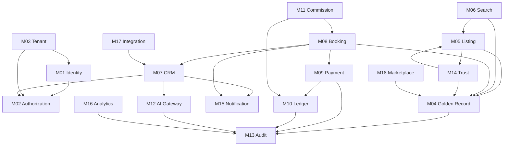

### 5.4 NestJS Project Structure

```
wereal-api/
├── src/
│   ├── main.ts
│   ├── app.module.ts
│   ├── common/
│   │   ├── guards/          # JwtAuthGuard, TenantGuard, PermissionGuard
│   │   ├── interceptors/    # LoggingInterceptor, TenantContextInterceptor
│   │   ├── filters/         # ProblemDetailsExceptionFilter
│   │   ├── decorators/      # @RequirePermission, @CurrentUser, @TenantId
│   │   └── pipes/           # ValidationPipe global
│   ├── modules/
│   │   ├── identity/
│   │   ├── authorization/
│   │   ├── tenant/
│   │   ├── golden-record/
│   │   ├── listing/
│   │   ├── search/
│   │   ├── crm/
│   │   ├── booking/
│   │   ├── payment/
│   │   ├── ledger/
│   │   ├── ai-gateway/
│   │   ├── audit/
│   │   ├── trust/
│   │   ├── notification/
│   │   ├── analytics/
│   │   └── event-store/
│   └── workers/
│       ├── search-indexer.worker.ts
│       ├── outbox-publisher.worker.ts
│       ├── booking-expiry.worker.ts
│       └── reconciliation.worker.ts
├── test/
│   ├── e2e/
│   └── integration/
├── migrations/
└── openapi/
    └── wereal-api-v1.yaml
```

---

## 6. Thiết kế theo lớp L1–L9

### 6.1 L1 — Experience Layer

#### 6.1.1 Thành phần

| Component | Tech | Port/URL | Actor | Phase |
|-----------|------|----------|-------|-------|
| Public Portal | Next.js 14 | `www.wereal.vn` | Buyer, Guest | 1 |
| Agent Portal | Next.js 14 | `agent.wereal.vn` | Agent, Agency Admin | 1 |
| Admin Portal | Next.js 14 | `admin.wereal.vn` | Ops, Platform Admin | 1 |
| Developer Portal | Next.js 14 | `developer.wereal.vn` | Developer Admin | 2 |
| Mobile App (Sale) | React Native | iOS/Android | Agent | 2 |
| Buyer App | React Native | iOS/Android | Buyer | 3 |

#### 6.1.2 Interface L1 → L2/L3

| Interface | Protocol | Mô tả |
|-----------|----------|-------|
| REST API | HTTPS JSON | Mọi data mutation và query |
| SSE | `GET /v1/sse/stream` | Real-time inventory, lead, booking updates |
| Auth | OAuth2 Password + JWT | Login, refresh, MFA challenge |
| File upload | Presigned S3 URL | Media listing upload trực tiếp S3 |

#### 6.1.3 Shared Frontend Packages

| Package | Responsibility |
|---------|---------------|
| `@wereal/ui` | shadcn/ui components: Button, Table, Dialog, Form, Badge |
| `@wereal/api-client` | Generated OpenAPI client với tenant header injection |
| `@wereal/auth` | `useAuth()`, `useTenant()`, token refresh interceptor |
| `@wereal/realtime` | `useSSE(channel)` hook với reconnect backoff |

### 6.2 L2 — Identity & Access Layer

#### 6.2.1 Components

| Component | Module | Responsibility |
|-----------|--------|----------------|
| Auth Controller | M01 | Login, logout, refresh, password reset |
| JWT Service | M01 | Access token (15min), refresh token (7d) rotation |
| MFA Service | M01 | TOTP setup, OTP SMS, step-up auth |
| Tenant Middleware | M03 | Inject `tenant_id` vào request context |
| Permission Guard | M02 | `@RequirePermission('listing:create')` |
| ABAC Evaluator | M02 | Project/region scope check (P2) |

#### 6.2.2 JWT Claims Schema

```json
{
  "sub": "user_uuid",
  "tenant_id": "tenant_uuid",
  "tenant_type": "agency",
  "roles": ["agent", "sales"],
  "permissions": ["listing:create", "booking:create"],
  "abac_scopes": {
    "projects": ["proj_uuid_1", "proj_uuid_2"],
    "regions": ["hcm", "hn"]
  },
  "mfa_verified": true,
  "iat": 1722163200,
  "exp": 1722164100
}
```

### 6.3 L3 — Domain Application Layer

L3 chứa toàn bộ business logic — xem Section 5 cho module decomposition chi tiết.

| Domain subdomain | Modules | Key aggregates |
|------------------|---------|----------------|
| Inventory | M04, M05, M06, M14 | Unit, Listing |
| Sales | M07, M12 | Lead |
| Transaction | M08, M09, M10, M11 | Booking, PaymentIntent |
| Platform | M01–M03, M13, M15, M16 | Tenant, User |
| Network | M17, M18 | DistributionPolicy |

### 6.4 L4 — Data & Workflow Layer

#### 6.4.1 Components

| Component | Technology | Responsibility |
|-----------|------------|----------------|
| Primary DB | PostgreSQL 16 | CRUD entities, transactions, RLS |
| Event Store | PostgreSQL (append-only table) | Domain events immutable |
| Outbox Table | PostgreSQL | Reliable event publish |
| Outbox Publisher | Worker process | Poll outbox → RabbitMQ |
| Search Index | OpenSearch 2.x | Denormalized listing/unit index |
| Cache | Redis 7 | Session, entity cache, pub/sub |
| Distributed Lock | Redis 7 | Inventory lock Redlock |
| Object Storage | S3/MinIO | Media, documents |
| Job Queue | RabbitMQ | Async workers |

#### 6.4.2 PostgreSQL Schema Strategy

| Schema | Tables | RLS |
|--------|--------|-----|
| `core` | tenant, user, role, permission | ✅ |
| `inventory` | project, building, unit, unit_version, listing | ✅ |
| `crm` | lead, crm_activity, routing_rule | ✅ |
| `transaction` | booking, payment_intent, payment, refund | ✅ |
| `finance` | ledger_entry, ledger_account, reconciliation | ✅ |
| `events` | domain_events, outbox_events | ✅ (append-only) |
| `audit` | audit_log | ✅ (append-only, no UPDATE/DELETE) |
| `ai` | ai_action_log, ai_prompt, lead_score | ✅ |

#### 6.4.3 RLS Policy Pattern

```sql
-- Enable RLS on all tenant-scoped tables
ALTER TABLE inventory.units ENABLE ROW LEVEL SECURITY;

-- Policy: tenant isolation
CREATE POLICY tenant_isolation ON inventory.units
  USING (tenant_id = current_setting('app.current_tenant')::uuid);

-- Policy: platform admin bypass (read-only cross-tenant aggregate)
CREATE POLICY platform_read ON inventory.units
  FOR SELECT
  USING (current_setting('app.is_platform_admin')::boolean = true);
```

### 6.5 L5 — AI Layer

| Component | Phase | Description |
|-----------|-------|-------------|
| AI Gateway Controller | 1 | `/v1/ai/copilot`, `/v1/ai/score-lead` |
| LLM Provider Adapter | 1 | Interface: `complete()`, `embed()` — impl: OpenAI |
| Guardrails Middleware | 1 | Block tool calls mutate domain entities |
| Prompt Registry | 1 | Versioned prompts per use case, tenant override |
| Lead Scoring Engine | 1 | Rule + LLM hybrid scoring |
| RAG Pipeline | 2 | Vector store per tenant, citation response |
| AI Agents | 3 | Sales, Ops, Compliance, Developer agents |
| Eval Pipeline | 2–3 | Prompt A/B, quality metrics |

### 6.6 L6 — Payment & Finance Layer

| Component | Module | Phase |
|-----------|--------|-------|
| Payment Orchestrator | M09 | 1 |
| Gateway Adapter (VNPay) | M09 | 1 |
| Gateway Adapter (MoMo) | M09 | 3 |
| PaymentIntent Manager | M09 | 1 |
| Webhook Handler | M09 | 1 |
| Double-entry Ledger | M10 | 1 |
| Reconciliation Job | M10 | 1 |
| Commission Settlement | M11 | 2 |
| Smart Escrow | M09 | 5 |
| BNPL Adapter | M09 | 5 |

### 6.7 L7 — Intelligence Layer

| Component | Data source | Phase |
|-----------|-------------|-------|
| KPI Dashboard API | PostgreSQL materialized views | 1 |
| GMV Dashboard | Ledger + booking events | 2 |
| Absorption Report | Unit status history | 2 |
| Campaign Attribution | Lead source + conversion chain | 3 |
| Absorption Forecast | ML model + feature store | 3 |
| Executive Reports | Data warehouse | 4 |

### 6.8 L8 — Trust & Compliance Layer

| Component | Module | Phase |
|-----------|--------|-------|
| Audit Trail | M13 | 1 |
| Anti-drift Engine | M14 | 1 |
| Verified Badge | M14 | 1 |
| Document Vault | M14 | 2 |
| Dispute Resolution Center | M14 | 3 |
| Regulatory Export Pack | M13 | 4 |
| Fraud Graph | M14 + M12 | 3 |

### 6.9 L9 — Network & Ecosystem Layer

| Component | Module | Phase |
|-----------|--------|-------|
| Zalo OA/ZNS Hub | M17 | 2 |
| Meta Lead Ads Connector | M17 | 2 |
| Outbound Webhook Platform | M17 | 3 |
| API Marketplace v1 | M17 | 4 |
| Bank/e-sign/valuation adapters | M17 | 4–5 |
| ERP Export Connectors | M17 | 4 |

---

## 7. Mô tả sơ đồ component

> Sơ đồ visual chi tiết tại [`So-do-kien-truc.md`](./So-do-kien-truc.md). Section này mô tả text-based C4 Level 2–3.

### 7.1 C4 Level 1 — System Context

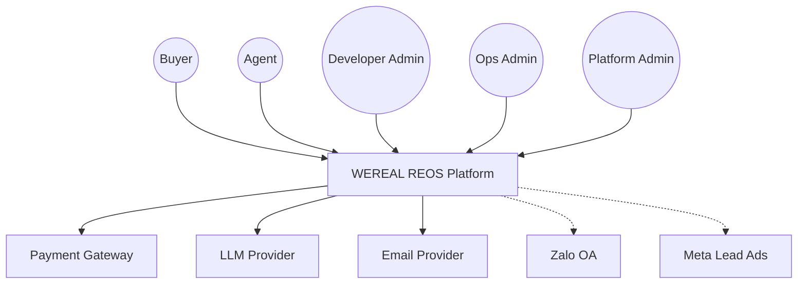

### 7.2 C4 Level 2 — Container Diagram (Phase 1)

| Container | Technology | Responsibility |
|-----------|------------|----------------|
| **Public Web App** | Next.js 14 | Buyer search, listing detail, lead form |
| **Agent Web App** | Next.js 14 | CRM, listing, booking, AI copilot |
| **Admin Web App** | Next.js 14 | Tenant mgmt, moderation, audit, reconciliation |
| **API Server** | NestJS monolith | All business logic, REST + SSE |
| **Worker Processes** | NestJS CLI workers | Outbox, search index, expiry, reconcile |
| **PostgreSQL** | PG 16 | Primary DB + event store + outbox |
| **Redis** | Redis 7 | Cache, lock, session, pub/sub |
| **OpenSearch** | OS 2.x | Search index |
| **RabbitMQ** | RabbitMQ 3.12 | Message queue |
| **Object Storage** | S3/MinIO | Media files |
| **CDN** | Cloudflare | Static assets, edge cache |
| **WAF** | Cloudflare WAF | DDoS, OWASP rules |

### 7.3 C4 Level 3 — Booking Module Components

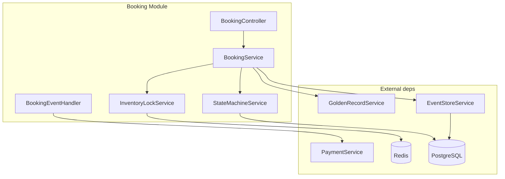

| Component | Interface | Responsibility |
|-----------|-----------|----------------|
| `BookingController` | REST `/v1/bookings` | HTTP adapter, validation, auth |
| `BookingService` | `createBooking()`, `cancelBooking()` | Orchestrate booking use cases |
| `StateMachineService` | `transition(event)` | Enforce 15-state rules |
| `InventoryLockService` | `acquireLock(unitId)`, `releaseLock()` | Redis Redlock |
| `BookingEventHandler` | `@OnEvent('PaymentConfirmed')` | React to payment events |

### 7.4 C4 Level 3 — Payment Module Components

| Component | Interface | Responsibility |
|-----------|-----------|----------------|
| `PaymentController` | REST `/v1/payments` | Create intent, query status |
| `WebhookController` | POST `/v1/webhooks/vnpay` | Receive gateway callbacks |
| `PaymentOrchestrator` | `createIntent()`, `processWebhook()` | Payment lifecycle |
| `GatewayAdapter` | `charge()`, `refund()`, `verifySignature()` | VNPay/MoMo abstraction |
| `LedgerService` | `writeEntry()`, `getBalance()` | Double-entry accounting |
| `ReconciliationService` | `runDailyReconcile()` | Match gateway vs ledger |

### 7.5 C4 Level 3 — AI Gateway Components

| Component | Interface | Responsibility |
|-----------|-----------|----------------|
| `AiController` | REST `/v1/ai/*` | Copilot, scoring endpoints |
| `CopilotService` | `generateListingCopy()` | Listing content generation |
| `LeadScoringService` | `scoreLead(leadId)` | Hot/warm/cold classification |
| `GuardrailsService` | `validateAction()` | Block domain mutations |
| `PromptRegistry` | `getPrompt(useCase, tenantId)` | Versioned prompt management |
| `LlmProviderAdapter` | `complete(messages)` | OpenAI/Anthropic abstraction |
| `AiActionLogger` | `log(action, latency, tokens)` | Audit + cost tracking |

---

## 8. Kiến trúc triển khai

### 8.1 Environment Topology

| Environment | Mục đích | URL | Data |
|-------------|----------|-----|------|
| **Local** | Dev workstation | `localhost:3000/3001` | Docker Compose |
| **Staging** | QA, UAT, integration test | `*.staging.wereal.vn` | Anonymized prod-like |
| **Production** | Live tenant traffic | `*.wereal.vn` | Real data |

### 8.2 Production Architecture (Phase 1)

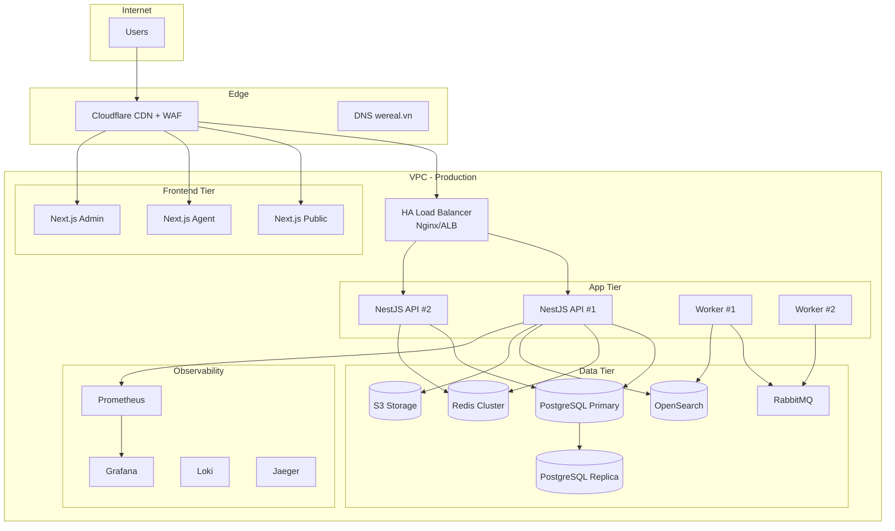

### 8.3 Deployment Specifications — Production Phase 1

| Component | Spec | Count | HA Strategy |
|-----------|------|-------|-------------|
| Load Balancer | Nginx / AWS ALB | 2 (active-passive) | Health check `/health` |
| NestJS API | 2 vCPU, 4GB RAM | 2+ (auto-scale 2–4) | Rolling deploy, zero-downtime |
| Worker | 1 vCPU, 2GB RAM | 2 | Leader election for cron jobs |
| Next.js (each portal) | 1 vCPU, 2GB RAM | 2 | Static export + SSR hybrid |
| PostgreSQL | db.r6g.large (2 vCPU, 16GB) | 1 primary + 1 replica | Streaming replication |
| Redis | cache.r6g.large | 1 primary + 1 replica | Sentinel mode |
| OpenSearch | r6g.large.search | 3 nodes (1 master, 2 data) | Cluster quorum |
| RabbitMQ | mq.t3.micro | 2 (mirror queue) | Mirrored queues |
| S3 | Standard tier | — | Cross-AZ replication |

### 8.4 Staging Environment

| Khác biệt vs Production | Staging |
|-------------------------|---------|
| Scale | Single instance mỗi tier |
| Payment | Sandbox gateway keys |
| LLM | Lower-cost model / mock |
| Data | Synthetic + anonymized |
| WAF | Rules relaxed cho testing |
| Domain | `*.staging.wereal.vn` |
| Deploy trigger | Auto on merge to `develop` |

### 8.5 CDN & WAF Configuration

| Rule | Configuration |
|------|---------------|
| **CDN cache** | Static assets TTL 1 year; API `Cache-Control: no-store` |
| **SSL/TLS** | TLS 1.2+ only; HSTS enabled |
| **WAF OWASP** | SQL injection, XSS, CSRF rules enabled |
| **Rate limit edge** | 10000 req/min per IP (supplement API rate limit) |
| **Geo block** | None Phase 1 (VN only by policy, not geo-block) |
| **DDoS** | Cloudflare DDoS protection automatic |
| **Bot management** | Challenge suspicious bots on login/register |

### 8.6 CI/CD Pipeline

```mermaid
flowchart LR
    PR[Pull Request] --> LINT[Lint + Type Check]
    LINT --> UNIT[Unit Tests]
    UNIT --> INT[Integration Tests]
    INT --> SAST[SAST Scan]
    SAST --> BUILD[Docker Build]
    BUILD --> STG[Deploy Staging]
    STG --> E2E[E2E Tests]
    E2E --> REV[Manual Review]
    REV --> PROD[Deploy Production]
    PROD --> SMOKE[Smoke Tests]
    SMOKE --> ALERT[Alert if fail]
```

| Stage | Tool | Gate |
|-------|------|------|
| Lint | ESLint, Prettier | Zero errors |
| Unit test | Jest | ≥ 70% coverage critical modules |
| Integration | Supertest + Testcontainers | 100% pass |
| SAST | Semgrep / SonarQube | Zero Critical/High |
| DAST | OWASP ZAP (staging) | Zero Critical (pre-release) |
| Load test | k6 | NFR-P01, P03, P08 pass |
| Deploy | GitHub Actions + Docker | Blue-green rolling |

### 8.7 Backup & Disaster Recovery

| Metric | Phase 1 Target | Mechanism |
|--------|----------------|-----------|
| RPO | ≤ 24 giờ | Daily PG snapshot + WAL archive |
| RTO | ≤ 4 giờ | Restore runbook, replica promote |
| Backup retention | 30 daily + 12 monthly | S3 backup bucket |
| DR drill | Quarterly | Timed restore test |
| Event store backup | Included in PG backup | Same RPO |

---

## 9. Thiết kế bảo mật

### 9.1 Security Architecture Overview

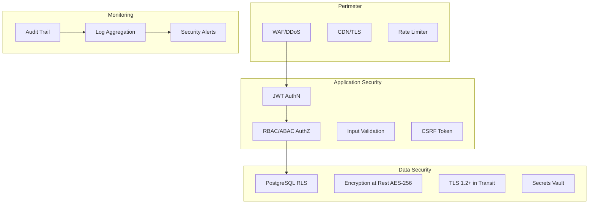

### 9.2 Authentication Flow — JWT

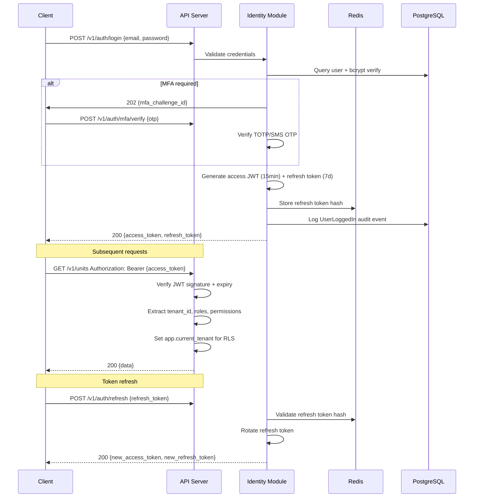

#### 9.2.1 Token Configuration

| Token | TTL | Storage (client) | Storage (server) |
|-------|-----|------------------|------------------|
| Access JWT | 15 phút | Memory (JS variable) | Stateless |
| Refresh token | 7 ngày | HttpOnly Secure cookie | Redis hash |
| MFA challenge | 5 phút | Response body | Redis TTL key |
| SSE token | 1 giờ | Query param (short-lived) | Redis |

### 9.3 RBAC + ABAC Design

#### 9.3.1 RBAC — Role Hierarchy Phase 1

| Role | Tenant Type | Mô tả |
|------|-------------|-------|
| `platform_admin` | Platform | Full platform management |
| `platform_finance` | Platform | Ledger, reconciliation, settlement |
| `developer_admin` | Developer | Golden Record CRUD, project management |
| `agency_admin` | Agency | Team management, routing config |
| `agent` | Agency | Listing, CRM, booking |
| `ops_admin` | Platform/Agency | Moderation, audit, dispute |
| `buyer` | — | Public portal self-service (P3 app) |

#### 9.3.2 ABAC — Attribute Policies (Phase 2)

| Policy | Attribute | Rule |
|--------|-----------|------|
| Project scope | `user.abac_scopes.projects` | Agent chỉ truy cập project trong scope |
| Region scope | `user.abac_scopes.regions` | Lead routing giới hạn region |
| Tenant type | `user.tenant_type` | Developer không truy cập CRM Agency |
| Resource owner | `resource.agent_id` | Agent chỉ sửa listing của mình (trừ admin) |
| Time-based | `request.timestamp` | Maintenance window restrictions |

### 9.4 MFA Requirements

| Action | MFA Required | Method |
|--------|-------------|--------|
| Login (platform_admin) | ✅ Always | TOTP |
| Payment confirmation (buyer) | ✅ | SMS OTP |
| E-sign contract | ✅ | SMS OTP + TOTP |
| Admin tenant suspend | ✅ | TOTP |
| Refund approval > 50M VND | ✅ | TOTP |
| Bulk import > 1000 units | ✅ | TOTP |
| API key generation | ✅ | TOTP |

### 9.5 Encryption

| Layer | Algorithm | Key management |
|-------|-----------|----------------|
| Data at rest (PostgreSQL) | AES-256 (RDS/ disk encryption) | Cloud KMS |
| Data at rest (S3) | SSE-S3 or SSE-KMS | AWS KMS |
| Data in transit | TLS 1.2+ (prefer 1.3) | Let's Encrypt / ACM |
| Password storage | bcrypt (cost factor 12) | — |
| Refresh token | SHA-256 hash in Redis | — |
| PII fields (optional P2) | Application-level AES-256-GCM | Vault-stored key per tenant |
| JWT signing | RS256 (RSA 2048) | Vault rotation 90 days |

### 9.6 OWASP Top 10 Mitigation

| OWASP Risk | Mitigation WEREAL | Verification |
|------------|-------------------|--------------|
| A01 Broken Access Control | RBAC + ABAC + RLS 3-layer; deny-by-default | Pen test + RLS test suite |
| A02 Cryptographic Failures | TLS 1.2+, AES-256 at rest, bcrypt passwords | SSL scan, config audit |
| A03 Injection | Parameterized queries (TypeORM), input validation (class-validator) | SAST + SQL injection test |
| A04 Insecure Design | Threat modeling, ADR review, guardrails AI | Architecture review |
| A05 Security Misconfiguration | IaC, hardened Docker, security headers | DAST, config scan |
| A06 Vulnerable Components | Dependabot, Snyk, CVE patch ≤ 7 days | CI gate |
| A07 Auth Failures | JWT rotation, MFA, rate limit login | Auth test suite |
| A08 Data Integrity Failures | Webhook signature verify, event store immutable | Integration test |
| A09 Logging Failures | Structured audit log, AI action log, payment log | Log review |
| A10 SSRF | Allowlist outbound URLs, no user-controlled fetch | Code review |

### 9.7 Security Headers

```
Strict-Transport-Security: max-age=31536000; includeSubDomains
X-Content-Type-Options: nosniff
X-Frame-Options: DENY
Content-Security-Policy: default-src 'self'; script-src 'self'; ...
Referrer-Policy: strict-origin-when-cross-origin
Permissions-Policy: camera=(), microphone=(), geolocation=(self)
```

---

## 10. Ma trận phân quyền

### 10.1 Roles × Permissions × Resources (Phase 1 Core)

**Chú thích:** ✅ = Allow | ⚠️ = Allow with scope restriction | ❌ = Deny | 🔒 = MFA required

#### 10.1.1 Golden Record & Inventory

| Resource/Action | platform_admin | developer_admin | agency_admin | agent | ops_admin |
|-----------------|----------------|-----------------|--------------|-------|-----------|
| `unit:create` | ❌ | ✅ | ❌ | ❌ | ❌ |
| `unit:read` | ✅ | ✅ | ⚠️ project scope | ⚠️ project scope | ✅ |
| `unit:update` | ❌ | ✅ 🔒 | ❌ | ❌ | ❌ |
| `unit:delete` | ❌ | ✅ 🔒 | ❌ | ❌ | ❌ |
| `unit:version:read` | ✅ | ✅ | ❌ | ❌ | ✅ |
| `project:create` | ❌ | ✅ | ❌ | ❌ | ❌ |
| `project:read` | ✅ | ✅ | ⚠️ assigned | ⚠️ assigned | ✅ |
| `inventory:bulk_import` | ❌ | ✅ 🔒 | ❌ | ❌ | ❌ |

#### 10.1.2 Listing & Search

| Resource/Action | platform_admin | developer_admin | agency_admin | agent | ops_admin |
|-----------------|----------------|-----------------|--------------|-------|-----------|
| `listing:create` | ❌ | ❌ | ✅ | ✅ | ❌ |
| `listing:read` | ✅ | ✅ | ✅ tenant | ✅ own + team | ✅ |
| `listing:update` | ❌ | ❌ | ✅ | ⚠️ own only | ❌ |
| `listing:submit_review` | ❌ | ❌ | ✅ | ✅ | ❌ |
| `listing:approve` | ❌ | ⚠️ own project | ❌ | ❌ | ✅ |
| `listing:reject` | ❌ | ⚠️ own project | ❌ | ❌ | ✅ |
| `listing:publish` | ❌ | ❌ | ❌ | ❌ | ✅ (after approve) |
| `search:public` | ✅ | ✅ | ✅ | ✅ | ✅ |
| `media:upload` | ❌ | ❌ | ✅ | ✅ | ❌ |

#### 10.1.3 CRM & Leads

| Resource/Action | platform_admin | developer_admin | agency_admin | agent | ops_admin |
|-----------------|----------------|-----------------|--------------|-------|-----------|
| `lead:create` | ❌ | ❌ | ✅ | ✅ | ❌ |
| `lead:read` | ✅ aggregate | ❌ | ✅ tenant | ⚠️ assigned | ✅ |
| `lead:assign` | ❌ | ❌ | ✅ | ❌ | ✅ |
| `lead:update` | ❌ | ❌ | ✅ | ⚠️ assigned | ❌ |
| `activity:create` | ❌ | ❌ | ✅ | ✅ | ❌ |
| `activity:read` | ❌ | ❌ | ✅ tenant | ⚠️ assigned | ✅ |
| `routing:configure` | ❌ | ❌ | ✅ | ❌ | ❌ |

#### 10.1.4 Booking & Transaction

| Resource/Action | platform_admin | developer_admin | agency_admin | agent | ops_admin |
|-----------------|----------------|-----------------|--------------|-------|-----------|
| `booking:create` | ❌ | ❌ | ✅ | ✅ | ❌ |
| `booking:read` | ✅ | ⚠️ own project | ✅ tenant | ⚠️ own | ✅ |
| `booking:cancel` | ❌ | ⚠️ policy | ✅ | ⚠️ own pre-deposit | ✅ 🔒 |
| `booking:timeline:replay` | ✅ | ✅ | ❌ | ❌ | ✅ |
| `reservation:extend` | ❌ | ❌ | ✅ | ⚠️ own | ❌ |

#### 10.1.5 Payment & Finance

| Resource/Action | platform_admin | platform_finance | developer_admin | agency_admin | agent |
|-----------------|----------------|------------------|-----------------|--------------|-------|
| `payment_intent:create` | ❌ | ❌ | ❌ | ✅ | ✅ |
| `payment:read` | ✅ | ✅ | ⚠️ own project | ✅ tenant | ⚠️ own booking |
| `payment:link:send` | ❌ | ❌ | ❌ | ✅ | ✅ |
| `refund:approve` | ❌ | ✅ 🔒 | ❌ | ❌ | ❌ |
| `ledger:read` | ✅ | ✅ | ❌ | ❌ | ❌ |
| `reconciliation:run` | ❌ | ✅ 🔒 | ❌ | ❌ | ❌ |
| `reconciliation:read` | ✅ | ✅ | ❌ | ❌ | ❌ |

#### 10.1.6 AI, Trust & Admin

| Resource/Action | platform_admin | developer_admin | agency_admin | agent | ops_admin |
|-----------------|----------------|-----------------|--------------|-------|-----------|
| `ai:copilot:use` | ❌ | ❌ | ✅ | ✅ | ❌ |
| `ai:content:approve` | ❌ | ❌ | ✅ | ✅ | ❌ |
| `ai:score:read` | ✅ | ❌ | ✅ tenant | ⚠️ assigned lead | ✅ |
| `audit:read` | ✅ | ⚠️ own tenant | ⚠️ own tenant | ❌ | ✅ |
| `tenant:create` | ✅ 🔒 | ❌ | ❌ | ❌ | ❌ |
| `tenant:suspend` | ✅ 🔒 | ❌ | ❌ | ❌ | ❌ |
| `user:manage` | ✅ | ⚠️ own tenant | ✅ own tenant | ❌ | ❌ |
| `dashboard:kpi:read` | ✅ | ✅ | ✅ | ⚠️ own stats | ✅ |

### 10.2 Permission Naming Convention

```
{resource}:{action}[/{scope}]

Ví dụ:
- unit:update
- listing:approve
- booking:cancel
- ledger:read
- ai:copilot:use
```

### 10.3 Policy Enforcement Points

| Layer | Enforcement | Fail mode |
|-------|-------------|-----------|
| API Gateway | Rate limit, API key (P4) | 429 Too Many Requests |
| NestJS Guard | `@RequirePermission()` decorator | 403 Forbidden |
| Service layer | Business rule check (ownership) | 403 Forbidden |
| PostgreSQL RLS | Row filter | Empty result (not 403 — by design) |

---

## 11. Thiết kế luồng dữ liệu

### 11.1 Golden Record Sync Flow

Luồng đồng bộ Golden Record → Search Index → SSE Push khi trạng thái unit thay đổi.

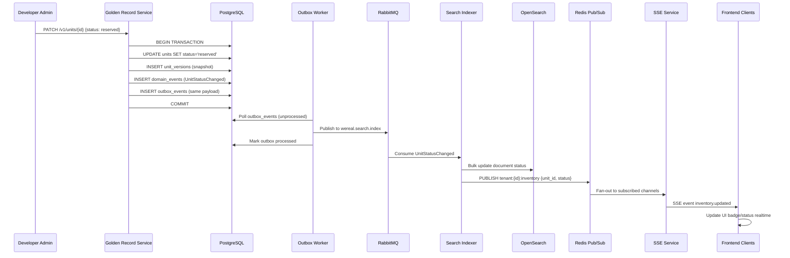

#### 11.1.1 Sync SLA & Failure Handling

| Step | SLA (NFR-P04) | Failure handling |
|------|---------------|------------------|
| PG commit | Immediate | Transaction rollback |
| Outbox publish | ≤ 1s | Retry with exponential backoff |
| Search index update | ≤ 5s total | DLQ + alert; stale index fallback |
| SSE push | ≤ 5s total | Client reconnect + poll fallback |

### 11.2 Booking Flow — End to End

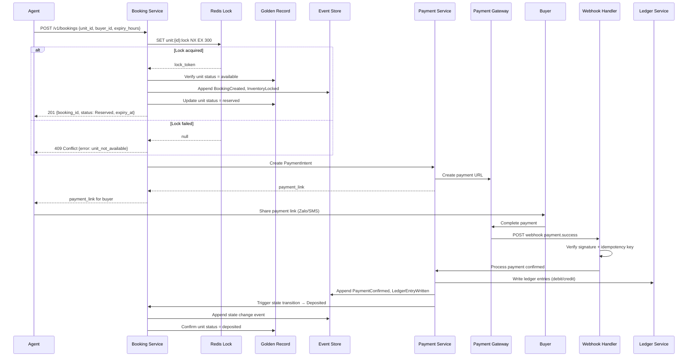

#### 11.2.2 Booking Error Paths

| Scenario | HTTP Status | System action |
|----------|-------------|---------------|
| Unit already locked | 409 Conflict | Return existing booking info if same agent |
| Unit sold | 410 Gone | Suggest similar units from search |
| Expiry reached | — (async) | Release lock, emit InventoryReleased, notify agent |
| Payment failed | — (webhook) | Revert to Reserved, notify retry |
| Double webhook | 200 OK (idempotent) | Skip duplicate ledger write |

### 11.3 Payment Webhook Flow

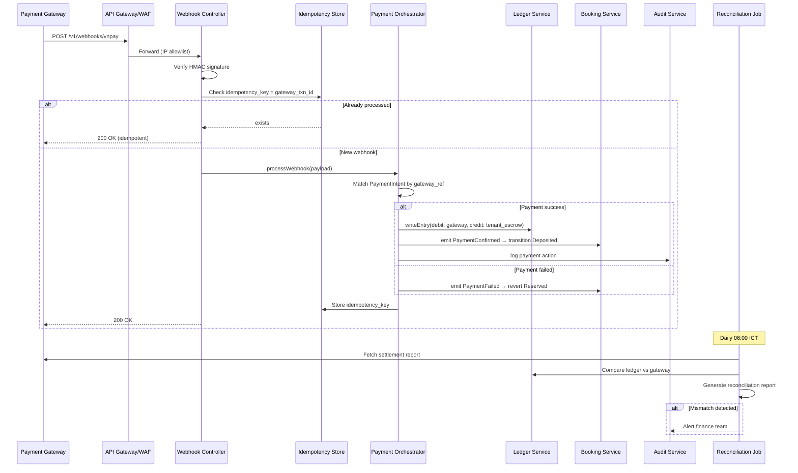

#### 11.3.1 Webhook Security Checklist

| Check | Implementation |
|-------|----------------|
| Signature verification | HMAC-SHA512 with gateway secret |
| IP allowlist | Gateway IP ranges only |
| Idempotency | `webhook_idempotency` table, unique gateway_txn_id |
| Timestamp validation | Reject if > 5 min old |
| Payload schema validation | class-validator DTO |
| Async processing | Return 200 immediately, process in queue if > 500ms |
| Retry from gateway | Safe due to idempotency |
| Audit | Every webhook logged with raw payload (masked PAN) |

### 11.4 Anti-drift Validation Flow

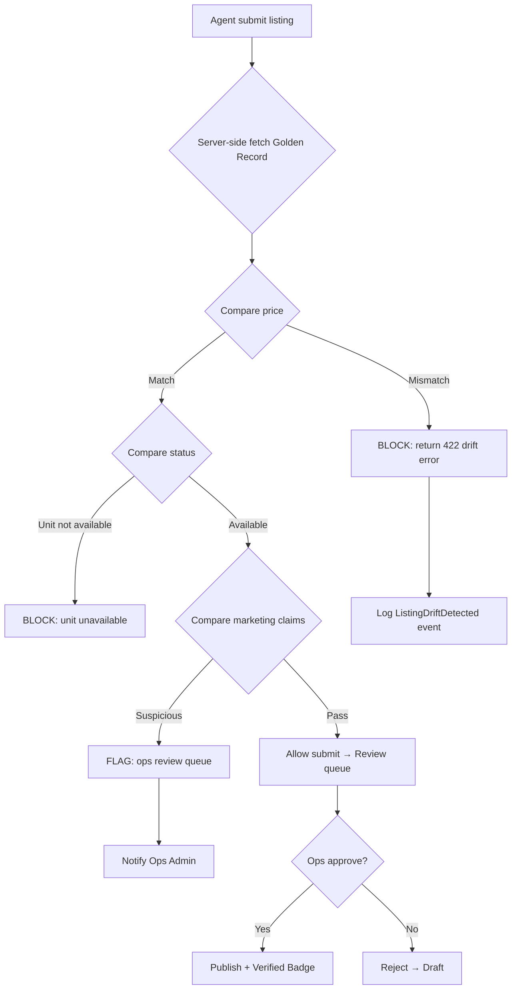

### 11.5 Lead Capture → AI Scoring → Routing Flow

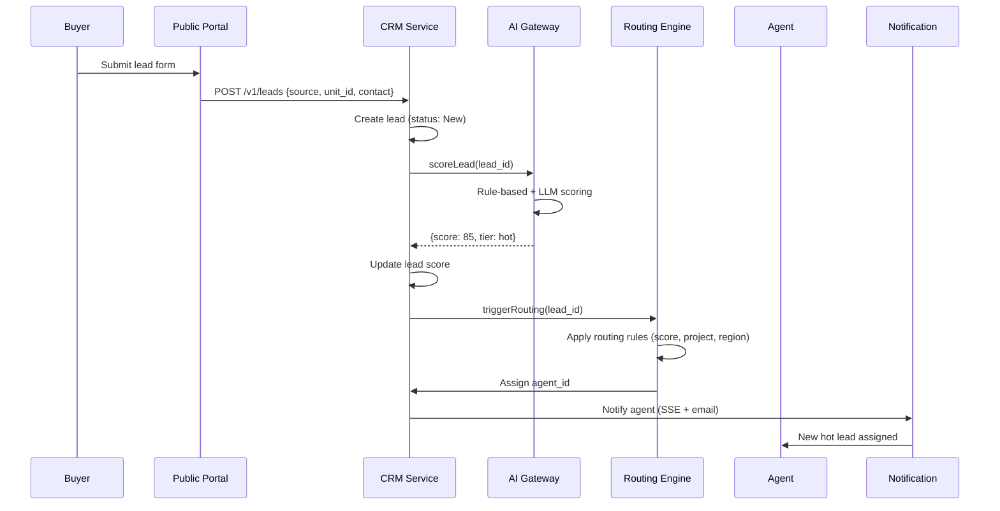

---

## 12. Thiết kế tích hợp

### 12.1 Integration Architecture

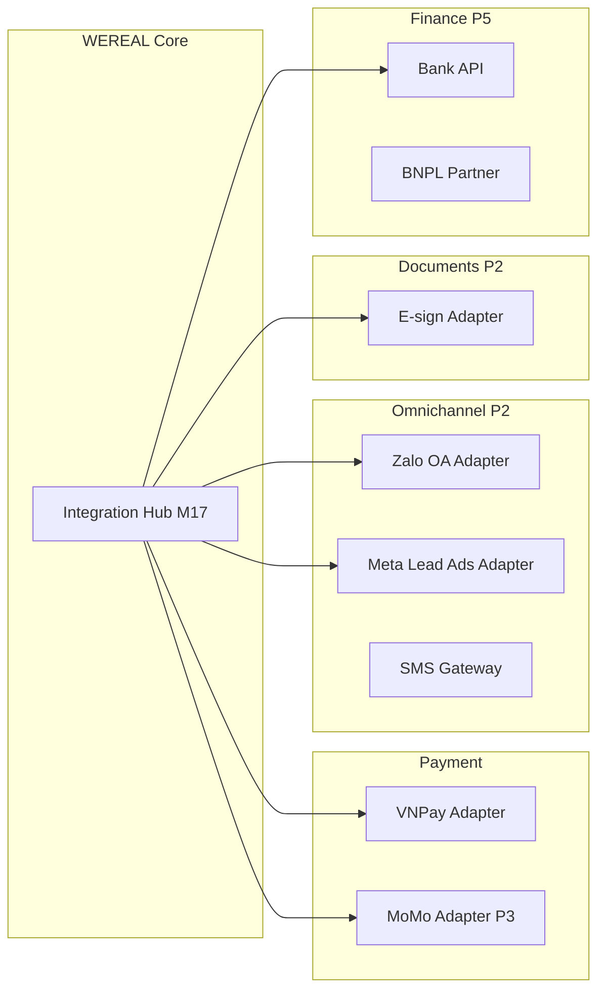

### 12.2 Payment Gateway Adapter Pattern

#### 12.2.1 Adapter Interface

```typescript
interface PaymentGatewayAdapter {
  readonly providerId: string;
  createPaymentIntent(params: CreateIntentParams): Promise<GatewayIntentResult>;
  verifyWebhookSignature(payload: string, signature: string): boolean;
  parseWebhookPayload(payload: unknown): WebhookEvent;
  queryTransaction(gatewayRef: string): Promise<TransactionStatus>;
  refund(params: RefundParams): Promise<RefundResult>;
}
```

#### 12.2.2 VNPay Adapter (Phase 1 Primary)

| Aspect | Detail |
|--------|--------|
| **Protocol** | Redirect URL + IPN webhook |
| **Signature** | HMAC-SHA512 |
| **Sandbox** | `sandbox.vnpayment.vn` |
| **Webhook endpoint** | `POST /v1/webhooks/vnpay` |
| **Idempotency key** | `vnp_TxnRef` |
| **Settlement report** | Daily CSV/API |
| **Currency** | VND only |
| **Timeout** | Payment link expiry 15 min |

#### 12.2.3 Multi-gateway Routing (Phase 3)

| Rule | Primary | Fallback | Condition |
|------|---------|----------|-----------|
| Default | VNPay | MoMo | VNPay circuit open |
| Amount > 500M VND | Bank transfer | VNPay | Amount-based routing |
| Buyer preference | MoMo | VNPay | Stored preference |
| Tenant config | Per-tenant gateway | Platform default | Tenant policy |

### 12.3 Webhook Platform (Outbound — Phase 3)

| Feature | Design |
|---------|--------|
| Tenant registration | Admin UI configure webhook URL + secret |
| Event types | `booking.created`, `payment.confirmed`, `listing.published`, etc. |
| Delivery | HMAC-signed POST with retry (3 attempts, exponential backoff) |
| Idempotency | `event_id` in payload |
| Log | Delivery log per tenant with response status |
| Rate limit | 100 webhook/min per tenant |

### 12.4 Zalo OA Integration (Phase 2)

| Flow | Direction | Endpoint |
|------|-----------|----------|
| Lead notification | WEREAL → Zalo | ZNS template message |
| OTP delivery | WEREAL → Zalo | ZNS OTP template |
| Incoming message | Zalo → WEREAL | Webhook `/v1/webhooks/zalo` |
| Lead Ads sync | Meta → WEREAL | Webhook `/v1/webhooks/meta` |

### 12.5 E-sign Integration (Phase 2)

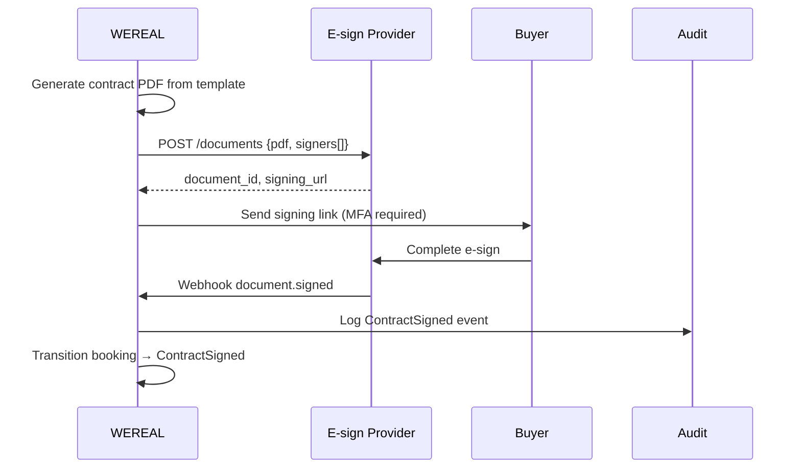

---

## 13. Thiết kế kiến trúc AI

### 13.1 AI Architecture Overview

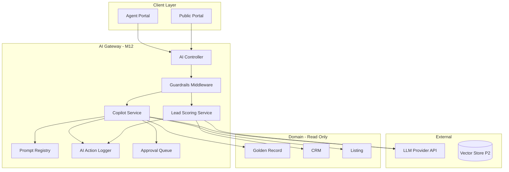

### 13.2 AI Gateway Components

| Component | Responsibility | Phase |
|-----------|---------------|-------|
| **AI Controller** | REST endpoints, request validation | 1 |
| **Guardrails Middleware** | Pre/post LLM call validation | 1 |
| **Prompt Registry** | Versioned prompts, tenant overrides | 1 |
| **Copilot Service** | Listing copy, headline, project summary | 1 |
| **Lead Scoring Service** | Hot/warm/cold classification | 1 |
| **RAG Service** | Legal/policy FAQ with citation | 2 |
| **Matching Service** | Buyer-product recommendation | 2 |
| **Agent Services** | Sales/Ops/Compliance/Developer agents | 3 |
| **Approval Queue** | Human-in-the-loop before publish/send | 1 |
| **AI Action Logger** | Every AI call logged with latency, tokens, cost | 1 |
| **Eval Pipeline** | Prompt A/B testing, quality metrics | 2 |

### 13.3 Guardrails Design

#### 13.3.1 Hard Rules (FR-AI-03)

| Rule ID | Rule | Enforcement |
|---------|------|-------------|
| GR-AI-01 | AI **không được** gọi API mutate `unit.price` | Block tool call; log violation |
| GR-AI-02 | AI **không được** gọi API mutate `unit.status` | Block tool call |
| GR-AI-03 | AI **không được** tạo booking trực tiếp | Block tool call |
| GR-AI-04 | AI **không được** tạo PaymentIntent | Block tool call |
| GR-AI-05 | AI content **phải** qua approval queue trước publish | Intercept publish endpoint |
| GR-AI-06 | AI output **phải** có disclaimer pháp lý | Post-process append disclaimer |
| GR-AI-07 | AI **không được** truy cập cross-tenant data | Tenant context filter |
| GR-AI-08 | PII trong prompt **phải** masked trước gửi LLM | PII scrubber middleware |

#### 13.3.2 Guardrails Flow

```mermaid
flowchart TD
    REQ[AI Request] --> TENANT{Tenant context valid?}
    TENANT -->|No| DENY1[403 Forbidden]
    TENANT -->|Yes| PII[PII Scrubber]
    PII --> PROMPT[Load prompt from registry]
    PROMPT --> LLM[Call LLM Provider]
    LLM --> OUTPUT[Output Validator]
    OUTPUT --> MUTATE{Contains mutation intent?}
    MUTATE -->|Yes| DENY2[Block + log GR-AI violation]
    MUTATE -->|No| DISC[Append disclaimer]
    DISC --> LOG[AI Action Log]
    LOG --> APPROVAL{Requires approval?}
    APPROVAL -->|Yes| QUEUE[Approval Queue]
    APPROVAL -->|No| RETURN[Return to client]
    QUEUE --> HITL[Human approve/reject]
```

### 13.4 RAG Architecture (Phase 2)

| Component | Technology | Tenant isolation |
|-----------|------------|------------------|
| Document ingestion | PDF parser + chunker | Per-tenant document vault |
| Embedding | OpenAI text-embedding-3-small | — |
| Vector store | pgvector (Phase 2) → Pinecone (P3) | Separate namespace per tenant |
| Retrieval | Top-k similarity + metadata filter | Filter by tenant_id + project_id |
| Generation | LLM with retrieved context | Citation required in response |
| Eval | Human review sample 10% | Quality score tracking |

### 13.5 AI Cost & Latency Management

| Metric | Target | Control |
|--------|--------|---------|
| Copilot P95 latency | ≤ 8s (NFR-P05) | Timeout 10s; fallback template |
| Lead scoring latency | ≤ 3s (NFR-P06) | Rule-first, LLM optional |
| Token budget per tenant | Configurable monthly cap | Hard stop at 100% budget |
| Cost logging | Per request token count × price | `ai_action_log.cost_usd` |
| Model selection | GPT-4o-mini (P1 copilot); GPT-4o (P3 agents) | Config per use case |

---

## 14. Thiết kế real-time

### 14.1 Real-time Architecture

```mermaid
flowchart LR
    subgraph Event Sources
        GR[Golden Record]
        BK[Booking]
        CRM[CRM]
        PAY[Payment]
    end

    subgraph Event Bus
        RD[Redis Pub/Sub]
    end

    subgraph SSE Layer
        SSE[SSE Controller]
        CONN[Connection Manager]
    end

    subgraph Clients
        PUB[Public Portal]
        AGT[Agent Portal]
        ADM[Admin Portal]
    end

    GR --> RD
    BK --> RD
    CRM --> RD
    PAY --> RD
    RD --> SSE
    SSE --> CONN
    CONN --> PUB
    CONN --> AGT
    CONN --> ADM
```

### 14.2 SSE Channel Design

| Channel pattern | Events | Subscribers |
|-----------------|--------|-------------|
| `tenant:{tenant_id}:inventory` | unit.status_changed, unit.price_changed | Agent, Public, Admin |
| `tenant:{tenant_id}:leads` | lead.assigned, lead.scored | Agent |
| `tenant:{tenant_id}:bookings` | booking.created, booking.state_changed | Agent, Admin |
| `user:{user_id}:notifications` | notification.* | Specific user |
| `listing:{listing_id}:status` | listing.published, listing.verified | Public detail page |

#### 14.2.1 SSE Message Format

```json
{
  "id": "evt_uuid",
  "event": "inventory.updated",
  "data": {
    "unit_id": "unit_uuid",
    "status": "reserved",
    "project_id": "proj_uuid",
    "timestamp": "2026-12-31T10:00:00+07:00"
  },
  "retry": 3000
}
```

#### 14.2.2 SSE Connection Management

| Aspect | Design |
|--------|--------|
| Authentication | Short-lived SSE token (1h) via query param |
| Reconnect | Client exponential backoff 1s→30s |
| Heartbeat | `:keepalive` comment every 30s |
| Max connections | 10,000 concurrent (Phase 1) |
| Connection per user | Max 5 tabs |
| Scale path | Dedicated SSE service Phase 2; WebSocket mobile |

### 14.3 Redis Pub/Sub vs Redis Streams

| Feature | Pub/Sub (Phase 1) | Streams (Phase 2+) |
|---------|-------------------|-------------------|
| Message persistence | ❌ Fire-and-forget | ✅ Persisted |
| Consumer groups | ❌ | ✅ |
| Replay | ❌ | ✅ |
| Latency | < 1ms | < 5ms |
| Use case | SSE fan-out realtime | Reliable event processing |

**Phase 1 decision:** Pub/Sub đủ cho SSE fan-out; domain events đã persist trong PostgreSQL event store.

### 14.4 Inventory Lock Design (Redis)

#### 14.4.1 Redlock Algorithm

```typescript
// Pseudocode — InventoryLockService
async acquireLock(unitId: string, bookingId: string, ttlSeconds: number): Promise<string | null> {
  const lockKey = `lock:unit:${unitId}`;
  const lockToken = uuid();
  const result = await redis.set(lockKey, lockToken, 'NX', 'EX', ttlSeconds);
  if (result === 'OK') {
    await this.eventStore.append('InventoryLocked', { unitId, bookingId, lockToken });
    return lockToken;
  }
  return null; // Lock held by another booking
}

async releaseLock(unitId: string, lockToken: string): Promise<boolean> {
  // Lua script: delete only if token matches (prevent wrong release)
  const script = `
    if redis.call("get", KEYS[1]) == ARGV[1] then
      return redis.call("del", KEYS[1])
    else
      return 0
    end`;
  return await redis.eval(script, 1, `lock:unit:${unitId}`, lockToken) === 1;
}
```

#### 14.4.2 Lock Parameters

| Parameter | Default | Configurable |
|-----------|---------|--------------|
| Lock TTL | 300s (5 min) | Tenant config |
| Reservation expiry | 24–72h | Tenant config |
| Lock retry (client) | 0 (fail immediately) | — |
| Auto-release | TTL expiry + booking expiry worker | — |
| DB backup constraint | `units.status` CHECK + optimistic version | Prevent drift |

#### 14.4.3 Concurrency Test Requirement (NFR-P08)

| Test | Scenario | Expected |
|------|----------|----------|
| TC-LOCK-01 | 100 concurrent booking same unit | Exactly 1 success, 99 conflict |
| TC-LOCK-02 | Lock TTL expiry during payment | Auto-release, unit available |
| TC-LOCK-03 | Agent cancel releases lock | Unit immediately available |
| TC-LOCK-04 | Redis failure fallback | DB advisory lock backup; alert P0 |

---

## 15. Thiết kế event sourcing

### 15.1 Event Store Schema

```sql
CREATE SCHEMA IF NOT EXISTS events;

CREATE TABLE events.domain_events (
    event_id        UUID PRIMARY KEY DEFAULT gen_random_uuid(),
    tenant_id       UUID NOT NULL,
    aggregate_type  VARCHAR(50) NOT NULL,  -- 'Unit', 'Booking', 'Payment'
    aggregate_id    UUID NOT NULL,
    event_type      VARCHAR(100) NOT NULL,  -- 'UnitStatusChanged'
    event_version   INTEGER NOT NULL,       -- Optimistic concurrency
    payload         JSONB NOT NULL,
    metadata        JSONB NOT NULL DEFAULT '{}',  -- actor_id, correlation_id, causation_id
    occurred_at     TIMESTAMPTZ NOT NULL DEFAULT NOW(),
    
    CONSTRAINT uq_aggregate_version UNIQUE (aggregate_type, aggregate_id, event_version)
);

-- BRIN index for time-range queries (time-travel, replay)
CREATE INDEX idx_domain_events_occurred_at ON events.domain_events 
    USING BRIN (occurred_at);

CREATE INDEX idx_domain_events_aggregate ON events.domain_events 
    (aggregate_type, aggregate_id, event_version);

CREATE INDEX idx_domain_events_tenant ON events.domain_events (tenant_id, occurred_at);

-- Append-only: revoke UPDATE/DELETE
REVOKE UPDATE, DELETE ON events.domain_events FROM wereal_app;
```

### 15.2 Outbox Pattern Schema

```sql
CREATE TABLE events.outbox_events (
    outbox_id       UUID PRIMARY KEY DEFAULT gen_random_uuid(),
    tenant_id       UUID NOT NULL,
    event_type      VARCHAR(100) NOT NULL,
    payload         JSONB NOT NULL,
    destination     VARCHAR(100) NOT NULL,  -- 'search.index', 'notification', 'webhook'
    status          VARCHAR(20) NOT NULL DEFAULT 'pending',  -- pending, published, failed
    retry_count     INTEGER NOT NULL DEFAULT 0,
    created_at      TIMESTAMPTZ NOT NULL DEFAULT NOW(),
    published_at    TIMESTAMPTZ
);

CREATE INDEX idx_outbox_pending ON events.outbox_events (status, created_at) 
    WHERE status = 'pending';
```

### 15.3 Aggregates & Event Types

| Aggregate | Aggregate Root ID | Key Events | Projection |
|-----------|-------------------|------------|------------|
| **Unit** | unit_id | UnitCreated, UnitPriceChanged, UnitStatusChanged | Current unit state table |
| **Booking** | booking_id | BookingCreated, InventoryLocked, PaymentConfirmed, DealCompleted, BookingCancelled | booking.current_state |
| **Payment** | payment_intent_id | PaymentIntentCreated, PaymentConfirmed, PaymentFailed, RefundProcessed | payment.status |
| **Listing** | listing_id | ListingCreated, ListingPublished, ListingDriftDetected | listing.status |
| **Lead** | lead_id | LeadCaptured, LeadScored, AgentAssigned | lead.score, lead.agent_id |

### 15.4 Event Envelope Standard

```json
{
  "event_id": "550e8400-e29b-41d4-a716-446655440000",
  "event_type": "UnitStatusChanged",
  "aggregate_type": "Unit",
  "aggregate_id": "unit-uuid",
  "event_version": 5,
  "tenant_id": "tenant-uuid",
  "occurred_at": "2026-12-31T10:00:00+07:00",
  "payload": {
    "unit_id": "unit-uuid",
    "old_status": "available",
    "new_status": "reserved",
    "booking_id": "booking-uuid",
    "reason": "booking_created"
  },
  "metadata": {
    "actor_id": "user-uuid",
    "correlation_id": "request-uuid",
    "causation_id": "prior-event-uuid"
  }
}
```

### 15.5 Projections

| Projection | Source events | Target | Update mechanism |
|------------|---------------|--------|------------------|
| Unit current state | Unit* events | `inventory.units` | Synchronous in transaction |
| Booking timeline | Booking* events | `transaction.booking_state_history` | Synchronous |
| Search index | Unit*, Listing* events | OpenSearch | Async via outbox |
| KPI metrics | All transaction events | Materialized views | Async batch (5 min) |
| SSE notifications | Unit*, Booking* events | Redis pub/sub | Async immediate |
| Audit trail | All events | `audit.audit_log` | Synchronous |

### 15.6 Replay & Time-Travel

```mermaid
sequenceDiagram
    participant OPS as Ops Admin
    participant API as Event Store Service
    participant PG as PostgreSQL events schema
    participant UI as Admin Portal

    OPS->>API: GET /v1/events/replay?booking_id=X
    API->>PG: SELECT * FROM domain_events WHERE aggregate_id=X ORDER BY event_version
    PG-->>API: Event stream [1..N]
    API-->>UI: Timeline visualization

    OPS->>API: GET /v1/units/{id}/snapshot?as_of=2026-06-01T00:00:00Z
    API->>PG: Query unit_versions + domain_events WHERE occurred_at <= as_of
    API->>API: Reconstruct state at T (nearest version)
    API-->>UI: Historical snapshot
```

| Use case | API | Phase |
|----------|-----|-------|
| Dispute evidence | `GET /v1/bookings/{id}/timeline` | 1 |
| Time-travel inventory | `GET /v1/units/{id}/snapshot?as_of=` | 2 |
| Debug/replay | Internal admin tool | 1 |
| Analytics backfill | Batch replay to DW | 3 |

---

## 16. Thiết kế state machine

### 16.1 Booking Transaction State Machine — 15 States

**Trạng thái chính (12 active + 3 terminal):**

```
Draft → Published → Viewed → Qualified → Contacted → Scheduled
  → Reserved → DepositPending → Deposited → ContractDrafted
  → ContractSigned → Completed

Terminal: Cancelled | Expired | Refunded
```

```mermaid
stateDiagram-v2
    [*] --> Draft: ListingCreated
    Draft --> Published: ListingApproved
    Published --> Viewed: UnitViewed
    Viewed --> Qualified: LeadSubmitted
    Qualified --> Contacted: AgentContacted
    Contacted --> Scheduled: VisitScheduled
    Scheduled --> Reserved: BookingCreated + Lock
    Reserved --> DepositPending: PaymentIntentCreated
    DepositPending --> Deposited: PaymentConfirmed
    DepositPending --> Reserved: PaymentFailed
    Deposited --> ContractDrafted: ContractGenerated
    ContractDrafted --> ContractSigned: ContractSigned
    ContractSigned --> Completed: DealClosed

    Reserved --> Expired: TimerExpired
    Qualified --> Expired: AutoExpire SLA
    Published --> Draft: ListingRejected

    Reserved --> Cancelled: CancelRequested
    DepositPending --> Cancelled: CancelRequested
    Deposited --> Refunded: RefundApproved

    Completed --> [*]
    Cancelled --> [*]
    Expired --> [*]
    Refunded --> [*]
```

### 16.2 Transition Rules Table (18 transitions)

| # | From State | Event/Trigger | To State | Guard Condition | Actor | Side Effect |
|---|------------|---------------|----------|-----------------|-------|-------------|
| T01 | — | ListingCreated | Draft | Unit available; agent authorized | Agent | Create listing record |
| T02 | Draft | ListingApproved | Published | Anti-drift pass; Ops/Dev approve | Ops Admin | Index search; SSE push |
| T03 | Published | UnitViewed | Viewed | Buyer opens detail | Buyer | Log UnitViewed event |
| T04 | Viewed | LeadSubmitted | Qualified | Lead form valid; consent OK | Buyer | Create lead; AI score |
| T05 | Qualified | AgentContacted | Contacted | Agent logs call/meeting | Agent | SLA timer start |
| T06 | Contacted | VisitScheduled | Scheduled | Meeting booked | Agent | Calendar event |
| T07 | Scheduled | BookingCreated | Reserved | Atomic lock success; expiry set | Agent | Lock unit; timer start |
| T08 | Reserved | PaymentIntentCreated | DepositPending | Min deposit policy met | System | Payment link sent |
| T09 | DepositPending | PaymentConfirmed | Deposited | Webhook verified; amount OK | System | Ledger write; GR→reserved |
| T10 | Deposited | ContractGenerated | ContractDrafted | Template merged | System | Doc vault store |
| T11 | ContractDrafted | ContractSigned | ContractSigned | E-sign complete + MFA | Buyer | Audit trail |
| T12 | ContractSigned | DealClosed | Completed | All conditions met | System | Commission snapshot |
| T13 | Reserved | TimerExpired | Expired | expiry_at passed; no payment | System | Release lock; GR→available |
| T14 | DepositPending | PaymentFailed | Reserved | Gateway fail; retry window | System | Notify agent |
| T15 | Any pre-Completed | CancelRequested | Cancelled | Policy allows; approval if needed | Agent/Ops | Release lock if reserved |
| T16 | Deposited | RefundApproved | Refunded | Refund processed | Ops Admin 🔒 | Ledger reversal |
| T17 | Published | ListingRejected | Draft | Ops reject with reason | Ops Admin | Notify agent |
| T18 | Qualified | AutoExpire | Expired | SLA breach no contact | System | Re-route lead |

### 16.3 State Machine Implementation

```typescript
// StateMachineService — simplified
const TRANSITIONS: Record<string, { event: string; to: string; guard?: GuardFn }[]> = {
  'Reserved': [
    { event: 'PaymentIntentCreated', to: 'DepositPending' },
    { event: 'TimerExpired', to: 'Expired' },
    { event: 'CancelRequested', to: 'Cancelled', guard: canCancelBeforeDeposit },
  ],
  'DepositPending': [
    { event: 'PaymentConfirmed', to: 'Deposited' },
    { event: 'PaymentFailed', to: 'Reserved' },
    { event: 'CancelRequested', to: 'Cancelled', guard: canCancelBeforeDeposit },
  ],
  // ... remaining states
};

async transition(bookingId: string, event: string, actor: ActorContext): Promise<BookingState> {
  const booking = await this.repo.findById(bookingId);
  const rules = TRANSITIONS[booking.currentState];
  const rule = rules?.find(r => r.event === event);
  if (!rule) throw new InvalidTransitionError(booking.currentState, event);
  if (rule.guard && !await rule.guard(booking, actor)) throw new GuardFailedError();
  
  await this.eventStore.append('BookingStateChanged', {
    bookingId, from: booking.currentState, to: rule.to, event, actorId: actor.id
  });
  return rule.to;
}
```

### 16.4 Phase 1 vs Phase 2+ States

| State | Phase 1 | Phase 2+ |
|-------|---------|----------|
| Draft → Deposited | ✅ Full flow | ✅ |
| ContractDrafted | ⚠️ Optional (manual) | ✅ Auto template |
| ContractSigned | ⚠️ Manual confirm | ✅ E-sign integration |
| Completed | ✅ Manual trigger | ✅ Auto on ContractSigned |
| Commission snapshot | ❌ (P2) | ✅ |

### 16.5 CRM Pipeline Alignment

Booking states map 1:1 với CRM pipeline stages — cho phép unified timeline view:

| Booking State | CRM Pipeline Stage | CRM Activity Type |
|---------------|-------------------|---------------------|
| Viewed | Awareness | page_view |
| Qualified | Lead | lead_created |
| Contacted | Contact | call, email |
| Scheduled | Meeting | meeting_scheduled |
| Reserved | Negotiation | booking_created |
| Deposited | Commitment | payment_received |
| Completed | Closed Won | deal_closed |
| Cancelled | Closed Lost | booking_cancelled |
| Expired | Closed Lost | booking_expired |

---

## 17. Chiến lược mở rộng Phase 1–6

### 17.1 Scale Roadmap Overview

| Dimension | Phase 1 (2026) | Phase 2 (2027 Q1) | Phase 3 (2027 Q2-Q3) | Phase 4 (2028 Q1) | Phase 5–6 (2028+) |
|-----------|----------------|-------------------|----------------------|-------------------|-------------------|
| **Tenants** | 5 pilot | 50 | 200 | 500 | 2000+ |
| **Concurrent users** | 500 | 2,000 | 5,000 | 10,000 | 50,000 |
| **Units/tenant** | 5,000 | 20,000 | 50,000 | 50,000 | 100,000 |
| **API instances** | 2–4 | 4–8 | 8–16 | 16–32 | Auto-scale |
| **Architecture** | Modular monolith | Partial service split | CQRS + CDC | Multi-region | Full ecosystem |
| **Uptime SLA** | 99.5% | 99.7% | 99.9% | 99.9% | 99.95% |
| **Search lag** | ≤ 5s | ≤ 2s | ≤ 1s | ≤ 500ms | ≤ 200ms |

### 17.2 Phase 1 — MVP Foundation (T8–T12/2026)

| Strategy | Implementation |
|----------|----------------|
| **Vertical scale first** | Single PG primary + 1 replica; Redis single node |
| **Modular monolith** | 18 modules, single deploy |
| **Async where possible** | Outbox → RabbitMQ for search, notification |
| **Cache hot paths** | Redis cache unit status, listing detail |
| **Connection pooling** | PgBouncer 100 connections |
| **CDN offload** | Static assets + listing images via CDN |

**Bottleneck mitigation P1:**

| Bottleneck | Mitigation |
|------------|------------|
| Inventory lock contention | Redis Redlock; fail-fast no retry |
| Search query load | OpenSearch dedicated; cache popular queries |
| SSE connections | Redis pub/sub; limit 10K connections |
| Payment webhook burst | Queue-based async processing |

### 17.3 Phase 2 — Scale & Split (T1–T4/2027)

| Strategy | Implementation |
|----------|----------------|
| **Service extraction** | Payment, Search, Notification → independent services |
| **Read replica** | PG read replica for analytics queries |
| **Redis cluster** | 3-node Redis cluster |
| **OpenSearch scale** | 3 data nodes; index lifecycle management |
| **Mobile app** | React Native; offline cache |
| **Omnichannel** | Zalo/Meta integration adds webhook volume |

### 17.4 Phase 3 — Intelligence & CQRS (T5–T9/2027)

| Strategy | Implementation |
|----------|----------------|
| **Full CQRS** | Write PG → CDC (Debezium) → OpenSearch < 1s |
| **Kafka migration** | RabbitMQ → Kafka for event bus |
| **Data warehouse** | PostgreSQL → S3 → Snowflake/BigQuery ETL |
| **AI service split** | FastAPI sidecar for RAG + Agents |
| **Feature store** | ML features for scoring, forecast |
| **5K concurrent** | Auto-scale API 8–16 instances |

### 17.5 Phase 4 — Enterprise (T10/2027–T2/2028)

| Strategy | Implementation |
|----------|----------------|
| **Multi-region** | Primary VN (HCMC) + DR HN; read replica regional |
| **SSO/White-label** | Per-tenant subdomain routing |
| **SLA 99.9%** | Multi-AZ deployment; circuit breakers |
| **API Marketplace** | Partner API keys; rate limit per partner |
| **Custom workflow** | Temporal workflow engine |

### 17.6 Phase 5–6 — Finance & Network (2028+)

| Strategy | Implementation |
|----------|----------------|
| **Embedded finance** | PCI-scoped payment service; bank API integration |
| **Smart Escrow** | Separate escrow account management |
| **Marketplace network** | Cross-tenant discovery; leaderboard |
| **Multi-country prep** | i18n, multi-currency, data residency |
| **Market Data Product** | Anonymized aggregate data API |

### 17.7 Database Scaling Strategy

| Phase | Strategy | Trigger |
|-------|----------|---------|
| P1 | Single primary + 1 replica | Default |
| P2 | Read replica for analytics | KPI query load > 30% primary |
| P3 | Table partitioning (audit_log, domain_events) | Table > 50GB |
| P4 | Citus/sharding by tenant_id | > 500 tenants or > 10TB |
| P5 | Dedicated finance DB | PCI compliance scope |

### 17.8 Cost Optimization

| Area | Phase 1 | Scale optimization |
|------|---------|-------------------|
| Compute | 2 API instances | Spot instances for workers |
| Database | db.r6g.large | Reserved instances 1-year |
| OpenSearch | 3 nodes minimum | UltraWarm for old indexes |
| LLM | GPT-4o-mini | Cache common copilot prompts |
| CDN | Cloudflare Pro | Aggressive image caching |
| Storage | S3 Standard | Lifecycle → IA after 90 days |

---

## 18. Tóm tắt ADR

> **ADR files:** [`adr/README.md`](./adr/README.md) — registry đầy đủ ADR-001→005

### 18.1 ADR-001: Modular Monolith cho Phase 1

> File: [`adr/ADR-001-modular-monolith-phase-1.md`](./adr/ADR-001-modular-monolith-phase-1.md)

| Field | Value |
|-------|-------|
| **Status** | Accepted |
| **Date** | 15/07/2026 |
| **Context** | Team 8–12 engineers; go-live 31/12/2026; 39 FR Must; chưa có production traffic |
| **Decision** | Triển khai NestJS modular monolith thay vì microservices |
| **Rationale** | (1) Velocity — single deploy, shared DB transactions; (2) Team size không đủ ops microservices; (3) Module boundary = future service boundary; (4) Booking+Payment cần ACID cùng transaction |
| **Consequences** | (+) Fast iteration, simple ops; (+) Easy refactor module internals; (−) Single point of scale; (−) Must discipline module boundaries |
| **Migration path** | Extract Payment (P2), Search (P2), AI (P3) khi metrics justify |

### 18.2 ADR-002: PostgreSQL 16 + RLS cho Tenant Isolation

> File: [`adr/ADR-002-postgresql-rls-tenant-isolation.md`](./adr/ADR-002-postgresql-rls-tenant-isolation.md)

| Field | Value |
|-------|-------|
| **Status** | Accepted |
| **Date** | 15/07/2026 |
| **Context** | Multi-tenant SaaS B2B2C; zero cross-tenant leak (NFR-S02); PDPA compliance |
| **Decision** | PostgreSQL 16 Row-Level Security là lớp isolation chính ở database |
| **Rationale** | (1) Defense in depth — app bug không leak data; (2) Native PG feature, mature; (3) Event store cùng DB đơn giản ops; (4) Team familiar PostgreSQL |
| **Consequences** | (+) DB-level guarantee; (+) Audit policy via pg_policies; (−) Connection pool phải SET tenant per request; (−) RLS overhead ~5% query |
| **Alternatives rejected** | Schema-per-tenant (ops nightmare); DB-per-tenant (cost); App-only filter (risky) |
| **Implementation** | `SET app.current_tenant` in connection middleware; integration test 100% RLS |

### 18.3 ADR-003: Event Store trên PostgreSQL + RabbitMQ (→ Kafka P3)

> File: [`adr/ADR-003-event-store-postgresql-rabbitmq.md`](./adr/ADR-003-event-store-postgresql-rabbitmq.md)

| Field | Value |
|-------|-------|
| **Status** | Accepted |
| **Date** | 18/07/2026 |
| **Context** | Event sourcing cho booking/payment; replay dispute; async search sync; team chưa có Kafka expertise |
| **Decision** | (1) Event store = PostgreSQL append-only table; (2) Message queue = RabbitMQ Phase 1; (3) Migrate Kafka Phase 3 |
| **Rationale** | (1) PG event store — ACID cùng business transaction, no extra infra P1; (2) RabbitMQ — simpler ops, đủ 500 events/s; (3) Outbox pattern reliable publish; (4) Kafka khi cần replay log + high throughput |
| **Consequences** | (+) Single DB backup includes events; (+) RabbitMQ ops familiar; (−) PG event store scale limit ~10K events/s; (−) Migration effort P3 |
| **Review trigger** | Event throughput > 1000/s sustained OR need event replay from bus |

### 18.4 ADR-004: Payment Gateway Adapter Pattern

> File: [`adr/ADR-004-payment-gateway-adapter-pattern.md`](./adr/ADR-004-payment-gateway-adapter-pattern.md)

| Field | Value |
|-------|-------|
| **Status** | Accepted |
| **Date** | 20/07/2026 |
| **Context** | Phase 1: 1 gateway (VNPay); Phase 3: multi-gateway; FR-PAY-06; không tự xây gateway (EX-01) |
| **Decision** | Interface `PaymentGatewayAdapter` với implementation per provider; orchestrator route by config |
| **Rationale** | (1) Swap gateway ≤ 2 sprint (NFR-CM03); (2) Sandbox/prod keys isolated; (3) Webhook handler per provider; (4) Test with mock adapter |
| **Consequences** | (+) Vendor independence; (+) Unit test without real gateway; (−) Lowest common denominator API; (−) Provider-specific features need extension |
| **Phase 1 scope** | VNPayAdapter only; MoMoAdapter stub |

### 18.5 ADR-005: AI Gateway — NestJS Module Phase 1, FastAPI Sidecar Phase 2

> File: [`adr/ADR-005-ai-gateway-architecture.md`](./adr/ADR-005-ai-gateway-architecture.md)

| Field | Value |
|-------|-------|
| **Status** | Accepted |
| **Date** | 22/07/2026 |
| **Context** | Phase 1 AI: copilot + scoring + guardrails; Phase 2: RAG; Phase 3: Agents; FR-AI-03 guardrails bắt buộc |
| **Decision** | (1) Phase 1: AI Gateway as NestJS module calling LLM API; (2) Phase 2+: Extract FastAPI sidecar for RAG/ML; (3) Central guardrails in gateway regardless |
| **Rationale** | (1) P1 AI scope nhỏ — NestJS module đủ, shared auth/tenant; (2) Python ecosystem tốt hơn for RAG/ML P2; (3) Guardrails must be centralized; (4) LLM provider abstraction from day 1 |
| **Consequences** | (+) Fast P1 delivery; (+) Guardrails enforced single point; (−) Node.js not ideal for ML P3; (−) Sidecar adds network hop P2 |
| **Guardrails** | Non-negotiable: AI never mutates price/inventory/booking (FR-AI-03) |

### 18.6 ADR Summary Table

| ADR | Title | Status | Phase Impact | File |
|-----|-------|--------|--------------|------|
| ADR-001 | Modular Monolith | Accepted | P1 architecture | [`adr/ADR-001-modular-monolith-phase-1.md`](./adr/ADR-001-modular-monolith-phase-1.md) |
| ADR-002 | PostgreSQL RLS | Accepted | P1 data isolation | [`adr/ADR-002-postgresql-rls-tenant-isolation.md`](./adr/ADR-002-postgresql-rls-tenant-isolation.md) |
| ADR-003 | Event Store PG + RabbitMQ | Accepted | P1–P3 event architecture | [`adr/ADR-003-event-store-postgresql-rabbitmq.md`](./adr/ADR-003-event-store-postgresql-rabbitmq.md) |
| ADR-004 | Payment Adapter Pattern | Accepted | P1–P3 payment | [`adr/ADR-004-payment-gateway-adapter-pattern.md`](./adr/ADR-004-payment-gateway-adapter-pattern.md) |
| ADR-005 | AI Gateway Architecture | Accepted | P1–P3 AI | [`adr/ADR-005-ai-gateway-architecture.md`](./adr/ADR-005-ai-gateway-architecture.md) |

---

## 19. Truy vết SRS FR → Module thiết kế

### 19.1 Golden Record & Inventory (GR) — 8 FR

| FR ID | Tên FR | Module chính | Module phụ | Layer | Phase |
|-------|--------|--------------|------------|-------|-------|
| FR-GR-01 | Quản lý Golden Record | M04 golden-record | M03 tenant, M13 audit | L3, L4 | 1 |
| FR-GR-02 | Versioning giá, tồn kho, policy | M04 golden-record | Event Store | L3, L4 | 1 |
| FR-GR-03 | Listing marketing từ unit gốc | M05 listing | M04 golden-record | L3 | 1 |
| FR-GR-04 | Anti-drift auto-block/flag | M14 trust | M04, M05 | L3, L8 | 1 |
| FR-GR-05 | Verified Listing badge | M14 trust | M05 listing, M06 search | L3, L8 | 1 |
| FR-GR-06 | Time-travel query | M04 golden-record | Event Store | L3, L4 | 2 |
| FR-GR-07 | Bulk import Excel/CSV | M04 golden-record | M05 listing | L3 | 2 |
| FR-GR-08 | Real-time push trạng thái unit | M15 notification | M04, M06 search | L1, L4 | 1 |

### 19.2 Tenant & Identity (ID) — 6 FR

| FR ID | Tên FR | Module chính | Module phụ | Layer | Phase |
|-------|--------|--------------|------------|-------|-------|
| FR-ID-01 | Multi-tenant hierarchy | M03 tenant | M01 identity | L2, L3 | 1 |
| FR-ID-02 | RBAC và ABAC | M02 authorization | M01 identity | L2 | 1–2 |
| FR-ID-03 | Tenant isolation RLS | M03 tenant | PostgreSQL RLS | L2, L4 | 1 |
| FR-ID-04 | MFA/OTP nhạy cảm | M01 identity | M15 notification | L2 | 1 |
| FR-ID-05 | KYC/KYB | M03 tenant | M13 audit | L2, L8 | 2 |
| FR-ID-06 | SSO Enterprise | M01 identity | M17 integration | L2, L9 | 4 |

### 19.3 Listing & Search (LS) — 6 FR

| FR ID | Tên FR | Module chính | Module phụ | Layer | Phase |
|-------|--------|--------------|------------|-------|-------|
| FR-LS-01 | CRUD listing + approval | M05 listing | M14 trust | L3 | 1 |
| FR-LS-02 | Full-text + facet + geo search | M06 search | OpenSearch | L3, L4 | 1 |
| FR-LS-03 | Media upload listing | M05 listing | S3 storage | L3, L4 | 1 |
| FR-LS-04 | So sánh sản phẩm | M06 search | Public Portal | L1, L3 | 1 |
| FR-LS-05 | Duplicate listing detection | M05 listing | M14 trust | L3 | 2 |
| FR-LS-06 | Search sync CDC | M06 search | Outbox worker | L4 | 1 |

### 19.4 CRM & Omnichannel (CRM) — 9 FR

| FR ID | Tên FR | Module chính | Module phụ | Layer | Phase |
|-------|--------|--------------|------------|-------|-------|
| FR-CRM-01 | Lead capture đa nguồn | M07 crm | Public Portal | L1, L3 | 1 |
| FR-CRM-02 | Lead gắn entity | M07 crm | M04 golden-record | L3 | 1 |
| FR-CRM-03 | Lead routing | M07 crm | M12 ai-gateway | L3, L5 | 1 |
| FR-CRM-04 | CRM activities timeline | M07 crm | Event Store | L3, L4 | 1 |
| FR-CRM-05 | Pipeline + state machine | M07 crm | M08 booking | L3 | 1–2 |
| FR-CRM-06 | Zalo OA/ZNS integration | M17 integration | M07 crm | L3, L9 | 2 |
| FR-CRM-07 | Meta Lead Ads sync | M17 integration | M07 crm | L3, L9 | 2 |
| FR-CRM-08 | SLA reminder escalation | M07 crm | M15 notification | L3 | 2 |
| FR-CRM-09 | Omnichannel unified inbox | M07 crm | M17 integration | L3, L9 | 3 |

### 19.5 Booking & Transaction (BK) — 8 FR

| FR ID | Tên FR | Module chính | Module phụ | Layer | Phase |
|-------|--------|--------------|------------|-------|-------|
| FR-BK-01 | Reservation với expiry | M08 booking | M04 golden-record | L3 | 1 |
| FR-BK-02 | Atomic inventory lock | M08 booking | Redis lock | L3, L4 | 1 |
| FR-BK-03 | Transaction state machine 15 states | M08 booking | StateMachineService | L3 | 1 |
| FR-BK-04 | Domain events event store | Event Store module | M08, M09 | L4 | 1 |
| FR-BK-05 | Contract template merge | M08 booking | M17 integration | L3 | 2 |
| FR-BK-06 | E-sign integration | M17 integration | M08 booking | L3, L9 | 2 |
| FR-BK-07 | Cancel/refund workflow | M08 booking | M09 payment, M10 ledger | L3, L6 | 1 |
| FR-BK-08 | Custom workflow per tenant | M08 booking | Temporal engine | L3, L4 | 4 |

### 19.6 Payment & Finance (PAY) — 10 FR

| FR ID | Tên FR | Module chính | Module phụ | Layer | Phase |
|-------|--------|--------------|------------|-------|-------|
| FR-PAY-01 | Payment orchestration | M09 payment | Gateway adapter | L6 | 1 |
| FR-PAY-02 | PaymentIntent Invoice Receipt Refund | M09 payment | M13 audit | L6 | 1 |
| FR-PAY-03 | Double-entry ledger | M10 ledger | M09 payment | L6 | 1 |
| FR-PAY-04 | Webhook idempotent reconciliation | M09 payment, M10 ledger | M13 audit | L6 | 1 |
| FR-PAY-05 | Deposit payment gắn booking | M09 payment | M08 booking | L6 | 1 |
| FR-PAY-06 | Multi-gateway routing fallback | M09 payment | Gateway adapters | L6 | 3 |
| FR-PAY-07 | Commission settlement batch payout | M11 commission | M10 ledger | L6 | 2 |
| FR-PAY-08 | Smart Escrow conditional release | M09 payment | M17 bank adapter | L6 | 5 |
| FR-PAY-09 | BNPL trả góp đợt | M09 payment | M17 integration | L6 | 5 |
| FR-PAY-10 | Mortgage pre-qualification | M09 payment | M17 bank adapter | L6 | 5 |

### 19.7 Commission (COM) — 5 FR

| FR ID | Tên FR | Module chính | Module phụ | Layer | Phase |
|-------|--------|--------------|------------|-------|-------|
| FR-COM-01 | Commission policy per project | M11 commission | M04 golden-record | L3, L6 | 2 |
| FR-COM-02 | Policy snapshot at deal close | M11 commission | M08 booking | L6 | 2 |
| FR-COM-03 | Split commission multi agent | M11 commission | M07 crm | L6 | 2 |
| FR-COM-04 | Holdback khi tranh chấp | M11 commission | M14 trust | L6, L8 | 2 |
| FR-COM-05 | Export kế toán CSV/Excel | M11 commission | M10 ledger | L6 | 2 |

### 19.8 AI Layer (AI) — 10 FR

| FR ID | Tên FR | Module chính | Module phụ | Layer | Phase |
|-------|--------|--------------|------------|-------|-------|
| FR-AI-01 | Content copilot listing | M12 ai-gateway | M05 listing | L5 | 1 |
| FR-AI-02 | Lead scoring tự động | M12 ai-gateway | M07 crm | L5 | 1 |
| FR-AI-03 | Guardrails no mutate | M12 ai-gateway | All domain modules | L5 | 1 |
| FR-AI-04 | Human approval AI content | M12 ai-gateway | M15 notification | L5 | 1 |
| FR-AI-05 | RAG knowledge assistant | M12 ai-gateway | Vector store | L5 | 2 |
| FR-AI-06 | Buyer-product matching | M12 ai-gateway | M06 search | L5 | 2 |
| FR-AI-07 | Sales Agent draft reply | M12 ai-gateway | M07 crm | L5 | 3 |
| FR-AI-08 | Ops Compliance Agent anomaly | M12 ai-gateway | M14 trust | L5, L8 | 3 |
| FR-AI-09 | Buyer conversational discovery | M12 ai-gateway | Public Portal | L1, L5 | 3 |
| FR-AI-10 | Pricing intelligence fraud detection | M12 ai-gateway | M14 trust | L5, L8 | 3 |

### 19.9 Trust & Compliance (TR) — 5 FR

| FR ID | Tên FR | Module chính | Module phụ | Layer | Phase |
|-------|--------|--------------|------------|-------|-------|
| FR-TR-01 | Audit trail toàn hệ thống | M13 audit | All modules | L8 | 1 |
| FR-TR-02 | Document vault watermark | M14 trust | S3 storage | L8 | 2 |
| FR-TR-03 | Dispute Resolution Center | M14 trust | M08 booking, Event Store | L8 | 3 |
| FR-TR-04 | Regulatory Export Pack | M13 audit | M14 trust | L8 | 4 |
| FR-TR-05 | AI action log | M13 audit | M12 ai-gateway | L5, L8 | 1 |

### 19.10 Analytics (AN) — 5 FR

| FR ID | Tên FR | Module chính | Module phụ | Layer | Phase |
|-------|--------|--------------|------------|-------|-------|
| FR-AN-01 | KPI dashboard funnel lead booking | M16 analytics | Event Store | L7 | 1 |
| FR-AN-02 | GMV dashboard | M16 analytics | M10 ledger | L7 | 2 |
| FR-AN-03 | Inventory absorption report | M16 analytics | M04 golden-record | L7 | 2 |
| FR-AN-04 | Campaign attribution | M16 analytics | M07 crm | L7 | 3 |
| FR-AN-05 | Absorption forecast 30/60/90 | M16 analytics | M12 ai-gateway | L7 | 3 |

### 19.11 Marketplace (MKT) — 3 FR

| FR ID | Tên FR | Module chính | Module phụ | Layer | Phase |
|-------|--------|--------------|------------|-------|-------|
| FR-MKT-01 | Distribution policy publish | M18 marketplace | M04 golden-record | L3, L9 | 2 |
| FR-MKT-02 | Agency apply approve quyền bán | M18 marketplace | M03 tenant | L3, L9 | 2 |
| FR-MKT-03 | Marketplace leaderboard compliance | M18 marketplace | M16 analytics | L7, L9 | 3 |

### 19.12 Experience Layer (UX) — 7 FR

| FR ID | Tên FR | Module chính | Module phụ | Layer | Phase |
|-------|--------|--------------|------------|-------|-------|
| FR-UX-01 | Public Portal | Public Web App | M06 search, M07 crm | L1 | 1 |
| FR-UX-02 | Agent Portal | Agent Web App | M07, M08, M12 | L1 | 1 |
| FR-UX-03 | Admin Portal | Admin Web App | M03, M13, M10 | L1 | 1 |
| FR-UX-04 | Developer Portal | Developer Web App | M04 golden-record | L1 | 2 |
| FR-UX-05 | Mobile App sale | Mobile App | All agent modules | L1 | 2 |
| FR-UX-06 | Buyer App native | Buyer Mobile App | M08, M09 | L1 | 3 |
| FR-UX-07 | White-label portal | All web apps | M03 tenant config | L1 | 4 |

### 19.13 Traceability Summary

| Module | FR Count | Phase 1 FR |
|--------|----------|------------|
| M04 golden-record | 8 | 6 |
| M01 identity | 4 | 3 |
| M02 authorization | 2 | 2 |
| M03 tenant | 4 | 3 |
| M05 listing | 6 | 4 |
| M06 search | 4 | 4 |
| M07 crm | 9 | 5 |
| M08 booking | 8 | 5 |
| M09 payment | 10 | 5 |
| M10 ledger | 4 | 3 |
| M11 commission | 5 | 0 |
| M12 ai-gateway | 10 | 4 |
| M13 audit | 4 | 2 |
| M14 trust | 6 | 3 |
| M15 notification | 3 | 2 |
| M16 analytics | 5 | 1 |
| M17 integration | 6 | 0 |
| M18 marketplace | 3 | 0 |
| Frontend apps | 7 | 3 |
| **Total** | **82 FR** | **39 Must P1** |

---

## 20. Phụ lục

### 20.1 Thuật ngữ (Glossary)

| # | Thuật ngữ | Định nghĩa |
|---|-----------|------------|
| 1 | **Golden Record** | Dữ liệu unit gốc từ Developer — single source of truth cho giá, trạng thái tồn kho, policy |
| 2 | **Product Graph** | Mô hình quan hệ Developer→Project→Phase→Building→Unit→Listing→Lead→Booking→Payment |
| 3 | **Anti-drift** | Cơ chế tự động phát hiện listing lệch giá/trạng thái so với Golden Record |
| 4 | **Modular Monolith** | Single deployable application với module boundaries rõ ràng — WEREAL Phase 1 pattern |
| 5 | **RLS** | Row-Level Security — PostgreSQL policy filter tenant_id mọi query |
| 6 | **Event Sourcing** | Pattern lưu trạng thái qua chuỗi domain events append-only |
| 7 | **Outbox Pattern** | Ghi event vào outbox table cùng business transaction; worker publish async |
| 8 | **CQRS** | Command Query Responsibility Segregation — tách write/read model |
| 9 | **Redlock** | Redis distributed lock algorithm — inventory lock WEREAL |
| 10 | **SSE** | Server-Sent Events — real-time push Phase 1 (thay WebSocket) |
| 11 | **PaymentIntent** | Đối tượng thanh toán abstract trước khi charge gateway |
| 12 | **Double-entry Ledger** | Sổ cái kế toán kép — debit/credit cân bằng mọi giao dịch |
| 13 | **Guardrails** | Ràng buộc AI không mutate giá, tồn kho, booking — read-only domain |
| 14 | **Human-in-the-loop** | Yêu cầu con người approve trước AI action có impact |
| 15 | **ADR** | Architecture Decision Record — tài liệu hóa quyết định kiến trúc |
| 16 | **CDC** | Change Data Capture — đồng bộ thay đổi DB sang search index |
| 17 | **Bounded Context** | Ranh giới domain module trong DDD — mapping 1:1 NestJS module |
| 18 | **Aggregate Root** | Entity gốc quản lý consistency boundary — Unit, Booking, PaymentIntent |
| 19 | **Time-travel Query** | Truy vấn trạng thái dữ liệu tại thời điểm T trong quá khứ |
| 20 | **Verified Listing** | Badge xác nhận listing khớp 100% Golden Record và đã duyệt |

### 20.2 Tham chiếu tài liệu thiết kế liên quan

| Tài liệu | File | Nội dung | Trạng thái |
|----------|------|----------|------------|
| **SRS v2.0** | [`Tai-lieu-yeu-cau-phan-mem.md`](./Tai-lieu-yeu-cau-phan-mem.md) | 82 FR, 52 NFR, state machine, personas | Draft |
| **Thiết kế API** | [`Thiet-ke-API.md`](./Thiet-ke-API.md) | OpenAPI 3.1 spec, endpoint chi tiết, error codes |
| **OpenAPI Specification** | [`openapi.yaml`](./openapi.yaml) | 71 endpoints Phase 1 — generated from catalog |
| **Sơ đồ CSDL** | [`So-do-CSDL.md`](./So-do-CSDL.md) | ERD, RLS policies, indexes, migrations | Planned Sprint S1 |
| **Sơ đồ Kiến trúc** | [`So-do-kien-truc.md`](./So-do-kien-truc.md) | C4 diagrams, deployment, sequence diagrams | Planned Sprint S1 |
| **Mockup UI** | [`Mockup-UI-mau.md`](./Mockup-UI-mau.md) | Wireframe 3 portals, design system tokens | Planned Sprint S0 |
| **Use Case & US** | [`Danh-sach-use-case-user-story.md`](./Danh-sach-use-case-user-story.md) | 58 UC, 132 US, sprint backlog | Draft v2.0 |
| **Tiêu chí chấp nhận** | [`Tieu-chi-chap-nhan.md`](./Tieu-chi-chap-nhan.md) | AC, TC, UAT scenarios | Draft v2.0 |
| **Phạm vi công việc** | [`Pham-vi-cong-viec.md`](./Pham-vi-cong-viec.md) | 9 lớp scope, deliverables | v2.0 |
| **Kế hoạch dự án** | [`Ke-hoach-du-an.md`](./Ke-hoach-du-an.md) | Timeline, team, budget | v2.0 |
| **Danh sách rủi ro** | [`Danh-sach-rui-ro.md`](./Danh-sach-rui-ro.md) | 42 rủi ro, mitigation | v2.0 |

### 20.3 Environment Variables Reference

| Variable | Description | Example |
|----------|-------------|---------|
| `DATABASE_URL` | PostgreSQL connection string | `postgresql://wereal:***@pg:5432/wereal` |
| `REDIS_URL` | Redis connection string | `redis://redis:6379/0` |
| `OPENSEARCH_URL` | OpenSearch endpoint | `https://os:9200` |
| `RABBITMQ_URL` | RabbitMQ AMQP URL | `amqp://wereal:***@mq:5672` |
| `S3_ENDPOINT` | Object storage endpoint | `https://s3.amazonaws.com` |
| `S3_BUCKET` | Media bucket name | `wereal-media-prod` |
| `JWT_PRIVATE_KEY` | RSA private key for JWT | Vault reference |
| `JWT_PUBLIC_KEY` | RSA public key | Vault reference |
| `VNPAY_TMN_CODE` | VNPay terminal code | Per environment |
| `VNPAY_HASH_SECRET` | VNPay HMAC secret | Vault reference |
| `OPENAI_API_KEY` | LLM provider key | Vault reference |
| `OTEL_EXPORTER_OTLP_ENDPOINT` | OpenTelemetry collector | `http://otel:4317` |

### 20.4 Health Check Endpoints

| Endpoint | Purpose | Checks |
|----------|---------|--------|
| `GET /health` | Load balancer health | Process alive |
| `GET /health/ready` | Kubernetes readiness | PG, Redis, OpenSearch, RabbitMQ connected |
| `GET /health/live` | Liveness probe | Event loop responsive |
| `GET /health/deep` | Ops diagnostic (auth required) | All dependencies + latency |

### 20.5 Naming Conventions

| Artifact | Convention | Example |
|----------|------------|---------|
| NestJS module | kebab-case directory | `golden-record/` |
| TypeORM entity | PascalCase class, snake_case table | `Unit` → `inventory.units` |
| API endpoint | kebab-case plural | `/v1/bookings` |
| Domain event | PascalCase verb phrase | `UnitStatusChanged` |
| Redis key | colon-separated | `lock:unit:{unit_id}` |
| RabbitMQ queue | dot-separated | `wereal.search.index` |
| PostgreSQL schema | domain name | `inventory`, `transaction` |
| Frontend component | PascalCase | `ListingCard.tsx` |
| Permission | resource:action | `booking:create` |

### 20.6 Phase 1 MVP Deliverables Mapping

| Deliverable ID | Mô tả | SDD Section | Module |
|----------------|-------|-------------|--------|
| D-P1-01 | Monolith API NestJS | §5, §6 | All modules |
| D-P1-02 | Golden Record schema + RLS | §6.4, §15 | M04, M03 |
| D-P1-03 | Event Store | §15 | Event Store |
| D-P1-04 | Public Portal | §6.1 | Public Web |
| D-P1-05 | Agent Portal | §6.1 | Agent Web |
| D-P1-06 | Admin Portal | §6.1 | Admin Web |
| D-P1-07 | OpenSearch integration | §4, §6.4 | M06 |
| D-P1-08 | Payment + Ledger | §11.3, §12 | M09, M10 |
| D-P1-09 | Real-time inventory lock + SSE | §14 | M08, M15 |
| D-P1-10 | AI copilot + scoring | §13 | M12 |
| D-P1-11 | Verified Listing | §11.4 | M14 |
| D-P1-12 | Audit trail | §15 | M13 |
| D-P1-13 | KPI dashboard | §6.7 | M16 |
| D-P1-14 | CI/CD pipeline | §8.6 | DevOps |
| D-P1-15 | Observability stack | §4.7 | OpenTelemetry |
| D-P1-16 | UAT environment | §8.2 | Staging |
| D-P1-17 | Runbook | §8.7 | Ops |
| D-P1-18 | Security review + pen test | §9 | Security |

### 20.7 Open Questions & Future ADRs

| # | Question | Impact | Target resolution |
|---|----------|--------|-------------------|
| OQ-01 | VNPay vs MoMo primary gateway? | Payment adapter default | Sprint S2 — PO decision |
| OQ-02 | Self-host OpenSearch vs AWS managed? | Cost, ops | Sprint S1 — DevOps |
| OQ-03 | pgvector vs Pinecone for RAG? | AI P2 architecture | Phase 2 kickoff |
| OQ-04 | Temporal vs custom workflow engine? | FR-BK-08 | Phase 4 ADR |
| OQ-05 | Cloud provider: AWS vs GCP vs VPS? | Deployment §8 | Sprint S0 — Steering Committee |
| OQ-06 | Multi-AZ within VN only or regional? | Phase 4 DR | Phase 3 planning |

### 20.8 Sign-off

| Vai trò | Họ tên | Chữ ký | Ngày | Ghi chú |
|---------|--------|--------|------|---------|
| Principal Architect | [TBD] | | | Author |
| Tech Lead Backend | [TBD] | | | Reviewer |
| Tech Lead Frontend | [TBD] | | | Reviewer |
| AI Lead | [TBD] | | | Reviewer |
| DevOps Lead | [TBD] | | | Reviewer |
| Security Lead | [TBD] | | | Reviewer |
| Product Owner | [TBD] | | | Approver |

---

> **End of Document**  
> WEREAL-SDD-2026-v1.0 | Generated 28/07/2026 | Confidential — Internal Use Only

