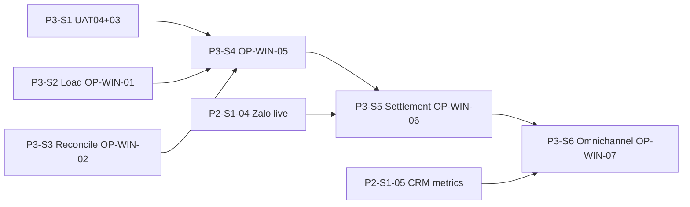

# Sprint Backlog P3 — Production Credibility (Tier 1)

> **Timeline:** 6 sprint × 2 tuần (T3–T4/2027) · **0–6 tháng**  
> **Goal:** Chứng minh production · pass OP-WIN-01→07 · đủ tin bán pilot trả tiền  
> **Gate:** G3.1 UAT signed · G3.2 staging live · G3.3 E2E CI green  
> **Scorecard target:** Composite **2.8 → 3.4** ([Domain Scorecard](../strategy/WEREAL-Domain-Scorecard.md))

---

## OP-WIN gates (P3 scope)

| ID | Tiêu chí | Sprint target | Evidence required |
|----|----------|---------------|-------------------|
| OP-WIN-01 | Không double-book | P3-S2 | UAT-05 + load test 50 concurrent |
| OP-WIN-02 | Reconcile 7 ngày 100% | P3-S3 | Finance dashboard streak export |
| OP-WIN-03 | Timeline replay ≤ 3 phút | P3-S1 | Audit CSV demo recording |
| OP-WIN-04 | Anti-drift 100% block | P3-S1 | UAT-04 signed |
| OP-WIN-05 | Vertical slice E2E 1 deal | P3-S4 | UAT-01→05 PO sign-off |
| OP-WIN-06 | Settlement batch E2E | P3-S5 | Payout SUBMITTED on staging |
| OP-WIN-07 | Omnichannel lead < 30s | P3-S6 | Admin metrics dashboard p95 |

---

## Sprint P3-S1 — UAT foundation + anti-drift + timeline

| Task ID | Module | Mô tả | UC/FR | Done when |
|---------|--------|-------|-------|-----------|
| P3-S1-01 ✅ | qa | Execute UAT-04 anti-drift manual + sign | OP-WIN-04 | Checklist ☐→☑ in UAT doc |
| P3-S1-02 ✅ | audit | OP-WIN-03 replay demo script ≤ 3 min | OP-WIN-03 | `scripts/demo-booking-replay.sh` + recording |
| P3-S1-03 ✅ | audit | Timeline export filter by bookingId verified | UC-TR-01 | CSV matches domain events |
| P3-S1-04 ✅ | listing | Anti-drift BLOCK preset E2E UI test path | UC-GR-03 | Wizard + moderation linked |
| P3-S1-05 ✅ | docs | Update UAT-P0 owner/date columns | S6-03 | At least UAT-04 signed |

**Demo P3-S1:** Listing price drift → BLOCK → agent sees GR truth · export timeline CSV in 3 min.

**Runbook:** [P3-S1-runbook.md](./P3-S1-runbook.md) · `./scripts/uat-p3-s1.sh`

---

## Sprint P3-S2 — Concurrent booking + load evidence

| Task ID | Module | Mô tả | UC/FR | Done when |
|---------|--------|-------|-------|-----------|
| P3-S2-01 ✅ | booking | UAT-05 concurrent book manual run | OP-WIN-01 | 2 parallel → 1 OK 1 conflict |
| P3-S2-02 ✅ | booking | Load test script 50 parallel bookings | OP-WIN-01 | `scripts/load/concurrent-book.k6.js` · 0 double-book |
| P3-S2-03 ✅ | redis | Inventory lock metrics log | UC-BK-01 | Lock contention logged |
| P3-S2-04 ✅ | qa | Document load test env + thresholds | S3-06 | README in `docs/dev/load-testing.md` |

**Demo P3-S2:** k6 report: 50 attempts same unit → exactly 1 RESERVED.

**Runbook:** [P3-S2-runbook.md](./P3-S2-runbook.md) · `./scripts/uat-p3-s2.sh` · `./scripts/load/run-concurrent-book.sh`

---

## Sprint P3-S3 — Reconcile streak (OP-WIN-02)

| Task ID | Module | Mô tả | UC/FR | Done when |
|---------|--------|-------|-------|-----------|
| P3-S3-01 ✅ | ledger | Daily reconcile job smoke on staging | UC-PAY-02 | 7 consecutive MATCHED days |
| P3-S3-02 ✅ | finance | Reconcile dashboard streak badge | SCR-FIN-002 | UI shows 7/7 green |
| P3-S3-03 ✅ | ledger | Discrepancy alert webhook/email stub | UC-PAY-02 | Ops notified on UNMATCHED |
| P3-S3-04 ✅ | qa | UAT-03 book→pay→ledger signed | OP-WIN-02 | UAT checklist ☐→☑ |

**Demo P3-S3:** Finance UI match rate 100% × 7 days · export KPI screenshot.

**Runbook:** [P3-S3-runbook.md](./P3-S3-runbook.md) · `./scripts/uat-p3-s3.sh`

---

## Sprint P3-S4 — Vertical slice E2E (OP-WIN-05)

| Task ID | Module | Mô tả | UC/FR | Done when |
|---------|--------|-------|-------|-----------|
| P3-S4-01 ✅ | qa | UAT-01 search→lead→scored | OP-WIN-05 | Lead in CRM + score SCORED |
| P3-S4-02 ✅ | qa | UAT-02 listing GR→approve→publish | OP-WIN-05 | Search index updated |
| P3-S4-03 ✅ | qa | UAT-03 book→pay→ledger (already auto) | OP-WIN-05 | `scripts/uat-p3-s4.sh` green |
| P3-S4-04 ✅ | commission | Commission snapshot on deposited booking | UC-COM-02 | Snapshot CALCULATED |
| P3-S4-05 ✅ | qa | PO sign-off UAT-01→05 | OP-WIN-05 | Signed row in UAT doc |

**Demo P3-S4:** 1 pilot deal GR → list → book → pay → ledger → commission snapshot · PO signature.

**Runbook:** [P3-S4-runbook.md](./P3-S4-runbook.md) · `./scripts/uat-p3-s4.sh`

---

## Sprint P3-S5 — Live integrations + settlement (OP-WIN-06)

| Task ID | Module | Mô tả | UC/FR | Done when |
|---------|--------|-------|-------|-----------|
| P3-S5-01 ✅ | zalo | `ZALO_ZNS_SANDBOX=false` on staging | UC-NW-01 | ZNS delivery DELIVERED |
| P3-S5-02 ✅ | sms | `SMS_SANDBOX=false` on staging | UC-NW-03 | OTP not `123456` on staging |
| P3-S5-03 ✅ | payment | VNPay sandbox → staging merchant | UC-PAY-01 | Real sandbox txn id |
| P3-S5-04 ✅ | commission | `SETTLEMENT_PAYOUT_ENABLED=true` staging | UC-PAY-04 | Payout SUBMITTED badge |
| P3-S5-05 ✅ | kyc | BR-23 agency KYC block → approve → settle | UC-ID-05 | OP-WIN-06 E2E demo |
| P3-S5-06 ✅ | env | Staging `.env` no MOCK defaults doc | ops | `docs/dev/staging-env.md` |

**Demo P3-S5:** Approve lines → settlement run → payout partner 200 → entries PAID.

**Runbook:** [P3-S5-runbook.md](./P3-S5-runbook.md) · `./scripts/uat-p3-s5.sh` · [staging-env.md](./staging-env.md)

---

## Sprint P3-S6 — Omnichannel SLA + E2E CI (OP-WIN-07)

| Task ID | Module | Mô tả | UC/FR | Done when |
|---------|--------|-------|-------|-----------|
| P3-S6-01 ✅ | crm | Admin omnichannel latency dashboard | UC-CRM-05 | p95 ingest < 30s |
| P3-S6-02 ✅ | meta | Meta lead webhook → CRM metric | UC-NW-02 | Latency panel live |
| P3-S6-03 ✅ | zalo | Zalo lead webhook → CRM metric | UC-NW-01 | Same dashboard |
| P3-S6-04 ✅ | qa | Playwright E2E 5 flows CI nightly | regression | search·list·book·reconcile·settle |
| P3-S6-05 ✅ | identity | Remove MFA `123456` on staging | UC-ID-03 | TOTP or SMS MFA path |
| P3-S6-06 ✅ | qa | P2 regression + P3 smoke in CI | OP-WIN-06→07 | Nightly green badge |

**Demo P3-S6:** Meta simulate → CRM lead timestamp delta < 30s on dashboard · CI badge green.

**Runbook:** [P3-S6-runbook.md](./P3-S6-runbook.md) · `./scripts/uat-p3-s6.sh` · `./scripts/smoke-p3-ci.sh`

---

## Definition of Done (Phase 3 / Tier 1)

- [ ] OP-WIN-01→05 PO sign-off ([UAT-P0](../uat/UAT-P0-pilot-checklist.md))
- [ ] OP-WIN-06 settlement payout E2E on staging
- [ ] OP-WIN-07 omnichannel p95 < 30s dashboard
- [ ] Staging env: no MOCK payment · no SMS/Zalo sandbox · payout enabled
- [ ] E2E CI 5 flows nightly green
- [ ] Load test concurrent book documented (50+ parallel)
- [ ] Domain scorecard composite ≥ 3.4

---

## Env quick reference (staging — not dev defaults)

```bash
# Payment
PAYMENT_DEFAULT_METHOD=VNPAY
# Zalo
ZALO_ZNS_SANDBOX=false
# SMS
SMS_SANDBOX=false
SMS_PROVIDER_URL=...
# Settlement
SETTLEMENT_PAYOUT_ENABLED=true
SETTLEMENT_PAYOUT_URL=...
# SSO (optional P3)
SSO_OIDC_USE_MOCK=false
# Meta
META_GRAPH_SANDBOX=false
META_APP_ID=...
```

---

## Dependency map



---

## Related docs

- [Sprint-Backlog-P2.md](./Sprint-Backlog-P2.md) — integrations Phase 2
- [Sprint-Backlog-P0.md](./Sprint-Backlog-P0.md) — vertical slice foundation
- [WEREAL-Domain-Scorecard.md](../strategy/WEREAL-Domain-Scorecard.md)
- [WEREAL-Competitive-Benchmark.md](../strategy/WEREAL-Competitive-Benchmark.md)
- [UAT-P0-pilot-checklist.md](../uat/UAT-P0-pilot-checklist.md)
- [WEREAL-BA-Master-Spec.md](../specs/WEREAL-BA-Master-Spec.md) § OP-WIN baseline
