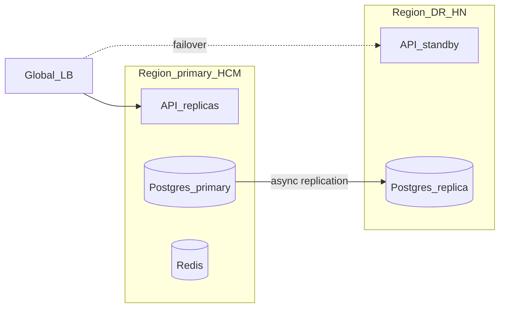

# Multi-region HA — Tier 6 target (99.95%)

> Architecture target · drill checklist · not yet deployed.

## Target topology



## SLO

| Metric | Target | Reference |
|--------|--------|-----------|
| Availability | 99.95% | [slo-99-5.md](./slo-99-5.md) |
| RPO | ≤ 15 min | Postgres WAL shipping |
| RTO | ≤ 60 min | DNS + API scale-up |

## Failover drill (staging)

1. Verify read replica lag < 30s
2. Promote replica or switch DNS to DR region
3. Run `./scripts/smoke-p0.sh` against DR endpoint
4. Run `./scripts/uat-staging-live.sh` against DR endpoint
5. Document elapsed RTO in incident log

## Env flags

```bash
REGION_ID=ap-southeast-1-hcm
DR_REGION_ID=ap-southeast-1-hn
MULTI_REGION_ENABLED=false
```

Enable `MULTI_REGION_ENABLED=true` only after drill sign-off.
