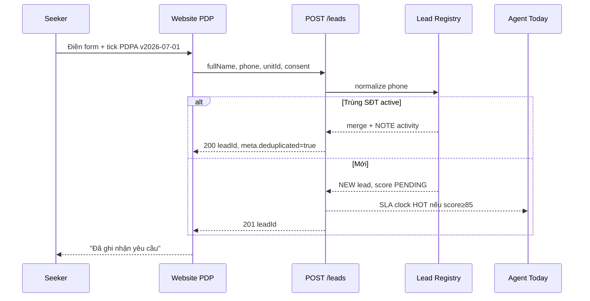
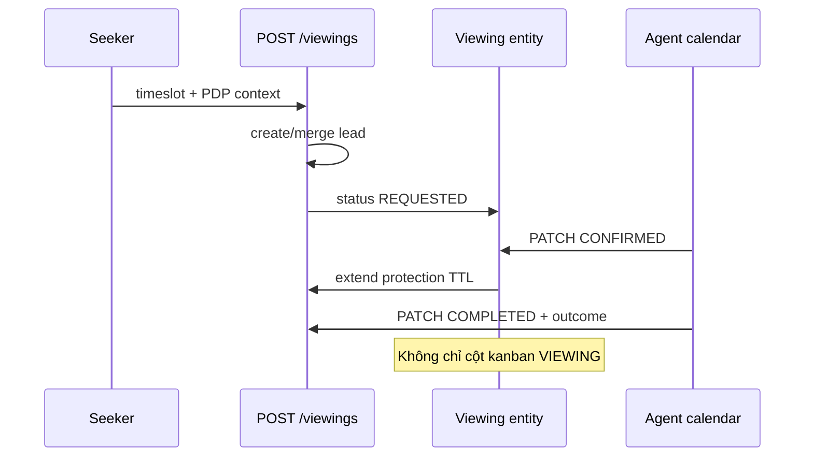
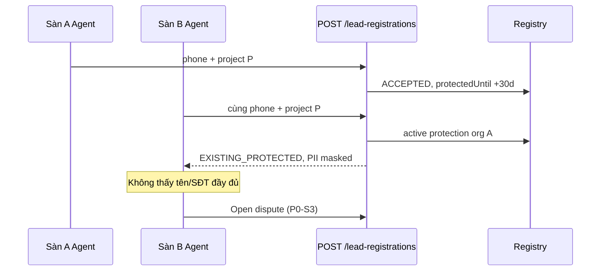
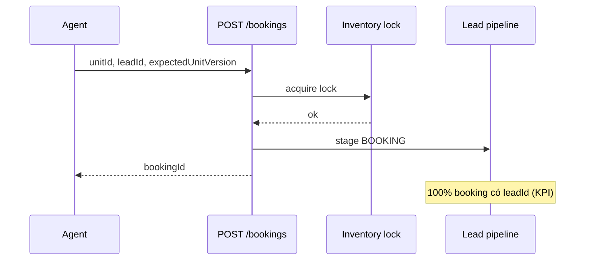

# Sequence diagrams — 4 luồng bắt buộc UAT

> **Mã:** NNHN-SEQ-001 v1.0 · **Wave 0 BA-03**

## 1. Public contact (PDPA + dedup)

## 2. Viewing request → confirm

## 3. Hai sàn trùng SĐT + dự án

## 4. Booking từ lead NEW

