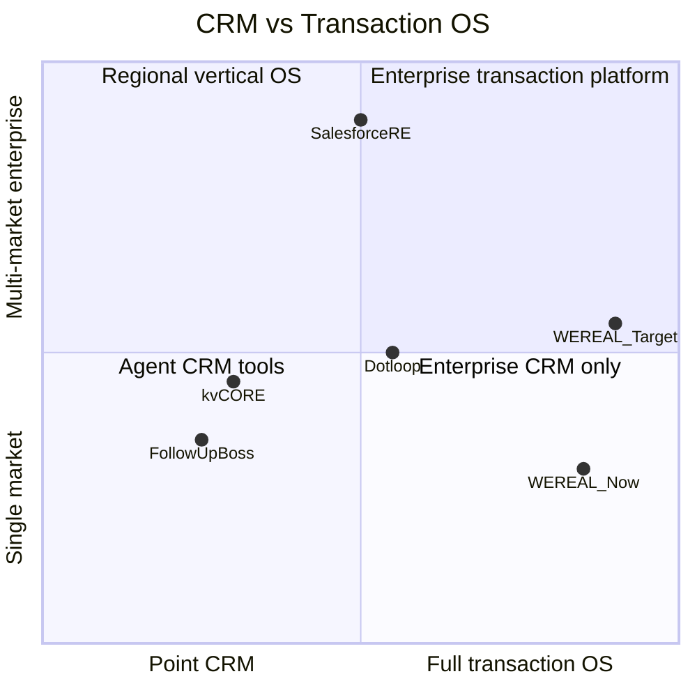

# WEREAL Competitive Benchmark — Jul 2026

> So sánh WEREAL As-Is với **Follow Up Boss · kvCORE · Dotloop · Salesforce Real Estate Cloud**  
> Phục vụ positioning: **Vertical OS BĐS VN** — không phải CRM copy Mỹ  
> Scorecard nội bộ: [WEREAL-Domain-Scorecard.md](./WEREAL-Domain-Scorecard.md) · Roadmap: [Sprint-Backlog-P3.md](../dev/Sprint-Backlog-P3.md)

---

## Executive summary

| Platform | Category | Maturity | Vertical depth (deal OS) | VN localization | WEREAL verdict |
|----------|----------|:--------:|:------------------------:|:---------------:|----------------|
| **WEREAL** | Vertical OS · Tier 5 code | ★★★☆☆ | ★★★★★ | ★★★★★ | Network layer shipped · GTM proof pending |
| Follow Up Boss | Agent CRM | ★★★★☆ | ★★☆☆☆ | ★☆☆☆☆ | WEREAL wins post-lead · FUB wins nurture |
| kvCORE | CRM + marketing | ★★★★☆ | ★★☆☆☆ | ★☆☆☆☆ | WEREAL wins finance · kvCORE wins campaigns |
| Dotloop | Transaction / e-sign | ★★★★★ | ★★★☆☆☆ | ★★☆☆☆ | Dotloop wins legal sign · WEREAL wins ledger |
| Salesforce RE | Enterprise CRM | ★★★★★ | ★★★☆☆☆ | ★★☆☆☆ | SF wins ecosystem · WEREAL wins VN stack |

**WEREAL không thắng bằng feature count CRM** — thắng bằng **GR → book → pay → ledger → commission** trong một tenant, với **Zalo/Meta/SMS** native.

---

## Comparison matrix (1–5 scale)

| Capability | WEREAL | Follow Up Boss | kvCORE | Dotloop | Salesforce RE |
|------------|:------:|:--------------:|:------:|:-------:|:-------------:|
| Lead capture & CRM | 3 | **5** | **5** | 2 | **5** |
| Marketing automation | 2 | 4 | **5** | 1 | 4 |
| Omnichannel (US) | 1 | 4 | 4 | 2 | 4 |
| Omnichannel (VN: Zalo/Meta/SMS) | **4** | 1 | 1 | 1 | 2 |
| Listing / inventory truth | **4** | 2 | 3 | 2 | 3 |
| Anti-drift / moderation | **4** | 1 | 2 | 1 | 2 |
| Booking / reservation | **4** | 2 | 2 | 3 | 3 |
| Payment / deposit | **4** | 1 | 1 | 2 | 2 |
| Ledger / reconcile | **4** | 1 | 1 | 1 | 2 |
| Commission / settlement | **3** | 1 | 1 | 1 | 2 |
| Escrow / BNPL | **4** | 1 | 1 | 2 | 2 |
| E-sign legal grade | 2 | 2 | 2 | **5** | 3 |
| Developer / finance portals | **4** | 1 | 2 | 2 | 3 |
| AI (production) | 3 | 3 | 3 | 2 | 4 |
| Mobile agent | **4** | **4** | **4** | 3 | 4 |
| Enterprise SSO / ABAC | 2 | 3 | 3 | 4 | **5** |
| API / partner ecosystem | **4** | 3 | 3 | 3 | **5** |
| Data intelligence product | **4** | 1 | 2 | 1 | 3 |
| SLA / uptime proof | 2 | **4** | **4** | **5** | **5** |
| Time on market | 1 | **5** | **5** | **5** | **5** |

---

## 1. Follow Up Boss (FUB)

**Positioning:** Agent-centric CRM · lead routing · email/text drip · team accountability.

| Dimension | FUB | WEREAL |
|-----------|-----|--------|
| **Strength** | Speed-to-lead · action plans · integrations (Zillow, etc.) | Deal OS after lead: booking, pay, commission |
| **Weakness vs WEREAL** | No developer GR · no ledger · no VNPay/Zalo | No drip campaigns · no dialer · weaker agent mobile polish |
| **Buyer persona** | US broker team | VN developer + agency + sàn |
| **Price band** | $69–500/mo per team | Enterprise pilot (custom) |

**When customer asks “FUB vs WEREAL”:**  
→ FUB = *“nurture lead Mỹ”* · WEREAL = *“đóng deal + đối soát HH tại VN”*.

**WEREAL must-have to match FUB in CRM lane:** omnichannel SLA dashboard (P3-S6) · agent mobile parity (Tier 4).

---

## 2. kvCORE (Inside Real Estate)

**Positioning:** CRM + **marketing automation** · websites · campaigns · AI assistant.

| Dimension | kvCORE | WEREAL |
|-----------|--------|--------|
| **Strength** | Landing pages · nurture · multi-channel campaigns | GR truth · finance OS · developer portal |
| **Weakness vs WEREAL** | Shallow transaction · no commission waterfall | Marketing automation depth · IDX/MLS |
| **AI** | Content + lead scoring (mature SaaS) | 6-surface federation (design > production) |

**When customer asks “kvCORE vs WEREAL”:**  
→ kvCORE = *“marketing machine”* · WEREAL = *“vận hành giao dịch & hoa hồng”*.

**Do not chase:** 50 email templates · A/B landing builder (Tier 5 defer per impact matrix).

---

## 3. Dotloop

**Positioning:** **Transaction management** · compliance · **legal e-sign** · broker workflows.

| Dimension | Dotloop | WEREAL |
|-----------|---------|--------|
| **Strength** | Court-admissible e-sign · loop templates · broker compliance | Booking state machine · ledger · escrow gates |
| **Weakness vs WEREAL** | No payment ledger · no developer commission split | E-sign legal grade · template compliance library |
| **Overlap** | Contract in deal flow | UC-BK-06/07 contract merge + OTP sign |

**When customer asks “Dotloop vs WEREAL”:**  
→ Dotloop = *“chữ ký & compliance loop Mỹ”* · WEREAL = *“tiền + sổ + HH sau ký”*.

**WEREAL Tier 2 must-have:** VN e-sign provider (VNPT/Viettel/DocuSign) + immutable vault.

---

## 4. Salesforce Real Estate Cloud

**Positioning:** **Enterprise CRM** · AppExchange · multi-org · global SI ecosystem.

| Dimension | Salesforce RE | WEREAL |
|-----------|---------------|--------|
| **Strength** | SSO SAML · ABAC · 1000+ integrations · SLA contract | Vertical completeness · VN rails · lower TCO pilot |
| **Weakness vs WEREAL** | Heavy customize · expensive · weak VN omnichannel | Ecosystem · multi-org · global support |
| **Overlap** | Lead/opportunity · partner portal | Developer portal · commission (custom on SF) |

**When customer asks “Salesforce vs WEREAL”:**  
→ Salesforce = *“enterprise CRM global”* · WEREAL = *“BĐS OS made for VN developer/agency model”*.

**WEREAL Tier 2–3 must-have:** SSO prod · config platform (exit audit-as-DB) · OpenAPI contract CI · partner SDK.

---

## Head-to-head: WEREAL unique wins

Features **none of the four competitors ship out-of-box** for VN developer model:

1. **Golden Record anti-drift** — listing price blocked when ≠ GR (`anti-drift.service`)
2. **Commission snapshot → settlement batch → KYC gate → payout** (UC-COM + UC-PAY-04)
3. **Ledger reconcile dashboard** with 7-day match rate (OP-WIN-02)
4. **Zalo OAuth + Meta OAuth + SMS** in one CRM inbox federation
5. **7 portals** — Agent · Buyer · Developer · Finance · Admin · Dev API · Auth
6. **Booking Redis lock** — concurrent reservation integrity (OP-WIN-01)

---

## Head-to-head: WEREAL clear losses

| Gap | Best competitor | WEREAL As-Is | P3/P4 target |
|-----|---------------|--------------|--------------|
| Legal e-sign | Dotloop 5/5 | 2/5 | Tier 2 provider |
| Marketing drip | kvCORE 5/5 | 2/5 | Defer / partner |
| Enterprise SSO | Salesforce 5/5 | 2/5 | P3 staging SSO live |
| Mobile agent UX | FUB/kvCORE 4/5 | 2.5/5 | Tier 4 buyer+agent apps |
| Uptime SLA proof | Dotloop/SF 5/5 | 1/5 | Tier 3 SRE + 99.5% |
| MLS/IDX feed | kvCORE 4/5 | 1/5 | Partner / Phase 5 |

---

## Positioning map

**Recommended message:**  
*“WEREAL là hệ điều hành giao dịch bất động sản — từ dữ liệu nguồn (GR) đến tiền và hoa hồng — được xây cho mô hình developer/agency Việt Nam.”*

---

## Win/loss playbook (sales)

| Prospect says | Response | Show |
|---------------|----------|------|
| “Chúng tôi dùng Salesforce” | WEREAL không thay SF CRM — bổ sung **pay + ledger + HH + Zalo** | Finance settlement · reconcile UI |
| “Cần CRM email marketing” | Partner kvCORE/HubSpot **hoặc** WEREAL webhook `lead.created` | Tenant webhooks SCR-DEV-013 |
| “Cần e-sign pháp lý” | Roadmap Tier 2 · hiện OTP + vault | Contract flow + audit trail |
| “Cần chống double-book” | Redis lock + UAT-05 + load test P3 | OP-WIN-01 evidence |
| “Cần Zalo lead vào CRM” | Meta/Zalo OAuth + <30s metric P3 | Admin integrations |

---

## Path to beat each competitor **in Vietnam**

| Competitor | Beat condition (24 mo) |
|------------|------------------------|
| **FUB** | Win every developer RFP needing **post-lead money flow** · FUB cannot localize VNPay/Zalo |
| **kvCORE** | Win **developer + finance** stakeholders · leave agent marketing to integrations |
| **Dotloop** | Partner for e-sign **or** Tier 2 VN provider · win on **ledger + commission** |
| **Salesforce** | Win mid-market VN developers who cannot afford SF SI · **faster time-to-pilot** with OP-WIN signed |

**#1 Vietnam definition:** 3 anchor developers · 500 agent WAU · OP-WIN-01→07 signed · staging live · composite scorecard ≥ 5.0 (Tier 5 code) · market maturity ★★★☆☆ until GTM sign-off.

---

## Tier 5 refresh (Jul 2026)

| Area | WEREAL score (post-T5) | Notes |
|------|------------------------|-------|
| Anchor network | 4/5 | 3 seed tenants · `/anchor/*` |
| Agent WAU | 4/5 | Telemetry live · 500 = ops target |
| API marketplace | 4/5 | BANK/ERP/NOTARY sandbox |
| NHNN escrow | 4/5 | DB + export scope · bank flag-gated |
| Data product | 4/5 | Heatmap · pricing · billing stub T6 |
| Platform ops | 2/5 | E2E/load scripts added · SLA doc |

See [Sprint-Backlog-T5.md](../dev/Sprint-Backlog-T5.md) · [Sprint-Backlog-T6.md](../dev/Sprint-Backlog-T6.md).

---

## Related docs

- [WEREAL-Domain-Scorecard.md](./WEREAL-Domain-Scorecard.md)
- [Sprint-Backlog-P3.md](../dev/Sprint-Backlog-P3.md) — Tier 1 execution
- [Sprint-Backlog-P2.md](../dev/Sprint-Backlog-P2.md)
- [WEREAL-BA-Master-Spec.md](../specs/WEREAL-BA-Master-Spec.md)
- [UAT-P0-pilot-checklist.md](../uat/UAT-P0-pilot-checklist.md)
